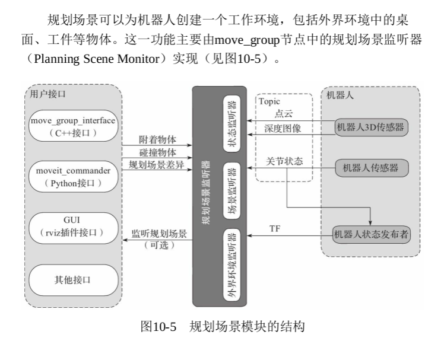

# Moveit  机械臂控制

 1) 组 装 : 创 建 机 器 人 URDF 模 型 .
2) 配 置 : 使 用 MoveIt! Setup Assistant 工 具 生 成 配 置 文 件 。
3) 驱 动 : 添 加 机 器 人 控 制 器 ( 真 实 机 器 人 》 或 控 制 器 插 件 ( 仿 真
机 器 人 。
4) 控 制 : 使 用 MoveIt! 控 制 机 器 人 运 动 ( 算 法 仿 真 、 物 理 仿
  真 ) 。

