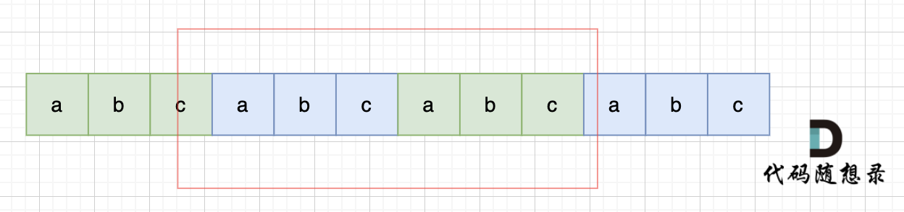

# 一、数组


# 二、链表


### [707. 设计链表](https://leetcode.cn/problems/design-linked-list/)

```C++
class MyLinkedList {
public:
    // 定义链表节点结构体
    struct LinkedNode {
        int val;
        LinkedNode* next;
        LinkedNode(int val):val(val), next(nullptr){}
    };

    // 初始化链表
    MyLinkedList() {
        _dummyHead = new LinkedNode(0); // 这里定义的头结点 是一个虚拟头结点，而不是真正的链表头结点
        _size = 0;
    }

    // 获取到第index个节点数值，如果index是非法数值直接返回-1， 注意index是从0开始的，第0个节点就是头结点
    int get(int index) {
        if (index > (_size - 1) || index < 0) {
            return -1;
        }
        LinkedNode* cur = _dummyHead->next;  // cur要指向头节点，而不是_dummyHead
        while(index--){ // 如果--index 就会陷入死循环
            cur = cur->next;
        }
        return cur->val;
    }

    // 在链表最前面插入一个节点，插入完成后，新插入的节点为链表的新的头结点
    void addAtHead(int val) {
        LinkedNode* newNode = new LinkedNode(val);
        newNode->next = _dummyHead->next;
        _dummyHead->next = newNode;
        _size++;
    }

    // 在链表最后面添加一个节点
    void addAtTail(int val) {
        LinkedNode* newNode = new LinkedNode(val);
        LinkedNode* cur = _dummyHead;
        while(cur->next != nullptr){
            cur = cur->next;
        }
        cur->next = newNode;
        _size++;
    }

    // 在第index个节点之前插入一个新节点，例如index为0，那么新插入的节点为链表的新头节点。
    // 如果index 等于链表的长度，则说明是新插入的节点为链表的尾结点
    // 如果index大于链表的长度，则返回空
    // 如果index小于0，则在头部插入节点
    void addAtIndex(int index, int val) {

        if(index > _size) return;
        // if(index < 0) index = 0;        
        if(index < 0) return;        
        LinkedNode* newNode = new LinkedNode(val);
        LinkedNode* cur = _dummyHead;
        while(index--) {
            cur = cur->next;
        }
        newNode->next = cur->next;
        cur->next = newNode;
        _size++;
    }

    // 删除第index个节点，如果index 大于等于链表的长度，直接return，注意index是从0开始的
    void deleteAtIndex(int index) {
        if (index >= _size || index < 0) {
            return;
        }
        LinkedNode* cur = _dummyHead;
        while(index--) {
            cur = cur ->next;
        }
        LinkedNode* tmp = cur->next;
        cur->next = cur->next->next;
        delete tmp;
        //delete命令指示释放了tmp指针原本所指的那部分内存，
        //被delete后的指针tmp的值（地址）并非就是NULL，而是随机值。也就是被delete后，
        //如果不再加上一句tmp=nullptr,tmp会成为乱指的野指针
        //如果之后的程序不小心使用了tmp，会指向难以预想的内存空间
        tmp=nullptr;
        _size--;
    }

    // 打印链表
    // void printLinkedList() {
    //     LinkedNode* cur = _dummyHead;
    //     while (cur->next != nullptr) {
    //         cout << cur->next->val << " ";
    //         cur = cur->next;
    //     }
    //     cout << endl;
    // }
private:
    int _size;
    LinkedNode* _dummyHead;

};
```


### [24. 两两交换链表中的节点](https://leetcode.cn/problems/swap-nodes-in-pairs/)

##### 考点：节点交换三部曲


```
        //注意条件顺序，防止空指针异常
        while(cur->next != nullptr && cur->next->next != nullptr){
            ListNode* tmp = cur->next;
            ListNode* tmp1 = cur->next->next->next;

            //开始交换
            cur->next = cur->next->next;
            cur->next->next = tmp;
            cur->next->next->next = tmp1;

            //移动到下一个交换位
            cur = cur->next->next;
        }
```


### [19. 删除链表的倒数第 N 个结点](https://leetcode.cn/problems/remove-nth-node-from-end-of-list/)

##### 考点：快慢指针找倒数第N节点

双指针的经典应用，如果要删除倒数第n个节点，让fast移动n步，然后让fast和slow同时移动，直到fast指向链表末尾。删掉slow所指向的节点就可以了。

- tips: fast首先走n + 1步 ，为什么是n+1呢，因为只有这样同时移动的时候slow才能指向删除节点的上一个节点（方便做删除操作）


### [面试题 02.07. 链表相交](https://leetcode.cn/problems/intersection-of-two-linked-lists-lcci/)

> https://programmercarl.com/%E9%9D%A2%E8%AF%95%E9%A2%9802.07.%E9%93%BE%E8%A1%A8%E7%9B%B8%E4%BA%A4.html#%E6%80%9D%E8%B7%AF

##### 考点：交点不是数值相等，而是指针相等

简单来说，就是求两个链表交点节点的**指针**。 这里要注意，**交点不是数值相等，而是指针相等**。

```
        ListNode* curA = headA;
        ListNode* curB = headB;
```

1. 求链表A、B的长度，然后让curA 、curB重新指向头节点

2. 让curA为最长链表的头，lenA为其长度

   ```
           if (lenB > lenA) {
               swap (lenA, lenB);
               swap (curA, curB);
           }
   ```

3. 求长度差，让curA和curB在同一起点上（末尾位置对齐）

   ```
           while (gap--) {
               curA = curA->next;
           }
   ```

4. 遍历curA 和 curB，遇到相同则直接返回


### [142. 环形链表 II](https://leetcode.cn/problems/linked-list-cycle-ii/)

题意： 给定一个链表，返回链表开始入环的第一个节点。 如果链表无环，则返回 null。

##### 一、判断链表是否有环

```
可以使用快慢指针法，分别定义 fast 和 slow 指针，从头结点出发，fast指针每次移动两个节点，slow指针每次移动一个节点，如果 fast 和 slow指针在途中相遇 ，说明这个链表有环。

为什么？其实相对于slow来说，fast是一个节点一个节点的靠近slow的，所以fast一定可以和slow重合。
```

##### 二、如果有环，如何找到这个环的入口

```
假设从头结点到环形入口节点 的节点数为x。 环形入口节点到 fast指针与slow指针相遇节点 节点数为y。 从相遇节点 再到环形入口节点节点数为 z。
那么：
从头结点出发一个指针，从相遇节点 也出发一个指针，这两个指针每次只走一个节点， 那么当这两个指针相遇的时候就是 环形入口的节点。
```


# 三、哈希表

### **技巧1：什么时候使用哈希法**？

**当我们需要查询一个元素是否出现过，或者一个元素是否在集合里的时候，就要第一时间想到哈希法。**

### 技巧2：数组和set来做哈希法的局限

- 数组的大小是受限制的，而且如果元素很少，而哈希值太大会造成内存空间的浪费。
- set是一个集合，里面放的元素只能是一个key，而两数之和这道题目，不仅要判断y是否存在而且还要记录y的下标位置，因为要返回x 和 y的下标。所以set 也不能用。


> 当我们要使用集合来解决哈希问题的时候，优先使用unordered_set，因为它的查询和增删效率是最优的，如果需要集合是有序的，那么就用set，如果要求不仅有序还要有重复数据的话，那么就用multiset。

### [242. 有效的字母异位词](https://leetcode.cn/problems/valid-anagram/)

给定两个字符串 `*s*` 和 `*t*` ，编写一个函数来判断 `*t*` 是否是 `*s*` 的字母异位词。

**注意：**若 `*s*` 和 `*t*` 中每个字符出现的次数都相同，则称 `*s*` 和 `*t*` 互为字母异位词。

##### **技巧1：数组做哈希表**

——因为数值少 就26个

##### **技巧2：record[s[i] - 'a']**

```C++
class Solution {
public:
    bool isAnagram(string s, string t) {
        int record[26] = {0};
        for (int i = 0; i < s.size(); i++) {
            // 并不需要记住字符a的ASCII，只要求出一个相对数值就可以了
            record[s[i] - 'a']++;
        }
        for (int i = 0; i < t.size(); i++) {
            record[t[i] - 'a']--;
        }
        for (int i = 0; i < 26; i++) {
            if (record[i] != 0) {
                // record数组如果有的元素不为零0，说明字符串s和t 一定是谁多了字符或者谁少了字符。
                return false;
            }
        }
        // record数组所有元素都为零0，说明字符串s和t是字母异位词
        return true;
    }
};
```


### [349. 两个数组的交集](https://leetcode.cn/problems/intersection-of-two-arrays/)

题意：给定两个数组，编写一个函数来计算它们的交集。

##### 1.考点：unordered_set

题目特意说明：**输出结果中的每个元素一定是唯一的，也就是说输出的结果的去重的， 同时可以不考虑输出结果的顺序**

unordered_set 读写效率是最高的，并不需要对数据进行排序，而且还不要让数据重复，所以选择unordered_set。

##### 2.unordered_set使用技巧

###### 初始化：

```
unordered_set<int> nums_set(nums1.begin(), nums1.end());
```

###### 查找与插入：

```
            if (nums_set.find(num) != nums_set.end()) {
                result_set.insert(num);
            }
```

###### set转vector

```
vector<int>(result_set.begin(), result_set.end());
```


### [1. 两数之和](https://leetcode.cn/problems/two-sum/)

##### 考点：**unordered_map**

数组和set来做哈希法的局限。

- 数组的大小是受限制的，而且如果元素很少，而哈希值太大会造成内存空间的浪费。
- set是一个集合，里面放的元素只能是一个key，而两数之和这道题目，不仅要判断y是否存在而且还要记录y的下标位置，因为要返回x 和 y的下标。所以set 也不能用。


本题其实有四个重点：

- 为什么会想到用哈希表
  - 本题，我们不仅要知道元素有没有遍历过，还要知道这个元素对应的下标，**需要使用 key value结构来存放，key来存元素，value来存下标，那么使用map正合适**。
- 哈希表为什么用map
  - **这道题目中并不需要key有序，选择std::unordered_map 效率更高！**
- 本题map是用来存什么的
  - map目的用来存放我们访问过的元素，因为遍历数组的时候，需要记录我们之前遍历过哪些元素和对应的下标，这样才能找到与当前元素相匹配的（也就是相加等于target）
- map中的key和value用来存什么的
  - {key：数据元素，value：数组元素对应的下标}

##### unordered_map的使用技巧

###### 查找、key与value的访问、插入

```C++
            auto iter = map.find(target - nums[i]); 
            if(iter != map.end()) {
                return {iter->second, i};
            }
            // 如果没找到匹配对，就把访问过的元素和下标加入到map中
            map.insert(pair<int, int>(nums[i], i)); 
```


### [454. 四数相加 II](https://leetcode.cn/problems/4sum-ii/)

本题解题步骤：

1. 首先定义 一个unordered_map，key放a和b两数之和，value 放a和b两数之和出现的次数。
2. 遍历大A和大B数组，统计两个数组元素之和，和出现的次数，放到map中。
3. 定义int变量count，用来统计 a+b+c+d = 0 出现的次数。
4. 在遍历大C和大D数组，找到如果 0-(c+d) 在map中出现过的话，就用count把map中key对应的value也就是出现次数统计出来。
5. 最后返回统计值 count 就可以了

```C++
class Solution {
public:
    int fourSumCount(vector<int>& A, vector<int>& B, vector<int>& C, vector<int>& D) {
        unordered_map<int, int> umap; //key:a+b的数值，value:a+b数值出现的次数
        // 遍历大A和大B数组，统计两个数组元素之和，和出现的次数，放到map中
        for (int a : A) {
            for (int b : B) {
                umap[a + b]++;
            }
        }
        int count = 0; // 统计a+b+c+d = 0 出现的次数
        // 在遍历大C和大D数组，找到如果 0-(c+d) 在map中出现过的话，就把map中key对应的value也就是出现次数统计出来。
        for (int c : C) {
            for (int d : D) {
                if (umap.find(0 - (c + d)) != umap.end()) {
                    count += umap[0 - (c + d)];
                }
            }
        }
        return count;
    }
};
```


### [202. 快乐数](https://leetcode.cn/problems/happy-number/)

> 编写一个算法来判断一个数 n 是不是快乐数。
>
> 「快乐数」定义为：对于一个正整数，每一次将该数替换为它每个位置上的数字的平方和，然后重复这个过程直到这个数变为 1，也可能是 无限循环 但始终变不到 1。如果 可以变为 1，那么这个数就是快乐数。
>
> 如果 n 是快乐数就返回 True ；不是，则返回 False 。

解法：

```
题目中说了会 无限循环，那么也就是说求和的过程中，sum会重复出现，这对解题很重要！当我们遇到了要快速判断一个元素是否出现集合里的时候，就要考虑哈希法了。
所以这道题目使用哈希法，来判断这个sum是否重复出现，如果重复了就是return false， 否则一直找到sum为1为止。

判断sum是否重复出现就可以使用unordered_set。
```


###### 难点：**取数值各个位上的单数操作**


### [383. 赎金信](https://leetcode.cn/problems/ransom-note/)

给你两个字符串：ransomNote 和 magazine ，判断 ransomNote 能不能由 magazine 里面的字符构成。

如果可以，返回 true ；否则返回 false 。

magazine 中的每个字符只能在 ransomNote 中使用一次。

```C++
class Solution {
public:
    bool canConstruct(string ransomNote, string magazine) {
        int record[26] = {0};
        //add
        if (ransomNote.size() > magazine.size()) {
            return false;
        }
        for (int i = 0; i < magazine.length(); i++) {
            // 通过record数据记录 magazine里各个字符出现次数
            record[magazine[i]-'a'] ++;
        }
        for (int j = 0; j < ransomNote.length(); j++) {
            // 遍历ransomNote，在record里对应的字符个数做--操作
            record[ransomNote[j]-'a']--;
            // 如果小于零说明ransomNote里出现的字符，magazine没有
            if(record[ransomNote[j]-'a'] < 0) {
                return false;
            }
        }
        return true;
    }
};
```


# 四、双指针

### [15. 三数之和](https://leetcode.cn/problems/3sum/)

给你一个包含 n 个整数的数组 nums，判断 nums 中是否存在三个元素 a，b，c ，使得 a + b + c = 0 ？请你找出所有满足条件且不重复的三元组。

**其实这道题目使用哈希法并不十分合适**，接下来我来介绍另一个解法：双指针法，**这道题目使用双指针法 要比哈希法高效一些**


1. 首先将数组排序，然后有一层for循环，i从下标0的地方开始，同时定一个下标left 定义在i+1的位置上，定义下标right 在数组结尾的位置上。
2. 如果nums[i] + nums[left] + nums[right] > 0 就说明 此时三数之和大了，因为数组是排序后了，所以right下标就应该向左移动，这样才能让三数之和小一些。
3. 如果 nums[i] + nums[left] + nums[right] < 0 说明 此时 三数之和小了，left 就向右移动，才能让三数之和大一些，直到left与right相遇为止。

###### 易错点1：nums[i] == nums[i + 1]

###### 难点：如何去重

```C++
class Solution {
public:
    vector<vector<int>> threeSum(vector<int>& nums) {
        vector<vector<int>> result;
        sort(nums.begin(), nums.end());
        // 找出a + b + c = 0
        // a = nums[i], b = nums[left], c = nums[right]
        for (int i = 0; i < nums.size(); i++) {
            // 排序之后如果第一个元素已经大于零，那么无论如何组合都不可能凑成三元组，直接返回结果就可以了
            if (nums[i] > 0) {
                return result;
            }
            // 错误去重a方法，将会漏掉-1,-1,2 这种情况， 判断成了结果集里不能有重复元素
            /*
            if (nums[i] == nums[i + 1]) {
                continue;
            }
            */
            // 正确去重a方法
            if (i > 0 && nums[i] == nums[i - 1]) {
                continue;
            }
            int left = i + 1;
            int right = nums.size() - 1;
            //right == left 时， 这两个指针都指向了同一个数，这时变成了“两数之和”
            while (right > left) {
                // 去重复逻辑如果放在这里，0，0，0 的情况，可能直接导致 right<=left 了，从而漏掉了 0,0,0 这种三元组
                /*
                while (right > left && nums[right] == nums[right - 1]) right--;
                while (right > left && nums[left] == nums[left + 1]) left++;
                */
                if (nums[i] + nums[left] + nums[right] > 0) right--;
                else if (nums[i] + nums[left] + nums[right] < 0) left++;
                else { // 等于0，收获结果
                    result.push_back(vector<int>{nums[i], nums[left], nums[right]});
                    // 去重逻辑应该放在找到一个三元组之后，对b 和 c去重
                    while (right > left && nums[right] == nums[right - 1]) right--;
                    while (right > left && nums[left] == nums[left + 1]) left++;

                    // 找到答案时，双指针同时收缩
                    right--;
                    left++;
                }
            }

        }
        return result;
    }
};
```


### [18. 四数之和](https://leetcode.cn/problems/4sum/)

三数之和的双指针解法是一层for循环num[i]为确定值，然后循环内有left和right下标作为双指针，找到nums[i] + nums[left] + nums[right] == 0。

四数之和的双指针解法是两层for循环nums[k] + nums[i]为确定值，依然是循环内有left和right下标作为双指针，找出nums[k] + nums[i] + nums[left] + nums[right] == target的情况，三数之和的时间复杂度是O(n^2)，四数之和的时间复杂度是O(n^3) 。

所以，四数之和，和[15.三数之和 (opens new window)](https://programmercarl.com/0015.三数之和.html)是一个思路，都是使用双指针法, 基本解法就是在[15.三数之和 (opens new window)](https://programmercarl.com/0015.三数之和.html)的基础上再套一层for循环。

但是有一些细节需要注意，例如： 不要判断`nums[k] > target` 就返回了，三数之和 可以通过 `nums[i] > 0` 就返回了，因为 0 已经是确定的数了，四数之和这道题目 target是任意值。比如：数组是`[-4, -3, -2, -1]`，`target`是`-10`，不能因为`-4 > -10`而跳过。但是我们依旧可以去做剪枝，逻辑变成`nums[i] > target && (nums[i] >=0 || target >= 0)`就可以了。

```C++
class Solution {
public:
    vector<vector<int>> fourSum(vector<int>& nums, int target) {
        vector<vector<int>> result;
        sort(nums.begin(), nums.end());
        for (int k = 0; k < nums.size(); k++) {
            // 剪枝处理
            if (nums[k] > target && nums[k] >= 0) {
            	break; // 这里使用break，统一通过最后的return返回
            }
            // 对nums[k]去重
            if (k > 0 && nums[k] == nums[k - 1]) {
                continue;
            }
            for (int i = k + 1; i < nums.size(); i++) {
                // 2级剪枝处理
                if (nums[k] + nums[i] > target && nums[k] + nums[i] >= 0) {
                    break;
                }

                // 对nums[i]去重
                if (i > k + 1 && nums[i] == nums[i - 1]) {
                    continue;
                }
                int left = i + 1;
                int right = nums.size() - 1;
                while (right > left) {
                    // nums[k] + nums[i] + nums[left] + nums[right] > target 会溢出
                    if ((long) nums[k] + nums[i] + nums[left] + nums[right] > target) {
                        right--;
                    // nums[k] + nums[i] + nums[left] + nums[right] < target 会溢出
                    } else if ((long) nums[k] + nums[i] + nums[left] + nums[right]  < target) {
                        left++;
                    } else {
                        result.push_back(vector<int>{nums[k], nums[i], nums[left], nums[right]});
                        // 对nums[left]和nums[right]去重
                        while (right > left && nums[right] == nums[right - 1]) right--;
                        while (right > left && nums[left] == nums[left + 1]) left++;

                        // 找到答案时，双指针同时收缩
                        right--;
                        left++;
                    }
                }

            }
        }
        return result;
    }
};
```


# 五、字符串

### [344. 反转字符串](https://leetcode.cn/problems/reverse-string/)

解法：定义两个指针（也可以说是索引下标），一个从字符串前面，一个从字符串后面，两个指针同时向中间移动，并交换元素。

```C++
void reverseString(vector<char>& s) {
    for (int i = 0, j = s.size() - 1; i < s.size()/2; i++, j--) {
        swap(s[i],s[j]);
    }
}
```


### [541. 反转字符串 II](https://leetcode.cn/problems/reverse-string-ii/)

> 给定一个字符串 `s` 和一个整数 `k`，从字符串开头算起，每计数至 `2k` 个字符，就反转这 `2k` 字符中的前 `k` 个字符。
>
> - 如果剩余字符少于 `k` 个，则将剩余字符全部反转。
> - 如果剩余字符小于 `2k` 但大于或等于 `k` 个，则反转前 `k` 个字符，其余字符保持原样。

```C++
class Solution {
public:
    void reverse(string& s, int start, int end) {
        for (int i = start, j = end; i < j; i++, j--) {
            swap(s[i], s[j]);
        }
    }
    string reverseStr(string s, int k) {
        for (int i = 0; i < s.size(); i += (2 * k)) {
            // 1. 每隔 2k 个字符的前 k 个字符进行反转
            // 2. 剩余字符小于 2k 但大于或等于 k 个，则反转前 k 个字符
            if (i + k <= s.size()) {
                reverse(s, i, i + k - 1);
                continue;
            }
            // 3. 剩余字符少于 k 个，则将剩余字符全部反转。
            reverse(s, i, s.size() - 1);
        }
        return s;
    }
};
```


### 替换数字

给定一个字符串 s，它包含小写字母和数字字符，请编写一个函数，将字符串中的字母字符保持不变，而将每个数字字符替换为number。

例如，对于输入字符串 "a1b2c3"，函数应该将其转换为 "anumberbnumbercnumber"。

1. 首先扩充数组到每个数字字符替换成 "number" 之后的大小。

   

2. 然后从后向前替换数字字符，也就是双指针法，过程如下：i指向新长度的末尾，j指向旧长度的末尾。


### [151. 反转字符串中的单词](https://leetcode.cn/problems/reverse-words-in-a-string/)

给定一个字符串，逐个翻转字符串中的每个单词。

解题步骤：

- **移除多余空格** : "the sky is blue"
- 将整个字符串反转："eulb si yks eht"
- 将每个单词反转："blue is sky the"

```C++
class Solution {
public:
    void reverse(string& s, int start, int end){ //翻转，区间写法：左闭右闭 []
        for (int i = start, j = end; i < j; i++, j--) {
            swap(s[i], s[j]);
        }
    }  

    void removeExtraSpaces(string& s) {//去除所有空格并在相邻单词之间添加空格, 快慢指针。
        int slow = 0;   //整体思想参考https://programmercarl.com/0027.移除元素.html
        for (int i = 0; i < s.size(); ++i) { //
            if (s[i] != ' ') { //遇到非空格就处理，即删除所有空格。
                if (slow != 0) s[slow++] = ' '; //手动控制空格，给单词之间添加空格。slow != 0说明不是第一个单词，需要在单词前添加空格。
                while (i < s.size() && s[i] != ' ') { //补上该单词，遇到空格说明单词结束。
                    s[slow++] = s[i++];
                }
            }
        }
        s.resize(slow); //slow的大小即为去除多余空格后的大小。
    }

    string reverseWords(string s) {
        removeExtraSpaces(s); //去除多余空格，保证单词之间之只有一个空格，且字符串首尾没空格。
        reverse(s, 0, s.size() - 1);
        int start = 0; //removeExtraSpaces后保证第一个单词的开始下标一定是0。
        //选择 i <= s.size() 作为循环条件，确保了最后一个单词也能被正确地翻转并更新其开始下标
        for (int i = 0; i < s.size(); ++i) {
            if ( s[i] == ' ') { //到达空格或者串尾，说明一个单词结束。进行翻转。
                reverse(s, start, i - 1); //翻转，注意是左闭右闭 []的翻转。
                start = i + 1; //更新下一个单词的开始下标start
            }
            if(i == s.size() - 1){
                reverse(s, start, i);
            }
        }
        return s;
    }
};
```

###### 难点：**移除多余空格** 


###  右旋字符串

[卡码网题目链接](https://kamacoder.com/problempage.php?pid=1065)

字符串的右旋转操作是把字符串尾部的若干个字符转移到字符串的前面。给定一个字符串 s 和一个正整数 k，请编写一个函数，将字符串中的后面 k 个字符移到字符串的前面，实现字符串的右旋转操作。

思路：

```C++
    int len = s.size(); //获取长度

    reverse(s.begin(), s.end()); // 整体反转
    reverse(s.begin(), s.begin() + n); // 先反转前一段，长度n
    reverse(s.begin() + n, s.end()); // 再反转后一段
```


### [28. 找出字符串中第一个匹配项的下标](https://leetcode.cn/problems/find-the-index-of-the-first-occurrence-in-a-string/)

> 给你两个字符串 `haystack` 和 `needle` ，请你在 `haystack` 字符串中找出 `needle` 字符串的第一个匹配项的下标（下标从 0 开始）。如果 `needle` 不是 `haystack` 的一部分，则返回 `-1`

###### KMP的经典思想:

**当出现字符串不匹配时，可以记录一部分之前已经匹配的文本内容，利用这些信息避免从头再去做匹配。**

```C++
class Solution {
public:
    // 求next数组
    void getNext(int* next, const string& s) {
        int j = 0;
        next[0] = 0; // 初始化next数组的第一个元素为0
        for (int i = 1; i < s.size(); i++) {
            while (j > 0 && s[i] != s[j]) {
                j = next[j - 1]; // 回溯到前一个匹配点
            }
            if (s[i] == s[j]) {
                j++; // 匹配成功，移动指针
            }
            next[i] = j; // 更新next数组
        }
    }

    int strStr(string haystack, string needle) {
        int next[needle.size()];
        getNext(next, needle); // 获取needle字符串的next数组
        int j = 0;
        for (int i = 0; i < haystack.size(); i++) {
            while (j > 0 && haystack[i] != needle[j]) {
                j = next[j - 1]; // 在匹配失败时回溯
            }
            if (haystack[i] == needle[j]) {
                j++; // 匹配成功，移动指针
            }
            //j 表示当前匹配的字符数，当 j 等于 needle.size() 时，说明整个子串都已经匹配成功
            if (j == needle.size()) {
                return (i - needle.size() + 1); // 返回匹配的起始位置
            }
        }
        return -1; // 未找到匹配子串
    }
};

```

对于：

```
if (j == needle.size()) {
    return (i - needle.size() + 1); // 返回匹配的起始位置
}
举个例子：
如果 `needle` 是 "abc"，而 `haystack` 是 "xyzabc"，当匹配到 "abc" 时，`i` 的位置是 5，`needle.size()` 是 3，所以匹配的起始位置就是 `5 - 3 + 1 = 3`。因此，返回值是匹配的起始位置。
```


### [459. 重复的子字符串](https://leetcode.cn/problems/repeated-substring-pattern/)

> 给定一个非空的字符串，判断它是否可以由它的一个子串重复多次构成。给定的字符串只含有小写英文字母，并且长度不超过10000。


###### 方法一：移动匹配

当一个字符串s：abcabc，内部由重复的子串组成，**判断字符串s是否由重复子串组成，只要两个s拼接在一起，里面还出现一个s的话，就说明是由重复子串组成。**

注意：在判断 s + s 拼接的字符串里是否出现一个s的的时候，**要刨除 s + s 的首字符和尾字符**，这样避免在s+s中搜索出原来的s，我们要搜索的是中间拼接出来的s。



```C++
class Solution {
public:
    bool repeatedSubstringPattern(string s) {
        string t = s + s;
        t.erase(t.begin()); t.erase(t.end() - 1); // 掐头去尾
        if (t.find(s) != std::string::npos) return true; // r
        return false;
    }
};
```

###### 拓展知识：std::string::npos

> 在 `std::string` 类中，`npos` 是一个常量，通常被定义为 `size_t` 类型的最大值，即 `std::numeric_limits<std::size_t>::max()`。这个值在字符串查找等操作中表示未找到匹配项。例如，**在 `find` 函数中，如果找不到子串，会返回 `std::string::npos`。**
>
> 在使用 `find` 进行查找时，检查返回值是否等于 `std::string::npos` 是一种常见的方式来判断查找是否成功。**如果返回值不等于 `npos`，则说明找到了匹配项；如果返回值等于 `npos`，则说明未找到匹配项。**


###### 方法二：KMP

- **在一个串中查找是否出现过另一个串，这是KMP的看家本领**

结论：

由**重复子串组成的字符串**中，**最长相等前后缀不包含的子串就是最小重复子串**，这里拿字符串s：abababab 来举例，ab就是最小重复单位，如图所示：


# 六、栈与队列

### [232. 用栈实现队列](https://leetcode.cn/problems/implement-queue-using-stacks/)

> 使用栈实现队列的下列操作：
>
> push(x) -- 将一个元素放入队列的尾部。
> pop() -- 从队列首部移除元素。
> peek() -- 返回队列首部的元素。
> empty() -- 返回队列是否为空。


使用栈来模式队列的行为，需要两个栈**一个输入栈，一个输出栈**，这里要注意输入栈和输出栈的关系。

```
queue.push(1);
queue.push(2);
queue.pop(); 注意此时的输出栈的操作
queue.push(3);
queue.push(4);
queue.pop();
queue.pop();注意此时的输出栈的操作
queue.pop();
queue.empty();
```


分析：

- 在push数据的时候，只要数据放进输入栈就好
- **在pop的时候**
  - **输出栈如果为空，就把进栈数据全部导入进来（注意是全部导入）**，再从出栈弹出数据
  - 输出栈不为空，则直接从出栈弹出数据就可以了。
- 判断队列为空
  - **如果进栈和出栈都为空的话，说明模拟的队列为空了。**
- pop() 和 peek()两个函数功能类似，代码实现上也是类似的
  - 直接使用已有的pop函数弹出首原属，因为pop函数弹出了元素res，所以再添加回去。


### [225. 用队列实现栈](https://leetcode.cn/problems/implement-stack-using-queues/)

> 使用队列实现栈的下列操作：
>
> - push(x) -- 元素 x 入栈
> - pop() -- 移除栈顶元素
> - top() -- 获取栈顶元素
> - empty() -- 返回栈是否为空

**用两个队列que1和que2实现队列的功能，que2其实完全就是一个备份的作用**，把que1最后面的元素以外的元素都备份到que2，然后弹出最后面的元素，再把其他元素从que2导回que1。

```
queue.push(1);        
queue.push(2);        
queue.pop();   // 注意弹出的操作       
queue.push(3);        
queue.push(4);       
queue.pop();  // 注意弹出的操作    
queue.pop();    
queue.pop();    
queue.empty();    
```


先创建两个队列que1、que2，以及初始化栈

- push(x) -- 元素 x 入栈

  - `que1.push(x);` 即：直接push进que1

- pop() -- 移除栈顶元素

  - 获取que1大小，将que1 导入que2，但要留下最后一个元素

  - 留下的最后一个元素就是要返回的值，记录最后一个元素之后 que1.pop()
  - 再将que2赋值给que1，清空que2，返回记录的元素

  ```C++
      int pop() {
          int size = que1.size();
          size--;
          while (size--) { // 将que1 导入que2，但要留下最后一个元素
              que2.push(que1.front());
              que1.pop();
          }
  
          int result = que1.front(); // 留下的最后一个元素就是要返回的值
          que1.pop();
          que1 = que2;            // 再将que2赋值给que1
          while (!que2.empty()) { // 清空que2
              que2.pop();
          }
          return result;
      }
  ```

- top() -- 获取栈顶元素

  - `return que1.back();`

- empty() -- 返回栈是否为空

  - `return que1.empty();`


优化：用一个队列就够了

**一个队列在模拟栈弹出元素的时候只要将队列头部的元素（除了最后一个元素外） 重新添加到队列尾部，此时再去弹出元素就是栈的顺序了。**

```C++
class MyStack {
public:
    queue<int> que;
    /** Initialize your data structure here. */
    MyStack() {

    }
    /** Push element x onto stack. */
    void push(int x) {
        que.push(x);
    }
    /** Removes the element on top of the stack and returns that element. */
    int pop() {
        int size = que.size();
        size--;
        while (size--) { // 将队列头部的元素（除了最后一个元素外） 重新添加到队列尾部
            que.push(que.front());
            que.pop();
        }
        int result = que.front(); // 此时弹出的元素顺序就是栈的顺序了
        que.pop();
        return result;
    }

    /** Get the top element. */
    int top() {
        return que.back();
    }

    /** Returns whether the stack is empty. */
    bool empty() {
        return que.empty();
    }
};
```


### [20. 有效的括号](https://leetcode.cn/problems/valid-parentheses/)

> 给定一个只包括 `'('`，`')'`，`'{'`，`'}'`，`'['`，`']'` 的字符串 `s` ，判断字符串是否有效。
>
> 有效字符串需满足：
>
> 1. 左括号必须用相同类型的右括号闭合。
> 2. 左括号必须以正确的顺序闭合。
> 3. 每个右括号都有一个对应的相同类型的左括号。


第一种情况：已经遍历完了字符串，但是栈不为空，说明有相应的左括号没有右括号来匹配，所以return false

第二种情况：遍历字符串匹配的过程中，发现栈里没有要匹配的字符。所以return false

第三种情况：遍历字符串匹配的过程中，栈已经为空了，没有匹配的字符了，说明右括号没有找到对应的左括号return false

> 技巧，在匹配左括号的时候，右括号先入栈，就只需要比较当前元素和栈顶相不相等就可以了，比左括号先入栈代码实现要简单的多了


### [1047. 删除字符串中的所有相邻重复项](https://leetcode.cn/problems/remove-all-adjacent-duplicates-in-string/)

> 示例：
>
> - 输入："abbaca"
> - 输出："ca"
> - 解释：例如，在 "abbaca" 中，我们可以删除 "bb" 由于两字母相邻且相同，这是此时唯一可以执行删除操作的重复项。之后我们得到字符串 "aaca"，其中又只有 "aa" 可以执行重复项删除操作，所以最后的字符串为 "ca"。


```c++
class Solution {
public:
    string removeDuplicates(string S) {
        stack<char> st;
        for (char s : S) {
            if (st.empty() || s != st.top()) {
                st.push(s);
            } else {
                st.pop(); // s 与 st.top()相等的情况
            }
        }
        string result = "";
        while (!st.empty()) { // 将栈中元素放到result字符串汇总
            result += st.top();
            st.pop();
        }
        //此时是字符串ac，因为从栈里弹出的元素是倒序的，所以再对字符串进行反转一下
        reverse (result.begin(), result.end()); // 此时字符串需要反转一下
        return result;

    }
};
```

优化：拿字符串直接作为栈，这样省去了栈还要转为字符串的操作。

```C++
class Solution {
public:
    string removeDuplicates(string S) {
        string result;
        for(char s : S) {
            if(result.empty() || result.back() != s) {
                result.push_back(s);
            }
            else {
                result.pop_back();
            }
        }
        return result;
    }
};
```


### [150. 逆波兰表达式求值](https://leetcode.cn/problems/evaluate-reverse-polish-notation/)

> 示例 ：
>
> - 输入: ["4", "13", "5", "/", "+"]
> - 输出: 6
> - 解释: 该算式转化为常见的中缀算术表达式为：(4 + (13 / 5)) = 6


```C++
class Solution {
public:
    int evalRPN(vector<string>& tokens) {
        // 力扣修改了后台测试数据，需要用longlong
        stack<long long> st; 
        for (int i = 0; i < tokens.size(); i++) {
            if (tokens[i] == "+" || tokens[i] == "-" || tokens[i] == "*" || tokens[i] == "/") {
                long long num1 = st.top();
                st.pop();
                long long num2 = st.top();
                st.pop();
                if (tokens[i] == "+") st.push(num2 + num1);
                if (tokens[i] == "-") st.push(num2 - num1);
                if (tokens[i] == "*") st.push(num2 * num1);
                if (tokens[i] == "/") st.push(num2 / num1);
            } else {
                //stoll 是 C++ 中的一个函数，用于将字符串转换为 long long 类型。
                st.push(stoll(tokens[i]));
            }
        }

        int result = st.top();
        st.pop(); // 把栈里最后一个元素弹出（其实不弹出也没事）
        return result;
    }
};
```


### [239. 滑动窗口最大值](https://leetcode.cn/problems/sliding-window-maximum/)

> 给你一个整数数组 `nums`，有一个大小为 `k` 的滑动窗口从数组的最左侧移动到数组的最右侧。你只可以看到在滑动窗口内的 `k` 个数字。滑动窗口每次只向右移动一位。

###### 技巧：单调队列

设计单调队列的时候，pop，和push操作要保持如下规则：

1. pop(value)：如果窗口**移除的元素value等于单调队列的出口元素**，那么队列弹出元素，否则不用任何操作
2. push(value)：如果push的元素value大于入口元素的数值，那么就将队列入口的元素弹出，直到push元素的数值小于等于队列入口元素的数值为止

保持如上规则，每次窗口移动的时候，只要问que.front()就可以返回当前窗口的最大值。

为了更直观的感受到单调队列的工作过程，以题目示例为例，输入: nums = [1,3,-1,-3,5,3,6,7], 和 k = 3，动画如下：


```C++
class Solution {
private:
    class MyQueue { //单调队列（从大到小）
    public:
        deque<int> que; // 使用deque来实现单调队列
        // 每次弹出的时候，比较当前要弹出的数值是否等于队列出口元素的数值，如果相等则弹出。
        // 同时pop之前判断队列当前是否为空。
        void pop(int value) {
            if (!que.empty() && value == que.front()) {
                que.pop_front();
            }
        }
        // 如果push的数值大于入口元素的数值，那么就将队列后端的数值弹出，直到push的数值小于等于队列入口元素的数值为止。
        // 这样就保持了队列里的数值是单调从大到小的了。
        void push(int value) {
            while (!que.empty() && value > que.back()) {
                que.pop_back();
            }
            que.push_back(value);

        }
        // 查询当前队列里的最大值 直接返回队列前端也就是front就可以了。
        int front() {
            return que.front();
        }
    };
public:
    vector<int> maxSlidingWindow(vector<int>& nums, int k) {
        MyQueue que;
        vector<int> result;
        for (int i = 0; i < k; i++) { // 先将前k的元素放进队列
            que.push(nums[i]);
        }
        result.push_back(que.front()); // result 记录前k的元素的最大值
        for (int i = k; i < nums.size(); i++) {
            que.pop(nums[i - k]); // 滑动窗口移除最前面元素
            que.push(nums[i]); // 滑动窗口前加入最后面的元素
            result.push_back(que.front()); // 记录对应的最大值
        }
        return result;
    }
};

输入：nums = [1,3,-1,-3,5,3,6,7], k = 3
输出：[3,3,5,5,6,7]
解释：
滑动窗口的位置                最大值
---------------               -----
[1  3  -1] -3  5  3  6  7       3
 1 [3  -1  -3] 5  3  6  7       3
 1  3 [-1  -3  5] 3  6  7       5
 1  3  -1 [-3  5  3] 6  7       5
 1  3  -1  -3 [5  3  6] 7       6
 1  3  -1  -3  5 [3  6  7]      7
```


### [347. 前 K 个高频元素](https://leetcode.cn/problems/top-k-frequent-elements/)

> 给定一个非空的整数数组，返回其中出现频率前 k 高的元素。
>
> 示例 1:
>
> - 输入: nums = [1,1,1,2,2,3], k = 2
> - 输出: [1,2]

###### 考点：优先级队列

使用小顶堆呢，还是大顶堆？

> 定义一个大小为k的大顶堆，在每次移动更新大顶堆的时候，每次弹出都把最大的元素弹出去了，那么怎么保留下来前K个高频元素呢。
>
> 而且使用大顶堆就要把所有元素都进行排序，那能不能只排序k个元素呢？
>
> **所以我们要用小顶堆，因为要统计最大前k个元素，只有小顶堆每次将最小的元素弹出，最后小顶堆里积累的才是前k个最大元素。**


```C++
class Solution {
public:
    // 小顶堆
    class mycomparison {
    public:
        bool operator()(const pair<int, int>& lhs, const pair<int, int>& rhs) {
            return lhs.second > rhs.second;
        }
    };
    vector<int> topKFrequent(vector<int>& nums, int k) {
        // 要统计元素出现频率
        unordered_map<int, int> map; // map<nums[i],对应出现的次数>
        for (int i = 0; i < nums.size(); i++) {
            map[nums[i]]++;
        }

        // 对频率排序
        // 定义一个小顶堆，大小为k
        priority_queue<pair<int, int>, vector<pair<int, int>>, mycomparison> pri_que;

        // 用固定大小为k的小顶堆，扫面所有频率的数值
        for (unordered_map<int, int>::iterator it = map.begin(); it != map.end(); it++) {
            pri_que.push(*it);
            if (pri_que.size() > k) { // 如果堆的大小大于了K，则队列弹出，保证堆的大小一直为k
                pri_que.pop();
            }
        }

        // 找出前K个高频元素，因为小顶堆先弹出的是最小的，所以倒序来输出到数组
        vector<int> result(k);
        for (int i = k - 1; i >= 0; i--) {
            result[i] = pri_que.top().first;
            pri_que.pop();
        }
        return result;

    }
};
```


# 七、二叉树

### [102. 二叉树的层序遍历](https://leetcode.cn/problems/binary-tree-level-order-traversal/)


```C++
class Solution {
public:
    vector<vector<int>> levelOrder(TreeNode* root) {
        queue<TreeNode*> que;
        if(root != nullptr) que.push(root);
        vector<vector<int>> result;
        while(!que.empty()){
            int size = que.size();
            vector<int> vec;
            // 这里一定要使用固定大小size，不要使用que.size()，因为que.size是不断变化的
            while(size--){
                TreeNode* node = que.front();
                que.pop();
                vec.push_back(node->val);
                if(node->left) que.push(node->left);
                if(node->right) que.push(node->right);
            }
            result.push_back(vec);
        }
        return result;
    }
```


### [116. 填充每个节点的下一个右侧节点指针](https://leetcode.cn/problems/populating-next-right-pointers-in-each-node/)


```C++
class Solution {
public:
    Node* connect(Node* root) {
        queue<Node*> que;
        if (root != NULL) que.push(root);
        while (!que.empty()) {
            int size = que.size();
            // vector<int> vec;
            Node* nodePre;
            Node* node;
            for (int i = 0; i < size; i++) {
                if (i == 0) {
                    nodePre = que.front(); // 取出一层的头结点
                    que.pop();
                    node = nodePre;
                } else {
                    node = que.front();
                    que.pop();
                    nodePre->next = node; // 本层前一个节点next指向本节点
                    nodePre = nodePre->next;
                }
                if (node->left) que.push(node->left);
                if (node->right) que.push(node->right);
            }
            nodePre->next = NULL; // 本层最后一个节点指向NULL
        }
        return root;

    }
};
```


### [104. 二叉树的最大深度](https://leetcode.cn/problems/maximum-depth-of-binary-tree/)

给定一个二叉树 `root` ，返回其最大深度。

二叉树的 **最大深度** 是指从根节点到最远叶子节点的最长路径上的节点数。

```C++
class Solution {
public:
    int maxDepth(TreeNode* root) {
        if (root == NULL) return 0;
        int depth = 0;
        queue<TreeNode*> que;
        que.push(root);
        while(!que.empty()) {
            int size = que.size();
            depth++; // 记录深度
            for (int i = 0; i < size; i++) {
                TreeNode* node = que.front();
                que.pop();
                if (node->left) que.push(node->left);
                if (node->right) que.push(node->right);
            }
        }
        return depth;
    }
};
```

### [111. 二叉树的最小深度](https://leetcode.cn/problems/minimum-depth-of-binary-tree/)

> 给定一个二叉树，找出其最小深度。
>
> 最小深度是从根节点到最近叶子节点的最短路径上的节点数量。
>
> **说明：**叶子节点是指没有子节点的节点。


- **层序遍历**

**只有当左右孩子都为空的时候，才说明遍历的最低点了。如果其中一个孩子为空则不是最低点**

```C++
class Solution {
public:
    int minDepth(TreeNode* root) {
        if (root == NULL) return 0;
        int depth = 0;
        queue<TreeNode*> que;
        que.push(root);
        while(!que.empty()) {
            int size = que.size();
            depth++; // 记录最小深度
            for (int i = 0; i < size; i++) {
                TreeNode* node = que.front();
                que.pop();
                if (node->left) que.push(node->left);
                if (node->right) que.push(node->right);
                if (!node->left && !node->right) { // 当左右孩子都为空的时候，说明是最低点的一层了，退出
                    return depth;
                }
            }
        }
        return depth;
    }
};
```


- 递归法

本题可以使用前序（中左右），也可以使用后序遍历（左右中），使用前序求的就是深度，使用后序求的是高度。

- 二叉树节点的深度：指从根节点到该节点的最长简单路径边的条数或者节点数（取决于深度从0开始还是从1开始）
- 二叉树节点的高度：指从该节点到叶子节点的最长简单路径边的条数或者节点数（取决于高度从0开始还是从1开始）

**而根节点的高度就是二叉树的最大深度**，所以本题中我们通过后序求的根节点高度来求的二叉树最大深度。

```C++
//后序遍历
class solution {
public:
    int getdepth(TreeNode* node) {
        if (node == NULL) return 0;
        int leftdepth = getdepth(node->left);       // 左
        int rightdepth = getdepth(node->right);     // 右
        int depth = 1 + max(leftdepth, rightdepth); // 中
        return depth;
    }
    int maxDepth(TreeNode* root) {
        return getdepth(root);
    }
};

//前序遍历——回溯
class solution {
public:
    int result;
    void getdepth(TreeNode* node, int depth) {
        result = depth > result ? depth : result; // 中

        if (node->left == NULL && node->right == NULL) return ;

        if (node->left) { // 左
            depth++;    // 深度+1
            getdepth(node->left, depth);
            depth--;    // 回溯，深度-1
        }
        if (node->right) { // 右
            depth++;    // 深度+1
            getdepth(node->right, depth);
            depth--;    // 回溯，深度-1
        }
        return ;
    }
    int maxDepth(TreeNode* root) {
        result = 0;
        if (root == NULL) return result;
        getdepth(root, 1);
        return result;
    }
};
```


### [226. 翻转二叉树](https://leetcode.cn/problems/invert-binary-tree/)


**注意只要把每一个节点的左右孩子翻转一下，就可以达到整体翻转的效果**

**这道题目使用前序遍历和后序遍历都可以，唯独中序遍历不方便，因为中序遍历会把某些节点的左右孩子翻转了两次！**

```C++
class Solution {
public:
    TreeNode* invertTree(TreeNode* root) {
        if (root == NULL) return root;
        swap(root->left, root->right);  // 中
        invertTree(root->left);         // 左
        invertTree(root->right);        // 右
        return root;
    }
};
//层数遍历也是可以翻转这棵树的，因为层序遍历也可以把每个节点的左右孩子都翻转一遍，代码如下：
class Solution {
public:
    TreeNode* invertTree(TreeNode* root) {
        queue<TreeNode*> que;
        if (root != NULL) que.push(root);
        while (!que.empty()) {
            int size = que.size();
            for (int i = 0; i < size; i++) {
                TreeNode* node = que.front();
                que.pop();
                swap(node->left, node->right); // 节点处理
                if (node->left) que.push(node->left);
                if (node->right) que.push(node->right);
            }
        }
        return root;
    }
};
```


### [101. 对称二叉树](https://leetcode.cn/problems/symmetric-tree/)

> 给定一个二叉树，检查它是否是镜像对称的。


对于二叉树是否对称，要比较的是根节点的左子树与右子树是不是相互翻转的，理解这一点就知道了**其实我们要比较的是两个树（这两个树是根节点的左右子树）**，所以在递归遍历的过程中，也是要同时遍历两棵树。

那么如何比较呢？

比较的是两个子树的里侧和外侧的元素是否相等。

本题遍历只能是“后序遍历”，因为我们要通过递归函数的返回值来判断两个子树的内侧节点和外侧节点是否相等。

**正是因为要遍历两棵树而且要比较内侧和外侧节点，所以准确的来说是一个树的遍历顺序是左右中，一个树的遍历顺序是右左中。**

```C++
class Solution {
public:
    bool compare(TreeNode* left, TreeNode* right) {
        // 首先排除空节点的情况
        if (left == NULL && right != NULL) return false;
        else if (left != NULL && right == NULL) return false;
        else if (left == NULL && right == NULL) return true;
        // 排除了空节点，再排除数值不相同的情况
        else if (left->val != right->val) return false;

        // 此时就是：左右节点都不为空，且数值相同的情况
        // 此时才做递归，做下一层的判断
        bool outside = compare(left->left, right->right);   // 左子树：左、 右子树：右
        bool inside = compare(left->right, right->left);    // 左子树：右、 右子树：左
        bool isSame = outside && inside;                    // 左子树：中、 右子树：中 （逻辑处理）
        return isSame;

    }
    bool isSymmetric(TreeNode* root) {
        if (root == NULL) return true;
        return compare(root->left, root->right);
    }
};
```

