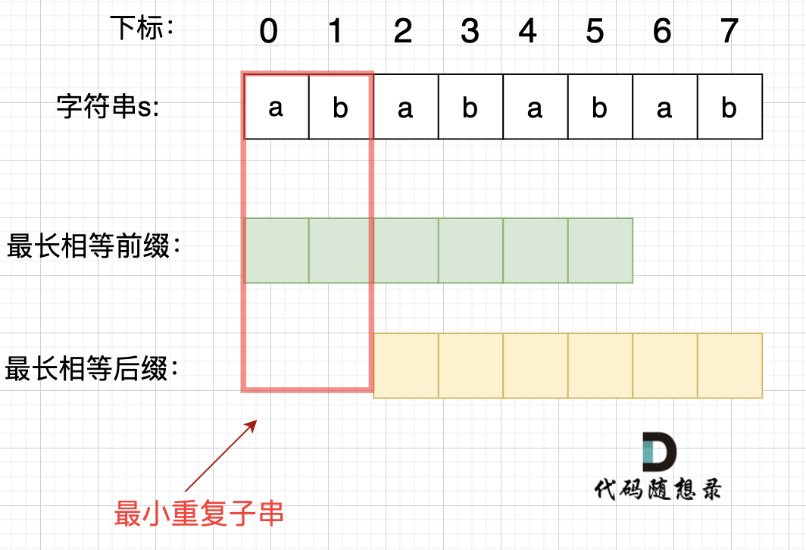
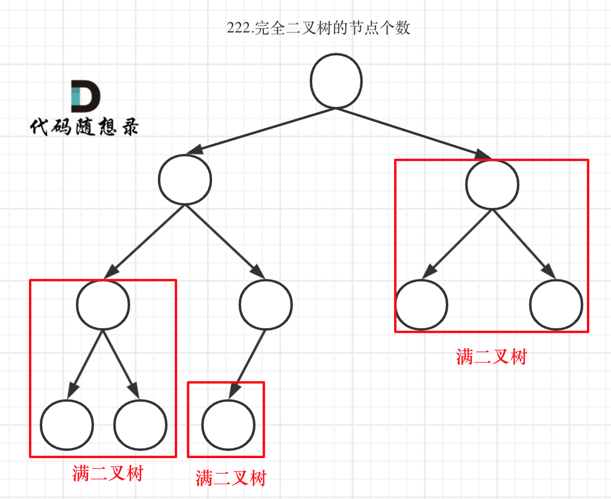
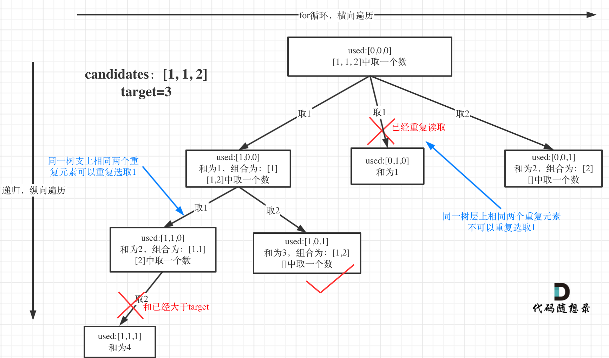
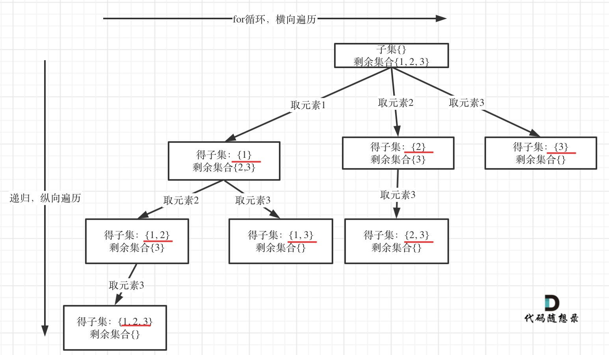

# 目录

[TOC]

# 技巧：

#### 1）自定义排序

- 将数组按照绝对值大小从大到小排序

```
static bool cmp(int a, int b) {
    return abs(a) > abs(b);
}

sort(A.begin(), A.end(), cmp);       // 第一步
```

- 对输入的区间列表 intervals 按照每个区间的起始位置从小到大排序

```
static bool cmp(const vector<int>& a, const vector<int>& b){
	return a[0] < b[0];
}
vector<vector<int>> result;
sort(intervals.begin(), intervals.end(), cmp);
```


#### 2)求10的n次方

```
#include <cmath>
// 例如 n 为 3
double result = std::pow(10, n);
```

#### 3)数组最后一个元素

```
intervals = [[1,3],[2,6],[8,10],[15,18]]
//有如下
intervals.back()[1] = 18
```

#### 4）构建有向图

[207. 课程表](https://leetcode.cn/problems/course-schedule/)

```c++
#include <vector>
#include <queue>

using namespace std;

class Solution {
public:
    bool canFinish(int numCourses, vector<vector<int>>& prerequisites) {
        // 初始化邻接表和入度数组
        vector<vector<int>> graph(numCourses);
        vector<int> indegree(numCourses, 0);

        // 构建图和统计每个课程的入度
        for (auto& pre : prerequisites) {
            graph[pre[1]].push_back(pre[0]);
            indegree[pre[0]]++;
        }

        // 将所有入度为 0 的课程加入队列
        queue<int> q;
        for (int i = 0; i < numCourses; ++i) {
            if (indegree[i] == 0) {
                q.push(i);
            }
        }

        // 拓扑排序过程
        while (!q.empty()) {
            int course = q.front();
            q.pop();
            numCourses--;

            // 遍历当前课程的所有后续课程
            for (int& nextCourse : graph[course]) {
                indegree[nextCourse]--;  // 将后续课程的入度减少 1
                if (indegree[nextCourse] == 0) {
                    q.push(nextCourse); // 如果后续课程的入度变为 0，则将其加入队列
                }
            }
        }

        // 如果所有课程都被处理过，则说明可以完成所有课程
        return numCourses == 0;
    }
};

```


# 一、数组


# 二、链表


### [707. 设计链表](https://leetcode.cn/problems/design-linked-list/)

```C++
class MyLinkedList {
public:
    // 定义链表节点结构体
    struct LinkedNode {
        int val;
        LinkedNode* next;
        LinkedNode(int val):val(val), next(nullptr){}
    };

    // 初始化链表
    MyLinkedList() {
        _dummyHead = new LinkedNode(0); // 这里定义的头结点 是一个虚拟头结点，而不是真正的链表头结点
        _size = 0;
    }

    // 获取到第index个节点数值，如果index是非法数值直接返回-1， 注意index是从0开始的，第0个节点就是头结点
    int get(int index) {
        if (index > (_size - 1) || index < 0) {
            return -1;
        }
        LinkedNode* cur = _dummyHead->next;  // cur要指向头节点，而不是_dummyHead
        while(index--){ // 如果--index 就会陷入死循环
            cur = cur->next;
        }
        return cur->val;
    }

    // 在链表最前面插入一个节点，插入完成后，新插入的节点为链表的新的头结点
    void addAtHead(int val) {
        LinkedNode* newNode = new LinkedNode(val);
        newNode->next = _dummyHead->next;
        _dummyHead->next = newNode;
        _size++;
    }

    // 在链表最后面添加一个节点
    void addAtTail(int val) {
        LinkedNode* newNode = new LinkedNode(val);
        LinkedNode* cur = _dummyHead;
        while(cur->next != nullptr){
            cur = cur->next;
        }
        cur->next = newNode;
        _size++;
    }

    // 在第index个节点之前插入一个新节点，例如index为0，那么新插入的节点为链表的新头节点。
    // 如果index 等于链表的长度，则说明是新插入的节点为链表的尾结点
    // 如果index大于链表的长度，则返回空
    // 如果index小于0，则在头部插入节点
    void addAtIndex(int index, int val) {

        if(index > _size) return;
        // if(index < 0) index = 0;        
        if(index < 0) return;        
        LinkedNode* newNode = new LinkedNode(val);
        LinkedNode* cur = _dummyHead;
        while(index--) {
            cur = cur->next;
        }
        newNode->next = cur->next;
        cur->next = newNode;
        _size++;
    }

    // 删除第index个节点，如果index 大于等于链表的长度，直接return，注意index是从0开始的
    void deleteAtIndex(int index) {
        if (index >= _size || index < 0) {
            return;
        }
        LinkedNode* cur = _dummyHead;
        while(index--) {
            cur = cur ->next;
        }
        LinkedNode* tmp = cur->next;
        cur->next = cur->next->next;
        delete tmp;
        //delete命令指示释放了tmp指针原本所指的那部分内存，
        //被delete后的指针tmp的值（地址）并非就是NULL，而是随机值。也就是被delete后，
        //如果不再加上一句tmp=nullptr,tmp会成为乱指的野指针
        //如果之后的程序不小心使用了tmp，会指向难以预想的内存空间
        tmp=nullptr;
        _size--;
    }

    // 打印链表
    // void printLinkedList() {
    //     LinkedNode* cur = _dummyHead;
    //     while (cur->next != nullptr) {
    //         cout << cur->next->val << " ";
    //         cur = cur->next;
    //     }
    //     cout << endl;
    // }
private:
    int _size;
    LinkedNode* _dummyHead;

};
```


### [24. 两两交换链表中的节点](https://leetcode.cn/problems/swap-nodes-in-pairs/)

##### 考点：节点交换三部曲


```
        //注意条件顺序，防止空指针异常
        while(cur->next != nullptr && cur->next->next != nullptr){
            ListNode* tmp = cur->next;
            ListNode* tmp1 = cur->next->next->next;

            //开始交换
            cur->next = cur->next->next;
            cur->next->next = tmp;
            cur->next->next->next = tmp1;

            //移动到下一个交换位
            cur = cur->next->next;
        }
```


### [19. 删除链表的倒数第 N 个结点](https://leetcode.cn/problems/remove-nth-node-from-end-of-list/)

##### 考点：快慢指针找倒数第N节点

双指针的经典应用，如果要删除倒数第n个节点，让fast移动n步，然后让fast和slow同时移动，直到fast指向链表末尾。删掉slow所指向的节点就可以了。

- tips: fast首先走n + 1步 ，为什么是n+1呢，因为只有这样同时移动的时候slow才能指向删除节点的上一个节点（方便做删除操作）


### [面试题 02.07. 链表相交](https://leetcode.cn/problems/intersection-of-two-linked-lists-lcci/)

> https://programmercarl.com/%E9%9D%A2%E8%AF%95%E9%A2%9802.07.%E9%93%BE%E8%A1%A8%E7%9B%B8%E4%BA%A4.html#%E6%80%9D%E8%B7%AF


##### 考点：交点不是数值相等，而是指针相等

简单来说，就是求两个链表交点节点的**指针**。 这里要注意，**交点不是数值相等，而是指针相等**。

```
        ListNode* curA = headA;
        ListNode* curB = headB;
```

1. 求链表A、B的长度，然后让curA 、curB重新指向头节点

2. 让curA为最长链表的头，lenA为其长度

   ```
           if (lenB > lenA) {
               swap (lenA, lenB);
               swap (curA, curB);
           }
   ```

3. 求长度差，让curA和curB在同一起点上（末尾位置对齐）

   ```
           while (gap--) {
               curA = curA->next;
           }
   ```

4. 遍历curA 和 curB，遇到相同则直接返回

```c++
class Solution {
public:
    ListNode *getIntersectionNode(ListNode *headA, ListNode *headB) {
        ListNode* curA = headA;
        ListNode* curB = headB;
        int lenA = 0, lenB = 0;
        while (curA != NULL) { // 求链表A的长度
            lenA++;
            curA = curA->next;
        }
        while (curB != NULL) { // 求链表B的长度
            lenB++;
            curB = curB->next;
        }
        curA = headA;
        curB = headB;
        // 让curA为最长链表的头，lenA为其长度
        if (lenB > lenA) {
            swap (lenA, lenB);
            swap (curA, curB);
        }
        // 求长度差
        int gap = lenA - lenB;
        // 让curA和curB在同一起点上（末尾位置对齐）
        while (gap--) {
            curA = curA->next;
        }
        // 遍历curA 和 curB，遇到相同则直接返回
        while (curA != NULL) {
            if (curA == curB) {
                return curA;
            }
            curA = curA->next;
            curB = curB->next;
        }
        return NULL;
    }
};
```

**另一种解法：更简洁！**

```c++
class Solution {
public:
    ListNode *getIntersectionNode(ListNode *headA, ListNode *headB) {
        // p1 指向 A 链表头结点，p2 指向 B 链表头结点
        ListNode* p1 = headA, *p2 = headB;
        while(p1!=p2)
        {
            // p1 走一步，如果走到 A 链表末尾，转到 B 链表
            if(p1 == nullptr)   
                p1 = headB;
            else
                p1 = p1->next;
            // p2 走一步，如果走到 B 链表末尾，转到 A 链表
            if(p2 == nullptr)
                p2 = headA;
            else
                p2 = p2->next;
        }
        return p1;
    }
};
```


### [142. 环形链表 II](https://leetcode.cn/problems/linked-list-cycle-ii/)

题意： 给定一个链表，返回链表开始入环的第一个节点。 如果链表无环，则返回 null。

##### 一、判断链表是否有环

```
可以使用快慢指针法，分别定义 fast 和 slow 指针，从头结点出发，fast指针每次移动两个节点，slow指针每次移动一个节点，如果 fast 和 slow指针在途中相遇 ，说明这个链表有环。

为什么？其实相对于slow来说，fast是一个节点一个节点的靠近slow的，所以fast一定可以和slow重合。
```

##### 二、如果有环，如何找到这个环的入口

```
假设从头结点到环形入口节点 的节点数为x。 环形入口节点到 fast指针与slow指针相遇节点 节点数为y。 从相遇节点 再到环形入口节点节点数为 z。
那么：
从头结点出发一个指针，从相遇节点 也出发一个指针，这两个指针每次只走一个节点， 那么当这两个指针相遇的时候就是 环形入口的节点。
```


# 三、哈希表

### **技巧1：什么时候使用哈希法**？

**当我们需要查询一个元素是否出现过，或者一个元素是否在集合里的时候，就要第一时间想到哈希法。**

### 技巧2：数组和set来做哈希法的局限

- 数组的大小是受限制的，而且如果元素很少，而哈希值太大会造成内存空间的浪费。
- set是一个集合，里面放的元素只能是一个key，而两数之和这道题目，不仅要判断y是否存在而且还要记录y的下标位置，因为要返回x 和 y的下标。所以set 也不能用。


> 当我们要使用集合来解决哈希问题的时候，优先使用unordered_set，因为它的查询和增删效率是最优的，如果需要集合是有序的，那么就用set，如果要求不仅有序还要有重复数据的话，那么就用multiset。

### [242. 有效的字母异位词](https://leetcode.cn/problems/valid-anagram/)

给定两个字符串 `*s*` 和 `*t*` ，编写一个函数来判断 `*t*` 是否是 `*s*` 的字母异位词。

**注意：**若 `*s*` 和 `*t*` 中每个字符出现的次数都相同，则称 `*s*` 和 `*t*` 互为字母异位词。

##### **技巧1：数组做哈希表**

——因为数值少 就26个

##### **技巧2：record[s[i] - 'a']**

```C++
class Solution {
public:
    bool isAnagram(string s, string t) {
        int record[26] = {0};
        for (int i = 0; i < s.size(); i++) {
            // 并不需要记住字符a的ASCII，只要求出一个相对数值就可以了
            record[s[i] - 'a']++;
        }
        for (int i = 0; i < t.size(); i++) {
            record[t[i] - 'a']--;
        }
        for (int i = 0; i < 26; i++) {
            if (record[i] != 0) {
                // record数组如果有的元素不为零0，说明字符串s和t 一定是谁多了字符或者谁少了字符。
                return false;
            }
        }
        // record数组所有元素都为零0，说明字符串s和t是字母异位词
        return true;
    }
};
```


### [349. 两个数组的交集](https://leetcode.cn/problems/intersection-of-two-arrays/)

题意：给定两个数组，编写一个函数来计算它们的交集。

##### 1.考点：unordered_set

题目特意说明：**输出结果中的每个元素一定是唯一的，也就是说输出的结果的去重的， 同时可以不考虑输出结果的顺序**

unordered_set 读写效率是最高的，并不需要对数据进行排序，而且还不要让数据重复，所以选择unordered_set。

##### 2.unordered_set使用技巧

###### 初始化：

```
unordered_set<int> nums_set(nums1.begin(), nums1.end());
```

###### 查找与插入：

```
            if (nums_set.find(num) != nums_set.end()) {
                result_set.insert(num);
            }
```

###### set转vector

```
vector<int>(result_set.begin(), result_set.end());
```


### [1. 两数之和](https://leetcode.cn/problems/two-sum/)

##### 考点：**unordered_map**

数组和set来做哈希法的局限。

- 数组的大小是受限制的，而且如果元素很少，而哈希值太大会造成内存空间的浪费。
- set是一个集合，里面放的元素只能是一个key，而两数之和这道题目，不仅要判断y是否存在而且还要记录y的下标位置，因为要返回x 和 y的下标。所以set 也不能用。


本题其实有四个重点：

- 为什么会想到用哈希表
  - 本题，我们不仅要知道元素有没有遍历过，还要知道这个元素对应的下标，**需要使用 key value结构来存放，key来存元素，value来存下标，那么使用map正合适**。
- 哈希表为什么用map
  - **这道题目中并不需要key有序，选择std::unordered_map 效率更高！**
- 本题map是用来存什么的
  - map目的用来存放我们访问过的元素，因为遍历数组的时候，需要记录我们之前遍历过哪些元素和对应的下标，这样才能找到与当前元素相匹配的（也就是相加等于target）
- map中的key和value用来存什么的
  - {key：数据元素，value：数组元素对应的下标}

##### unordered_map的使用技巧

###### 查找、key与value的访问、插入

```C++
            auto iter = map.find(target - nums[i]); 
            if(iter != map.end()) {
                return {iter->second, i};
            }
            // 如果没找到匹配对，就把访问过的元素和下标加入到map中
            map.insert(pair<int, int>(nums[i], i)); 
```


### [454. 四数相加 II](https://leetcode.cn/problems/4sum-ii/)

本题解题步骤：

1. 首先定义 一个unordered_map，key放a和b两数之和，value 放a和b两数之和出现的次数。
2. 遍历大A和大B数组，统计两个数组元素之和，和出现的次数，放到map中。
3. 定义int变量count，用来统计 a+b+c+d = 0 出现的次数。
4. 在遍历大C和大D数组，找到如果 0-(c+d) 在map中出现过的话，就用count把map中key对应的value也就是出现次数统计出来。
5. 最后返回统计值 count 就可以了

```C++
class Solution {
public:
    int fourSumCount(vector<int>& A, vector<int>& B, vector<int>& C, vector<int>& D) {
        unordered_map<int, int> umap; //key:a+b的数值，value:a+b数值出现的次数
        // 遍历大A和大B数组，统计两个数组元素之和，和出现的次数，放到map中
        for (int a : A) {
            for (int b : B) {
                umap[a + b]++;
            }
        }
        int count = 0; // 统计a+b+c+d = 0 出现的次数
        // 在遍历大C和大D数组，找到如果 0-(c+d) 在map中出现过的话，就把map中key对应的value也就是出现次数统计出来。
        for (int c : C) {
            for (int d : D) {
                if (umap.find(0 - (c + d)) != umap.end()) {
                    count += umap[0 - (c + d)];
                }
            }
        }
        return count;
    }
};
```


### [202. 快乐数](https://leetcode.cn/problems/happy-number/)

> 编写一个算法来判断一个数 n 是不是快乐数。
>
> 「快乐数」定义为：对于一个正整数，每一次将该数替换为它每个位置上的数字的平方和，然后重复这个过程直到这个数变为 1，也可能是 无限循环 但始终变不到 1。如果 可以变为 1，那么这个数就是快乐数。
>
> 如果 n 是快乐数就返回 True ；不是，则返回 False 。

解法：

```
题目中说了会 无限循环，那么也就是说求和的过程中，sum会重复出现，这对解题很重要！当我们遇到了要快速判断一个元素是否出现集合里的时候，就要考虑哈希法了。
所以这道题目使用哈希法，来判断这个sum是否重复出现，如果重复了就是return false， 否则一直找到sum为1为止。

判断sum是否重复出现就可以使用unordered_set。
```


###### 难点：**取数值各个位上的单数操作**


### [383. 赎金信](https://leetcode.cn/problems/ransom-note/)

给你两个字符串：ransomNote 和 magazine ，判断 ransomNote 能不能由 magazine 里面的字符构成。

如果可以，返回 true ；否则返回 false 。

magazine 中的每个字符只能在 ransomNote 中使用一次。

```C++
class Solution {
public:
    bool canConstruct(string ransomNote, string magazine) {
        int record[26] = {0};
        //add
        if (ransomNote.size() > magazine.size()) {
            return false;
        }
        for (int i = 0; i < magazine.length(); i++) {
            // 通过record数据记录 magazine里各个字符出现次数
            record[magazine[i]-'a'] ++;
        }
        for (int j = 0; j < ransomNote.length(); j++) {
            // 遍历ransomNote，在record里对应的字符个数做--操作
            record[ransomNote[j]-'a']--;
            // 如果小于零说明ransomNote里出现的字符，magazine没有
            if(record[ransomNote[j]-'a'] < 0) {
                return false;
            }
        }
        return true;
    }
};
```


# 四、双指针

### [15. 三数之和](https://leetcode.cn/problems/3sum/)

给你一个包含 n 个整数的数组 nums，判断 nums 中是否存在三个元素 a，b，c ，使得 a + b + c = 0 ？请你找出所有满足条件且不重复的三元组。

**其实这道题目使用哈希法并不十分合适**，接下来我来介绍另一个解法：双指针法，**这道题目使用双指针法 要比哈希法高效一些**


1. 首先将数组排序，然后有一层for循环，i从下标0的地方开始，同时定一个下标left 定义在i+1的位置上，定义下标right 在数组结尾的位置上。
2. 如果nums[i] + nums[left] + nums[right] > 0 就说明 此时三数之和大了，因为数组是排序后了，所以right下标就应该向左移动，这样才能让三数之和小一些。
3. 如果 nums[i] + nums[left] + nums[right] < 0 说明 此时 三数之和小了，left 就向右移动，才能让三数之和大一些，直到left与right相遇为止。

###### 易错点1：nums[i] == nums[i + 1]

###### 难点：如何去重

```C++
class Solution {
public:
    vector<vector<int>> threeSum(vector<int>& nums) {
        vector<vector<int>> result;
        sort(nums.begin(), nums.end());
        // 找出a + b + c = 0
        // a = nums[i], b = nums[left], c = nums[right]
        for (int i = 0; i < nums.size(); i++) {
            // 排序之后如果第一个元素已经大于零，那么无论如何组合都不可能凑成三元组，直接返回结果就可以了
            if (nums[i] > 0) {
                return result;
            }
            // 错误去重a方法，将会漏掉-1,-1,2 这种情况， 判断成了结果集里不能有重复元素
            /*
            if (nums[i] == nums[i + 1]) {
                continue;
            }
            */
            // 正确去重a方法
            if (i > 0 && nums[i] == nums[i - 1]) {
                continue;
            }
            int left = i + 1;
            int right = nums.size() - 1;
            //right == left 时， 这两个指针都指向了同一个数，这时变成了“两数之和”
            while (right > left) {
                // 去重复逻辑如果放在这里，0，0，0 的情况，可能直接导致 right<=left 了，从而漏掉了 0,0,0 这种三元组
                /*
                while (right > left && nums[right] == nums[right - 1]) right--;
                while (right > left && nums[left] == nums[left + 1]) left++;
                */
                if (nums[i] + nums[left] + nums[right] > 0) right--;
                else if (nums[i] + nums[left] + nums[right] < 0) left++;
                else { // 等于0，收获结果
                    result.push_back(vector<int>{nums[i], nums[left], nums[right]});
                    // 去重逻辑应该放在找到一个三元组之后，对b 和 c去重
                    while (right > left && nums[right] == nums[right - 1]) right--;
                    while (right > left && nums[left] == nums[left + 1]) left++;

                    // 找到答案时，双指针同时收缩
                    right--;
                    left++;
                }
            }

        }
        return result;
    }
};
```


### [18. 四数之和](https://leetcode.cn/problems/4sum/)

三数之和的双指针解法是一层for循环num[i]为确定值，然后循环内有left和right下标作为双指针，找到nums[i] + nums[left] + nums[right] == 0。

四数之和的双指针解法是两层for循环nums[k] + nums[i]为确定值，依然是循环内有left和right下标作为双指针，找出nums[k] + nums[i] + nums[left] + nums[right] == target的情况，三数之和的时间复杂度是O(n^2)，四数之和的时间复杂度是O(n^3) 。

所以，四数之和，和[15.三数之和 (opens new window)](https://programmercarl.com/0015.三数之和.html)是一个思路，都是使用双指针法, 基本解法就是在[15.三数之和 (opens new window)](https://programmercarl.com/0015.三数之和.html)的基础上再套一层for循环。

但是有一些细节需要注意，例如： 不要判断`nums[k] > target` 就返回了，三数之和 可以通过 `nums[i] > 0` 就返回了，因为 0 已经是确定的数了，四数之和这道题目 target是任意值。比如：数组是`[-4, -3, -2, -1]`，`target`是`-10`，不能因为`-4 > -10`而跳过。但是我们依旧可以去做剪枝，逻辑变成`nums[i] > target && (nums[i] >=0 || target >= 0)`就可以了。

```C++
class Solution {
public:
    vector<vector<int>> fourSum(vector<int>& nums, int target) {
        vector<vector<int>> result;
        sort(nums.begin(), nums.end());
        for (int k = 0; k < nums.size(); k++) {
            // 剪枝处理
            if (nums[k] > target && nums[k] >= 0) {
            	break; // 这里使用break，统一通过最后的return返回
            }
            // 对nums[k]去重
            if (k > 0 && nums[k] == nums[k - 1]) {
                continue;
            }
            for (int i = k + 1; i < nums.size(); i++) {
                // 2级剪枝处理
                if (nums[k] + nums[i] > target && nums[k] + nums[i] >= 0) {
                    break;
                }

                // 对nums[i]去重
                if (i > k + 1 && nums[i] == nums[i - 1]) {
                    continue;
                }
                int left = i + 1;
                int right = nums.size() - 1;
                while (right > left) {
                    // nums[k] + nums[i] + nums[left] + nums[right] > target 会溢出
                    if ((long) nums[k] + nums[i] + nums[left] + nums[right] > target) {
                        right--;
                    // nums[k] + nums[i] + nums[left] + nums[right] < target 会溢出
                    } else if ((long) nums[k] + nums[i] + nums[left] + nums[right]  < target) {
                        left++;
                    } else {
                        result.push_back(vector<int>{nums[k], nums[i], nums[left], nums[right]});
                        // 对nums[left]和nums[right]去重
                        while (right > left && nums[right] == nums[right - 1]) right--;
                        while (right > left && nums[left] == nums[left + 1]) left++;

                        // 找到答案时，双指针同时收缩
                        right--;
                        left++;
                    }
                }

            }
        }
        return result;
    }
};
```


# 五、字符串

### [344. 反转字符串](https://leetcode.cn/problems/reverse-string/)

解法：定义两个指针（也可以说是索引下标），一个从字符串前面，一个从字符串后面，两个指针同时向中间移动，并交换元素。

```C++
void reverseString(vector<char>& s) {
    for (int i = 0, j = s.size() - 1; i < s.size()/2; i++, j--) {
        swap(s[i],s[j]);
    }
}
//or
int left = 0, right = s.size() - 1;
while(left < right){
    swap(s[left], s[right]);
    left++;
    right--;
}
```


### [541. 反转字符串 II](https://leetcode.cn/problems/reverse-string-ii/)

> 给定一个字符串 `s` 和一个整数 `k`，从字符串开头算起，每计数至 `2k` 个字符，就反转这 `2k` 字符中的前 `k` 个字符。
>
> - 如果剩余字符少于 `k` 个，则将剩余字符全部反转。
> - 如果剩余字符小于 `2k` 但大于或等于 `k` 个，则反转前 `k` 个字符，其余字符保持原样。

```C++
class Solution {
public:
    void reverse(string& s, int start, int end) {
        for (int i = start, j = end; i < j; i++, j--) {
            swap(s[i], s[j]);
        }
    }
    string reverseStr(string s, int k) {
        for (int i = 0; i < s.size(); i += (2 * k)) {
            // 1. 每隔 2k 个字符的前 k 个字符进行反转
            // 2. 剩余字符小于 2k 但大于或等于 k 个，则反转前 k 个字符
            if (i + k <= s.size()) {
                reverse(s, i, i + k - 1);
                continue;
            }
            // 3. 剩余字符少于 k 个，则将剩余字符全部反转。
            reverse(s, i, s.size() - 1);
        }
        return s;
    }
};
```


### 替换数字

给定一个字符串 s，它包含小写字母和数字字符，请编写一个函数，将字符串中的字母字符保持不变，而将每个数字字符替换为number。

例如，对于输入字符串 "a1b2c3"，函数应该将其转换为 "anumberbnumbercnumber"。

1. 首先扩充数组到每个数字字符替换成 "number" 之后的大小。

   

2. 然后从后向前替换数字字符，也就是双指针法，过程如下：i指向新长度的末尾，j指向旧长度的末尾。


```C++
#include<iostream>
using namespace std;
int main() {
    string s;
    while (cin >> s) {
        int count = 0; // 统计数字的个数
        int sOldSize = s.size();
        for (int i = 0; i < s.size(); i++) {
            if (s[i] >= '0' && s[i] <= '9') {
                count++;
            }
        }
        // 扩充字符串s的大小，也就是每个空格替换成"number"之后的大小
        s.resize(s.size() + count * 5);
        int sNewSize = s.size();
        // 从后先前将空格替换为"number"
        for (int i = sNewSize - 1, j = sOldSize - 1; j < i; i--, j--) {
            if (s[j] > '9' || s[j] < '0') {
                s[i] = s[j];
            } else {
                s[i] = 'r';
                s[i - 1] = 'e';
                s[i - 2] = 'b';
                s[i - 3] = 'm';
                s[i - 4] = 'u';
                s[i - 5] = 'n';
                i -= 5;
            }
        }
        cout << s << endl;
    }
}

```


### [151. 反转字符串中的单词](https://leetcode.cn/problems/reverse-words-in-a-string/)

给定一个字符串，逐个翻转字符串中的每个单词。

解题步骤：

- **移除多余空格** : "the sky is blue"
- 将整个字符串反转："eulb si yks eht"
- 将每个单词反转："blue is sky the"

```C++
class Solution {
public:
    void reverse(string& s, int start, int end){ //翻转，区间写法：左闭右闭 []
        for (int i = start, j = end; i < j; i++, j--) {
            swap(s[i], s[j]);
        }
    }  

    void removeExtraSpaces(string& s) {//去除所有空格并在相邻单词之间添加空格, 快慢指针。
        int slow = 0;   //整体思想参考https://programmercarl.com/0027.移除元素.html
        for (int i = 0; i < s.size(); ++i) { //
            if (s[i] != ' ') { //遇到非空格就处理，即删除所有空格。
                if (slow != 0) s[slow++] = ' '; //手动控制空格，给单词之间添加空格。slow != 0说明不是第一个单词，需要在单词前添加空格。
                while (i < s.size() && s[i] != ' ') { //补上该单词，遇到空格说明单词结束。
                    s[slow++] = s[i++];
                }
            }
        }
        s.resize(slow); //slow的大小即为去除多余空格后的大小。
    }

    string reverseWords(string s) {
        removeExtraSpaces(s); //去除多余空格，保证单词之间之只有一个空格，且字符串首尾没空格。
        reverse(s, 0, s.size() - 1);
        int start = 0; //removeExtraSpaces后保证第一个单词的开始下标一定是0。
        //选择 i <= s.size() 作为循环条件，确保了最后一个单词也能被正确地翻转并更新其开始下标
        for (int i = 0; i < s.size(); ++i) {
            if ( s[i] == ' ') { //到达空格，说明一个单词结束。进行翻转。
                reverse(s, start, i - 1); //翻转，注意是左闭右闭 []的翻转。
                start = i + 1; //更新下一个单词的开始下标start
            }
            if(i == s.size() - 1){   //到达串尾，说明一个单词结束。进行翻转
                reverse(s, start, i);
            }
        }
        return s;
    }
};

//或者
        for (int i = 0; i <= s.size(); ++i) {
            if (i == s.size() || s[i] == ' ') { //到达空格或者串尾，说明一个单词结束。进行翻转。
                reverse(s, start, i - 1); //翻转，注意是左闭右闭 []的翻转。
                start = i + 1; //更新下一个单词的开始下标start
            }
        }
```

###### 难点：**移除多余空格** 


###  右旋字符串

[卡码网题目链接](https://kamacoder.com/problempage.php?pid=1065)

字符串的右旋转操作是把字符串尾部的若干个字符转移到字符串的前面。给定一个字符串 s 和一个正整数 k，请编写一个函数，将字符串中的后面 k 个字符移到字符串的前面，实现字符串的右旋转操作。

> 样例输入：
>
> ```text
> 2
> abcdefg 
> ```
>
> 样例输出：
>
> ```text
> fgabcde
> ```

思路：

```C++
    int len = s.size(); //获取长度

    reverse(s.begin(), s.end()); // 整体反转
    reverse(s.begin(), s.begin() + n); // 先反转前一段，长度n
    reverse(s.begin() + n, s.end()); // 再反转后一段
```


### [28. 找出字符串中第一个匹配项的下标](https://leetcode.cn/problems/find-the-index-of-the-first-occurrence-in-a-string/)

> 给你两个字符串 `haystack` 和 `needle` ，请你在 `haystack` 字符串中找出 `needle` 字符串的第一个匹配项的下标（下标从 0 开始）。如果 `needle` 不是 `haystack` 的一部分，则返回 `-1`

###### KMP的经典思想:

**当出现字符串不匹配时，可以记录一部分之前已经匹配的文本内容，利用这些信息避免从头再去做匹配。**

```C++
class Solution {
public:
    // 求next数组
    void getNext(int* next, const string& s) {
        int j = 0;
        next[0] = 0; // 初始化next数组的第一个元素为0
        for (int i = 1; i < s.size(); i++) {
            while (j > 0 && s[i] != s[j]) {
                j = next[j - 1]; // 回溯到前一个匹配点
            }
            if (s[i] == s[j]) {
                j++; // 匹配成功，移动指针
            }
            next[i] = j; // 更新next数组
        }
    }

    int strStr(string haystack, string needle) {
        int next[needle.size()];
        getNext(next, needle); // 获取needle字符串的next数组
        int j = 0;
        for (int i = 0; i < haystack.size(); i++) {
            while (j > 0 && haystack[i] != needle[j]) {
                j = next[j - 1]; // 在匹配失败时回溯
            }
            if (haystack[i] == needle[j]) {
                j++; // 匹配成功，移动指针
            }
            //j 表示当前匹配的字符数，当 j 等于 needle.size() 时，说明整个子串都已经匹配成功
            if (j == needle.size()) {
                return (i - needle.size() + 1); // 返回匹配的起始位置
            }
        }
        return -1; // 未找到匹配子串
    }
};

```

对于：

```
if (j == needle.size()) {
    return (i - needle.size() + 1); // 返回匹配的起始位置
}
举个例子：
如果 `needle` 是 "abc"，而 `haystack` 是 "xyzabc"，当匹配到 "abc" 时，`i` 的位置是 5，`needle.size()` 是 3，所以匹配的起始位置就是 `5 - 3 + 1 = 3`。因此，返回值是匹配的起始位置。
```


### [459. 重复的子字符串](https://leetcode.cn/problems/repeated-substring-pattern/)

> 给定一个非空的字符串，判断它是否可以由它的一个子串重复多次构成。给定的字符串只含有小写英文字母，并且长度不超过10000。


###### 方法一：移动匹配

当一个字符串s：abcabc，内部由重复的子串组成，**判断字符串s是否由重复子串组成，只要两个s拼接在一起，里面还出现一个s的话，就说明是由重复子串组成。**

注意：在判断 s + s 拼接的字符串里是否出现一个s的的时候，**要刨除 s + s 的首字符和尾字符**，这样避免在s+s中搜索出原来的s，我们要搜索的是中间拼接出来的s。


```C++
#include <string>
class Solution {
public:
    bool repeatedSubstringPattern(string s) {
        string t = s + s;
        t.erase(t.begin()); t.erase(t.end() - 1); // 掐头去尾
        if (t.find(s) != std::string::npos) return true; // r
        return false;
    }
};
```

###### 拓展知识：std::string::npos

> 在 `std::string` 类中，`npos` 是一个常量，通常被定义为 `size_t` 类型的最大值，即 `std::numeric_limits<std::size_t>::max()`。这个值在字符串查找等操作中表示未找到匹配项。例如，**在 `find` 函数中，如果找不到子串，会返回 `std::string::npos`。**
>
> 在使用 `find` 进行查找时，检查返回值是否等于 `std::string::npos` 是一种常见的方式来判断查找是否成功。**如果返回值不等于 `npos`，则说明找到了匹配项；如果返回值等于 `npos`，则说明未找到匹配项。**


###### 方法二：KMP

- **在一个串中查找是否出现过另一个串，这是KMP的看家本领**

结论：

由**重复子串组成的字符串**中，**最长相等前后缀不包含的子串就是最小重复子串**，这里拿字符串s：abababab 来举例，ab就是最小重复单位，如图所示：




# 六、栈与队列

### [232. 用栈实现队列](https://leetcode.cn/problems/implement-queue-using-stacks/)

> 使用栈实现队列的下列操作：
>
> push(x) -- 将一个元素放入队列的尾部。
> pop() -- 从队列首部移除元素。
> peek() -- 返回队列首部的元素。
> empty() -- 返回队列是否为空。


使用栈来模式队列的行为，需要两个栈**一个输入栈，一个输出栈**，这里要注意输入栈和输出栈的关系。

```
queue.push(1);
queue.push(2);
queue.pop(); 注意此时的输出栈的操作
queue.push(3);
queue.push(4);
queue.pop();
queue.pop();注意此时的输出栈的操作
queue.pop();
queue.empty();
```


分析：

- 在push数据的时候，只要数据放进输入栈就好
- **在pop的时候**
  - **输出栈如果为空，就把进栈数据全部导入进来（注意是全部导入）**，再从出栈弹出数据
  - 输出栈不为空，则直接从出栈弹出数据就可以了。
- 判断队列为空
  - **如果进栈和出栈都为空的话，说明模拟的队列为空了。**
- pop() 和 peek()两个函数功能类似，代码实现上也是类似的
  - 直接使用已有的pop函数弹出首原属，因为pop函数弹出了元素res，所以再添加回去。

```c++
class MyQueue {
public:
    stack<int> stIn;
    stack<int> stOut;
    /** Initialize your data structure here. */
    MyQueue() {

    }
    /** Push element x to the back of queue. */
    void push(int x) {
        stIn.push(x);
    }

    /** Removes the element from in front of queue and returns that element. */
    int pop() {
        // 只有当stOut为空的时候，再从stIn里导入数据（导入stIn全部数据）
        if (stOut.empty()) {
            // 从stIn导入数据直到stIn为空
            while(!stIn.empty()) {
                stOut.push(stIn.top());
                stIn.pop();
            }
        }
        int result = stOut.top();
        stOut.pop();
        return result;
    }

    /** Get the front element. */
    int peek() {
        int res = this->pop(); // 直接使用已有的pop函数
        stOut.push(res); // 因为pop函数弹出了元素res，所以再添加回去
        return res;
    }

    /** Returns whether the queue is empty. */
    bool empty() {
        return stIn.empty() && stOut.empty();
    }
};

```


### [225. 用队列实现栈](https://leetcode.cn/problems/implement-stack-using-queues/)

> 使用队列实现栈的下列操作：
>
> - push(x) -- 元素 x 入栈
> - pop() -- 移除栈顶元素
> - top() -- 获取栈顶元素
> - empty() -- 返回栈是否为空

**用两个队列que1和que2实现队列的功能，que2其实完全就是一个备份的作用**，把que1最后面的元素以外的元素都备份到que2，然后弹出最后面的元素，再把其他元素从que2导回que1。

```
queue.push(1);        
queue.push(2);        
queue.pop();   // 注意弹出的操作       
queue.push(3);        
queue.push(4);       
queue.pop();  // 注意弹出的操作    
queue.pop();    
queue.pop();    
queue.empty();    
```


先创建两个队列que1、que2，以及初始化栈

- push(x) -- 元素 x 入栈

  - `que1.push(x);` 即：直接push进que1

- pop() -- 移除栈顶元素

  - 获取que1大小，将que1 导入que2，但要留下最后一个元素

  - 留下的最后一个元素就是要返回的值，记录最后一个元素之后 que1.pop()
  - 再将que2赋值给que1，清空que2，返回记录的元素

  ```C++
      int pop() {
          int size = que1.size();
          size--;
          while (size--) { // 将que1 导入que2，但要留下最后一个元素
              que2.push(que1.front());
              que1.pop();
          }
  
          int result = que1.front(); // 留下的最后一个元素就是要返回的值
          que1.pop();
          que1 = que2;            // 再将que2赋值给que1
          while (!que2.empty()) { // 清空que2
              que2.pop();
          }
          return result;
      }
  ```

- top() -- 获取栈顶元素

  - `return que1.back();`

- empty() -- 返回栈是否为空

  - `return que1.empty();`


优化：用一个队列就够了

**一个队列在模拟栈弹出元素的时候只要将队列头部的元素（除了最后一个元素外） 重新添加到队列尾部，此时再去弹出元素就是栈的顺序了。**

```C++
class MyStack {
public:
    queue<int> que;
    /** Initialize your data structure here. */
    MyStack() {

    }
    /** Push element x onto stack. */
    void push(int x) {
        que.push(x);
    }
    /** Removes the element on top of the stack and returns that element. */
    int pop() {
        int size = que.size();
        size--;
        while (size--) { // 将队列头部的元素（除了最后一个元素外） 重新添加到队列尾部
            que.push(que.front());
            que.pop();
        }
        int result = que.front(); // 此时弹出的元素顺序就是栈的顺序了
        que.pop();
        return result;
    }

    /** Get the top element. */
    int top() {
        return que.back();
    }

    /** Returns whether the stack is empty. */
    bool empty() {
        return que.empty();
    }
};
```


### [20. 有效的括号](https://leetcode.cn/problems/valid-parentheses/)

> 给定一个只包括 `'('`，`')'`，`'{'`，`'}'`，`'['`，`']'` 的字符串 `s` ，判断字符串是否有效。
>
> 有效字符串需满足：
>
> 1. 左括号必须用相同类型的右括号闭合。
> 2. 左括号必须以正确的顺序闭合。
> 3. 每个右括号都有一个对应的相同类型的左括号。


第一种情况：已经遍历完了字符串，但是栈不为空，说明有相应的左括号没有右括号来匹配，所以return false

第二种情况：遍历字符串匹配的过程中，发现栈里没有要匹配的字符。所以return false

第三种情况：遍历字符串匹配的过程中，栈已经为空了，没有匹配的字符了，说明右括号没有找到对应的左括号return false

> 技巧，在匹配左括号的时候，右括号先入栈，就只需要比较当前元素和栈顶相不相等就可以了，比左括号先入栈代码实现要简单的多了

```c++
class Solution {
public:
    bool isValid(string s) {
        if (s.size() % 2 != 0) return false; // 如果s的长度为奇数，一定不符合要求
        stack<char> st;
        for (int i = 0; i < s.size(); i++) {
            if (s[i] == '(') st.push(')');
            else if (s[i] == '{') st.push('}');
            else if (s[i] == '[') st.push(']');
            // 第三种情况：遍历字符串匹配的过程中，栈已经为空了，没有匹配的字符了，说明右括号没有找到对应的左括号 return false
            // 第二种情况：遍历字符串匹配的过程中，发现栈里没有我们要匹配的字符。所以return false
            else if (st.empty() || st.top() != s[i]) return false;
            else st.pop(); // st.top() 与 s[i]相等，栈弹出元素
        }
        // 第一种情况：此时我们已经遍历完了字符串，但是栈不为空，说明有相应的左括号没有右括号来匹配，所以return false，否则就return true
        return st.empty();
    }
};
```


### [1047. 删除字符串中的所有相邻重复项](https://leetcode.cn/problems/remove-all-adjacent-duplicates-in-string/)

> 示例：
>
> - 输入："abbaca"
> - 输出："ca"
> - 解释：例如，在 "abbaca" 中，我们可以删除 "bb" 由于两字母相邻且相同，这是此时唯一可以执行删除操作的重复项。之后我们得到字符串 "aaca"，其中又只有 "aa" 可以执行重复项删除操作，所以最后的字符串为 "ca"。


```c++
class Solution {
public:
    string removeDuplicates(string S) {
        stack<char> st;
        for (char s : S) {
            if (st.empty() || s != st.top()) {
                st.push(s);
            } else {
                st.pop(); // s 与 st.top()相等的情况
            }
        }
        string result = "";
        while (!st.empty()) { // 将栈中元素放到result字符串汇总
            result += st.top();
            st.pop();
        }
        //此时是字符串ac，因为从栈里弹出的元素是倒序的，所以再对字符串进行反转一下
        reverse (result.begin(), result.end()); // 此时字符串需要反转一下
        return result;

    }
};
```

优化：拿字符串直接作为栈，这样省去了栈还要转为字符串的操作。

```C++
class Solution {
public:
    string removeDuplicates(string S) {
        string result;
        for(char s : S) {
            if(result.empty() || result.back() != s) {
                result.push_back(s);
            }
            else {
                result.pop_back();
            }
        }
        return result;
    }
};
```


### [150. 逆波兰表达式求值](https://leetcode.cn/problems/evaluate-reverse-polish-notation/)

> 示例 ：
>
> - 输入: ["4", "13", "5", "/", "+"]
> - 输出: 6
> - 解释: 该算式转化为常见的中缀算术表达式为：(4 + (13 / 5)) = 6

逆波兰表达式：是一种后缀表达式，所谓后缀就是指运算符写在后面。


```C++
class Solution {
public:
    int evalRPN(vector<string>& tokens) {
        // 力扣修改了后台测试数据，需要用longlong
        stack<long long> st; 
        for (int i = 0; i < tokens.size(); i++) {
            if (tokens[i] == "+" || tokens[i] == "-" || tokens[i] == "*" || tokens[i] == "/") {
                long long num1 = st.top();
                st.pop();
                long long num2 = st.top();
                st.pop();
                if (tokens[i] == "+") st.push(num2 + num1);
                if (tokens[i] == "-") st.push(num2 - num1);
                if (tokens[i] == "*") st.push(num2 * num1);
                if (tokens[i] == "/") st.push(num2 / num1);
            } else {
                //stoll 是 C++ 中的一个函数，用于将字符串转换为 long long 类型。
                st.push(stoll(tokens[i]));
            }
        }

        int result = st.top();
        st.pop(); // 把栈里最后一个元素弹出（其实不弹出也没事）
        return result;
    }
};
```


### [239. 滑动窗口最大值](https://leetcode.cn/problems/sliding-window-maximum/)

> 给你一个整数数组 `nums`，有一个大小为 `k` 的滑动窗口从数组的最左侧移动到数组的最右侧。你只可以看到在滑动窗口内的 `k` 个数字。滑动窗口每次只向右移动一位。
>
> 返回滑动窗口中的最大值。
>
> ```c++
> 输入：nums = [1,3,-1,-3,5,3,6,7], k = 3
> 输出：[3,3,5,5,6,7]
> 解释：
> 滑动窗口的位置                最大值
> ---------------               -----
> [1  3  -1] -3  5  3  6  7       3
>  1 [3  -1  -3] 5  3  6  7       3
>  1  3 [-1  -3  5] 3  6  7       5
>  1  3  -1 [-3  5  3] 6  7       5
>  1  3  -1  -3 [5  3  6] 7       6
>  1  3  -1  -3  5 [3  6  7]      7
> ```
>
> 

###### 技巧：单调队列

设计单调队列的时候，pop，和push操作要保持如下规则：

1. pop(value)：如果窗口**移除的元素value等于单调队列的出口元素**，那么队列弹出元素，否则不用任何操作
2. push(value)：如果push的元素value大于入口元素的数值，那么就将队列入口的元素弹出，直到push元素的数值小于等于队列入口元素的数值为止

保持如上规则，每次窗口移动的时候，只要问que.front()就可以返回当前窗口的最大值。

为了更直观的感受到单调队列的工作过程，以题目示例为例，输入: nums = [1,3,-1,-3,5,3,6,7], 和 k = 3，动画如下：


```C++
class Solution {
private:
    class MyQueue { //单调队列（从大到小）
    public:
        deque<int> que; // 使用deque来实现单调队列
        // 每次弹出的时候，比较当前要弹出的数值是否等于队列出口元素的数值，如果相等则弹出。
        // 同时pop之前判断队列当前是否为空。
        void pop(int value) {
            if (!que.empty() && value == que.front()) {
                que.pop_front();
            }
        }
        // 如果push的数值大于入口元素的数值，那么就将队列后端的数值弹出，直到push的数值小于等于队列入口元素的数值为止。
        // 这样就保持了队列里的数值是单调从大到小的了。
        void push(int value) {
            while (!que.empty() && value > que.back()) {
                que.pop_back();
            }
            que.push_back(value);

        }
        // 查询当前队列里的最大值 直接返回队列前端也就是front就可以了。
        int front() {
            return que.front();
        }
    };
public:
    vector<int> maxSlidingWindow(vector<int>& nums, int k) {
        MyQueue que;
        vector<int> result;
        for (int i = 0; i < k; i++) { // 先将前k的元素放进队列
            que.push(nums[i]);
        }
        result.push_back(que.front()); // result 记录前k的元素的最大值
        for (int i = k; i < nums.size(); i++) {
            que.pop(nums[i - k]); // 滑动窗口移除最前面元素
            que.push(nums[i]); // 滑动窗口前加入最后面的元素
            result.push_back(que.front()); // 记录对应的最大值
        }
        return result;
    }
};
```


### [347. 前 K 个高频元素](https://leetcode.cn/problems/top-k-frequent-elements/)

> 给定一个非空的整数数组，返回其中出现频率前 k 高的元素。
>
> 示例 1:
>
> - 输入: nums = [1,1,1,2,2,3], k = 2
> - 输出: [1,2]

###### 考点：优先级队列

使用小顶堆呢，还是大顶堆？

> 定义一个大小为k的大顶堆，在每次移动更新大顶堆的时候，每次弹出都把最大的元素弹出去了，那么怎么保留下来前K个高频元素呢。
>
> 而且使用大顶堆就要把所有元素都进行排序，那能不能只排序k个元素呢？
>
> **所以我们要用小顶堆，因为要统计最大前k个元素，只有小顶堆每次将最小的元素弹出，最后小顶堆里积累的才是前k个最大元素。**


```C++
class Solution {
public:
    // 小顶堆
    struct mycomparison {
        bool operator()(const pair<int, int>& lhs, const pair<int, int>& rhs) {
            return lhs.second > rhs.second;
        }
    };
    vector<int> topKFrequent(vector<int>& nums, int k) {
        // 要统计元素出现频率
        unordered_map<int, int> map; // map<nums[i],对应出现的次数>
        for (int i = 0; i < nums.size(); i++) {
            map[nums[i]]++;
        }

        // 对频率排序
        // 定义一个小顶堆，大小为k
        priority_queue<pair<int, int>, vector<pair<int, int>>, mycomparison> pri_que;

        // 用固定大小为k的小顶堆，扫面所有频率的数值
        for (unordered_map<int, int>::iterator it = map.begin(); it != map.end(); it++) {
            pri_que.push(*it);
            if (pri_que.size() > k) { // 如果堆的大小大于了K，则队列弹出，保证堆的大小一直为k
                pri_que.pop();
            }
        }

        // 找出前K个高频元素，因为小顶堆先弹出的是最小的，所以倒序来输出到数组
        vector<int> result(k);
        for (int i = k - 1; i >= 0; i--) {
            result[i] = pri_que.top().first;
            pri_que.pop();
        }
        return result;

    }
};
```

### [LCR 159. 库存管理 III](https://leetcode.cn/problems/zui-xiao-de-kge-shu-lcof/)

> 仓库管理员以数组 `stock` 形式记录商品库存表，其中 `stock[i]` 表示对应商品库存余量。请返回库存余量最少的 `cnt` 个商品余量，返回 **顺序不限**。
>
> ```
> 输入：stock = [0,2,3,6], cnt = 2
> 输出：[0,2] 或 [2,0]
> ```

```C++
class Solution {
public:
    vector<int> inventoryManagement(vector<int>& stock, int cnt) {
        quickSort(stock, 0, stock.size() - 1);
        vector<int> res;
        res.assign(stock.begin(), stock.begin() + cnt);
        return res;
    }
private:
    //快排
    void quickSort(vector<int>& stock, int l, int r) {
        // 子数组长度为 1 时终止递归
        if (l >= r) return;
        // 哨兵划分操作（以 stock[l] 作为基准数）
        int i = l, j = r;
        while (i < j) {
            while (i < j && stock[j] >= stock[l]) j--;
            while (i < j && stock[i] <= stock[l]) i++;
            swap(stock[i], stock[j]);
        }
        swap(stock[i], stock[l]);
        // 递归左（右）子数组执行哨兵划分
        quickSort(stock, l, i - 1);
        quickSort(stock, i + 1, r);
    }
};
```


# 七、二叉树


### 二叉树必备知识

#### 1、二叉树的特点：

###### 1）二叉搜索树

- **中序遍历**下，输出的二叉搜索树节点的数值是有序序列。（递增）
- 节点的左子树只包含小于当前节点的数；节点的右子树只包含大于当前节点的数；所有左子树和右子树自身必须也是二叉搜索树。
- 搜索树里不能有相同元素

###### 2）满二叉树

- 节点个树 = 2^树深度 - 1


#### **2、二叉树的前序、中序、后序遍历**


```
前序遍历A-B-D-F-G-H-I-E-C

中序遍历F-D-H-G-I-B-E-A-C

后序遍历F-H-I-G-D-E-B-C-A

前序(根左右)，中序(左根右)，后序(左右根)
```

#### 3、遍历顺序的选择

- 涉及到二叉树的构造，无论普通二叉树还是二叉搜索树一定前序，都是先构造中节点。
- 求普通二叉树的属性，一般是后序，一般要通过递归函数的返回值做计算。
- 求二叉搜索树的属性，一定是中序了，要不白瞎了有序性了。

注意在普通二叉树的属性中，我用的是一般为后序，例如单纯求深度就用前序，[二叉树：找所有路径 (opens new window)](https://programmercarl.com/0257.二叉树的所有路径.html)也用了前序，这是为了方便让父节点指向子节点。

所以求普通二叉树的属性还是要具体问题具体分析。

### [102. 二叉树的层序遍历](https://leetcode.cn/problems/binary-tree-level-order-traversal/)


```C++
class Solution {
public:
    vector<vector<int>> levelOrder(TreeNode* root) {
        queue<TreeNode*> que;
        if(root != nullptr) que.push(root);
        vector<vector<int>> result;
        while(!que.empty()){
            int size = que.size();
            vector<int> vec;
            // 这里一定要使用固定大小size，不要使用que.size()，因为que.size是不断变化的
            while(size--){
                TreeNode* node = que.front();
                que.pop();
                vec.push_back(node->val);
                if(node->left) que.push(node->left);
                if(node->right) que.push(node->right);
            }
            result.push_back(vec);
        }
        return result;
    }
```


### [116. 填充每个节点的下一个右侧节点指针](https://leetcode.cn/problems/populating-next-right-pointers-in-each-node/)


```C++
class Solution {
public:
    Node* connect(Node* root) {
        queue<Node*> que;
        if (root != NULL) que.push(root);
        while (!que.empty()) {
            int size = que.size();
            // vector<int> vec;
            Node* nodePre;
            Node* node;
            for (int i = 0; i < size; i++) {
                if (i == 0) {
                    nodePre = que.front(); // 取出一层的头结点
                    que.pop();
                    node = nodePre;
                } else {
                    node = que.front();
                    que.pop();
                    nodePre->next = node; // 本层前一个节点next指向本节点
                    nodePre = nodePre->next;
                }
                if (node->left) que.push(node->left);
                if (node->right) que.push(node->right);
            }
            nodePre->next = NULL; // 本层最后一个节点指向NULL
        }
        return root;

    }
};
```


### [104. 二叉树的最大深度](https://leetcode.cn/problems/maximum-depth-of-binary-tree/)

给定一个二叉树 `root` ，返回其最大深度。

二叉树的 **最大深度** 是指从根节点到最远叶子节点的最长路径上的节点数。

- 层序遍历

```C++
class Solution {
public:
    int maxDepth(TreeNode* root) {
        if (root == NULL) return 0;
        int depth = 0;
        queue<TreeNode*> que;
        que.push(root);
        while(!que.empty()) {
            int size = que.size();
            depth++; // 记录深度
            for (int i = 0; i < size; i++) {
                TreeNode* node = que.front();
                que.pop();
                if (node->left) que.push(node->left);
                if (node->right) que.push(node->right);
            }
        }
        return depth;
    }
};
```

- 递归法

本题可以使用前序（中左右），也可以使用后序遍历（左右中），使用**前序求的就是深度，使用后序求的是高度**。

- 二叉树节点的深度：指从根节点到该节点的最长简单路径边的条数或者节点数（取决于深度从0开始还是从1开始）
- 二叉树节点的高度：指从该节点到叶子节点的最长简单路径边的条数或者节点数（取决于高度从0开始还是从1开始）

**而根节点的高度就是二叉树的最大深度**，所以本题中我们通过后序求的根节点高度来求的二叉树最大深度。

```C++
//后序遍历
class solution {
public:
    int getdepth(TreeNode* node) {
        if (node == NULL) return 0;
        int leftdepth = getdepth(node->left);       // 左
        int rightdepth = getdepth(node->right);     // 右
        int depth = 1 + max(leftdepth, rightdepth); // 中
        return depth;
    }
    int maxDepth(TreeNode* root) {
        return getdepth(root);
    }
};

//前序遍历——回溯
class solution {
public:
    int result;
    void getdepth(TreeNode* node, int depth) {
        result = depth > result ? depth : result; // 中

        if (node->left == NULL && node->right == NULL) return ;

        if (node->left) { // 左
            depth++;    // 深度+1
            getdepth(node->left, depth);
            depth--;    // 回溯，深度-1
        }
        if (node->right) { // 右
            depth++;    // 深度+1
            getdepth(node->right, depth);
            depth--;    // 回溯，深度-1
        }
        return ;
    }
    int maxDepth(TreeNode* root) {
        result = 0;
        if (root == NULL) return result;
        getdepth(root, 1);
        return result;
    }
};
```


### [111. 二叉树的最小深度](https://leetcode.cn/problems/minimum-depth-of-binary-tree/)

> 给定一个二叉树，找出其最小深度。
>
> 最小深度是从根节点到最近叶子节点的最短路径上的节点数量。
>
> **说明：**叶子节点是指没有子节点的节点。


本题还有一个误区，题目中说的是：**最小深度是从根节点到最近叶子节点的最短路径上的节点数量。**注意是**叶子节点**。

什么是叶子节点，左右孩子都为空的节点才是叶子节点！

- **层序遍历**

**只有当左右孩子都为空的时候，才说明遍历的最低点了。如果其中一个孩子为空则不是最低点**

```C++
class Solution {
public:
    int minDepth(TreeNode* root) {
        if (root == NULL) return 0;
        int depth = 0;
        queue<TreeNode*> que;
        que.push(root);
        while(!que.empty()) {
            int size = que.size();
            depth++; // 记录最小深度
            for (int i = 0; i < size; i++) {
                TreeNode* node = que.front();
                que.pop();
                if (node->left) que.push(node->left);
                if (node->right) que.push(node->right);
                if (!node->left && !node->right) { // 当左右孩子都为空的时候，说明是最低点的一层了，退出
                    return depth;
                }
            }
        }
        return depth;
    }
};
```


- 递归法

确定单层递归的逻辑时，和求最大深度可就不一样了，一些同学可能会写如下代码：

```text
int leftDepth = getDepth(node->left);
int rightDepth = getDepth(node->right);
int result = 1 + min(leftDepth, rightDepth);
return result;
```

这个代码就犯了上图中的误区，如果这么求的话，没有左孩子的分支会算为最短深度。

所以，**如果左子树为空，右子树不为空，说明最小深度是 1 + 右子树的深度**。

反之，**右子树为空，左子树不为空，最小深度是 1 + 左子树的深度**。 **最后如果左右子树都不为空，返回左右子树深度最小值 + 1** 。

```C++
class Solution {
public:
    int getDepth(TreeNode* node) {
        if (node == NULL) return 0;
        int leftDepth = getDepth(node->left);           // 左
        int rightDepth = getDepth(node->right);         // 右
                                                        // 中
        // 当一个左子树为空，右不为空，这时并不是最低点
        if (node->left == NULL && node->right != NULL) { 
            return 1 + rightDepth;
        }   
        // 当一个右子树为空，左不为空，这时并不是最低点
        if (node->left != NULL && node->right == NULL) { 
            return 1 + leftDepth;
        }
        int result = 1 + min(leftDepth, rightDepth);
        return result;
    }

    int minDepth(TreeNode* root) {
        return getDepth(root);
    }
};

//前序遍历——回溯
class Solution {
private:
    int result;
    void getdepth(TreeNode* node, int depth) {
        // 函数递归终止条件
        if (node == nullptr) {
            return;
        }
        // 中，处理逻辑：判断是不是叶子结点
        if (node -> left == nullptr && node->right == nullptr) {
            result = min(result, depth);
        }
        if (node->left) { // 左
            getdepth(node->left, depth + 1);
        }
        if (node->right) { // 右
            getdepth(node->right, depth + 1);
        }
        return ;
    }

public:
    int minDepth(TreeNode* root) {
        if (root == nullptr) {
            return 0;
        }
        result = INT_MAX;
        getdepth(root, 1);
        return result;
    }
};
```


### [226. 翻转二叉树](https://leetcode.cn/problems/invert-binary-tree/)


**注意只要把每一个节点的左右孩子翻转一下，就可以达到整体翻转的效果**

**这道题目使用前序遍历和后序遍历都可以，唯独中序遍历不方便，因为中序遍历会把某些节点的左右孩子翻转了两次！**

```C++
class Solution {
public:
    TreeNode* invertTree(TreeNode* root) {
        if (root == NULL) return root;
        swap(root->left, root->right);  // 中
        invertTree(root->left);         // 左
        invertTree(root->right);        // 右
        return root;
    }
};
//层数遍历也是可以翻转这棵树的，因为层序遍历也可以把每个节点的左右孩子都翻转一遍，代码如下：
class Solution {
public:
    TreeNode* invertTree(TreeNode* root) {
        queue<TreeNode*> que;
        if (root != NULL) que.push(root);
        while (!que.empty()) {
            int size = que.size();
            for (int i = 0; i < size; i++) {
                TreeNode* node = que.front();
                que.pop();
                swap(node->left, node->right); // 节点处理
                if (node->left) que.push(node->left);
                if (node->right) que.push(node->right);
            }
        }
        return root;
    }
};
```


### [101. 对称二叉树](https://leetcode.cn/problems/symmetric-tree/)

> 给定一个二叉树，检查它是否是镜像对称的。


对于二叉树是否对称，要比较的是根节点的左子树与右子树是不是相互翻转的，理解这一点就知道了**其实我们要比较的是两个树（这两个树是根节点的左右子树）**，所以在递归遍历的过程中，也是要同时遍历两棵树。

那么如何比较呢？

比较的是两个子树的里侧和外侧的元素是否相等。

本题遍历只能是“后序遍历”，因为我们要通过递归函数的返回值来判断两个子树的内侧节点和外侧节点是否相等。

**正是因为要遍历两棵树而且要比较内侧和外侧节点，所以准确的来说是一个树的遍历顺序是左右中，一个树的遍历顺序是右左中。**

```C++
class Solution {
public:
    bool compare(TreeNode* left, TreeNode* right) {
        // 首先排除空节点的情况
        if (left == NULL && right != NULL) return false;
        else if (left != NULL && right == NULL) return false;
        else if (left == NULL && right == NULL) return true;
        // 排除了空节点，再排除数值不相同的情况
        else if (left->val != right->val) return false;

        // 此时就是：左右节点都不为空，且数值相同的情况
        // 此时才做递归，做下一层的判断
        bool outside = compare(left->left, right->right);   // 左子树：左、 右子树：右
        bool inside = compare(left->right, right->left);    // 左子树：右、 右子树：左
        bool isSame = outside && inside;                    // 左子树：中、 右子树：中 （逻辑处理）
        return isSame;

    }
    bool isSymmetric(TreeNode* root) {
        if (root == NULL) return true;
        return compare(root->left, root->right);
    }
};
```


### [222完全二叉树的节点个数](https://leetcode.cn/problems/count-complete-tree-nodes/)

- #### 普通二叉树的求法

单层递归的逻辑：先求它的左子树的节点数量，再求右子树的节点数量，最后取总和再加一 （加1是因为算上当前中间节点）就是目前节点为根节点的节点数量。

```cpp
//递归
class Solution {
private:
    int getNodesNum(TreeNode* cur) {
        if (cur == NULL) return 0;
        int leftNum = getNodesNum(cur->left);      // 左
        int rightNum = getNodesNum(cur->right);    // 右
        int treeNum = leftNum + rightNum + 1;      // 中
        return treeNum;
    }
public:
    int countNodes(TreeNode* root) {
        return getNodesNum(root);
    }
};
//迭代——层序遍历
class Solution {
public:
    int countNodes(TreeNode* root) {
        queue<TreeNode*> que;
        if (root != NULL) que.push(root);
        int result = 0;
        while (!que.empty()) {
            int size = que.size();
            for (int i = 0; i < size; i++) {
                TreeNode* node = que.front();
                que.pop();
                result++;   // 记录节点数量
                if (node->left) que.push(node->left);
                if (node->right) que.push(node->right);
            }
        }
        return result;
    }
};
```

- ##### 完全二叉树求法

完全二叉树中，除了最底层节点可能没填满外，其余每层节点数都达到最大值

完全二叉树只有两种情况，情况一：就是满二叉树，情况二：最后一层叶子节点没有满。

对于情况一，可以直接用 **2^树深度 - 1** 来计算，注意这里根节点深度为1。

对于情况二，分别递归左孩子，和右孩子，递归到某一深度一定会有左孩子或者右孩子为满二叉树，然后依然可以按照情况1来计算。



在完全二叉树中，如果递归向左遍历的深度等于递归向右遍历的深度，那说明就是满二叉树。

```c++
class Solution {
public:
    int countNodes(TreeNode* root) {
        if (root == nullptr) return 0;
        TreeNode* left = root->left;
        TreeNode* right = root->right;
        int leftDepth = 0, rightDepth = 0; // 这里初始为0是有目的的，为了下面求指数方便
        while (left) {  // 求左子树深度
            left = left->left;
            leftDepth++;
        }
        while (right) { // 求右子树深度
            right = right->right;
            rightDepth++;
        }
        if (leftDepth == rightDepth) {
            return (2 << leftDepth) - 1; // 注意(2<<1) 相当于2^2，所以leftDepth初始为0
        }
        int leftTreeNum = countNodes(root->left);       // 左
        int rightTreeNum = countNodes(root->right);     // 右
        int result = leftTreeNum + rightTreeNum + 1;    // 中
        return result;
    }
};
```


### [110. 平衡二叉树](https://leetcode.cn/problems/balanced-binary-tree/)

> 给定一个二叉树，判断它是否是 平衡二叉树
>
> 本题中，一棵高度平衡二叉树定义为：一个二叉树每个节点 的左右两个子树的高度差的绝对值不超过1。

既然要求比较高度，必然是要后序遍历。

```c++
class Solution {
public:
    // 返回以该节点为根节点的二叉树的高度，如果不是平衡二叉树了则返回-1
    int getHeight(TreeNode* node) {
        //终止条件
        if (node == NULL) {
            return 0;
        }
        //单层递归逻辑 分别求出其左右子树的高度，然后如果差值小于等于1，则返回当前二叉树的高度，否则返回-1，表示已经不是二叉平衡树了。
        int leftHeight = getHeight(node->left); // 左
        if (leftHeight == -1) return -1;
        int rightHeight = getHeight(node->right); // 右
        if (rightHeight == -1) return -1;

        int result;
        if (abs(leftHeight - rightHeight) > 1) {  // 中
            result = -1;
        } else {
            result = 1 + max(leftHeight, rightHeight); // 以当前节点为根节点的树的最大高度
        }
        return result;
    }
    bool isBalanced(TreeNode* root) {
        return getHeight(root) == -1 ? false : true;
    }
};
```

### [257. 二叉树的所有路径](https://leetcode.cn/problems/binary-tree-paths/)

> 给定一个二叉树，返回所有从根节点到叶子节点的路径。
>
> 说明: 叶子节点是指没有子节点的节点。

这道题目要求从根节点到叶子的路径，所以需要**前序遍历**，这样才方便让父节点指向孩子节点，找到对应的路径。

在这道题目中将第一次涉及到回溯，因为我们要把路径记录下来，需要回溯来回退一个路径再进入另一个路径。

前序遍历以及回溯的过程如图：


```C++
class Solution {
private:
	//要传入根节点，记录每一条路径的path，和存放结果集的result，这里递归不需要返回值
    //使用了vector 结构来记录路径，下面处理单层递归逻辑的时候，要做回溯，使用vector方便来做回溯。
    void traversal(TreeNode* cur, vector<int>& path, vector<string>& result) {
        //前序遍历，需要先处理中间节点，中间节点就是我们要记录路径上的节点，先放进path中。
        path.push_back(cur->val); // 中，中为什么写在这里，因为最后一个节点也要加入到path中 
        // 这才到了叶子节点 找到叶子节点，就开始结束的处理逻辑了（把路径放进result里）。
        //为什么没有判断cur是否为空呢，因为下面的逻辑可以控制空节点不入循环。
        if (cur->left == NULL && cur->right == NULL) {
            string sPath;
            for (int i = 0; i < path.size() - 1; i++) {
                sPath += to_string(path[i]);
                sPath += "->";
            }
            //添加最后一个节点
            sPath += to_string(path[path.size() - 1]);
            result.push_back(sPath);
            return;
        }
        if (cur->left) { // 左 
            traversal(cur->left, path, result);
            path.pop_back(); // 回溯
        }
        if (cur->right) { // 右
            traversal(cur->right, path, result);
            path.pop_back(); // 回溯
        }
    }

public:
    vector<string> binaryTreePaths(TreeNode* root) {
        vector<string> result;
        vector<int> path;
        if (root == NULL) return result;
        traversal(root, path, result);
        return result;
    }
};
```


### [404. 左叶子之和](https://leetcode.cn/problems/sum-of-left-leaves/)

计算给定二叉树的所有左叶子之和。


注意：

- **判断当前节点是不是左叶子是无法判断的，必须要通过节点的父节点来判断其左孩子是不是左叶子。**

> 如果该节点的左节点不为空，该节点的左节点的左节点为空，该节点的左节点的右节点为空，则找到了一个左叶子

- 递归的遍历顺序为后序遍历（左右中），是因为要通过递归函数的返回值来累加求取左叶子数值之和。

```c++
class Solution {
public:
    int sumOfLeftLeaves(TreeNode* root) {
        if (root == NULL) return 0;
		if (root->left == NULL && root->right== NULL) return 0; //其实这个也可以不写，如果不写不影响结果，但就会让递归多进行了一层。
        
        int leftValue = sumOfLeftLeaves(root->left);    // 左
        int rightValue = sumOfLeftLeaves(root->right);  // 右

        // 中
        if (root->left && !root->left->left && !root->left->right) { // 左子树就是一个左叶子的情况
            leftValue = root->left->val;
        }
        int sum = leftValue + rightValue;               
        return sum;
    }
};

//迭代法
class Solution {
public:
    int sumOfLeftLeaves(TreeNode* root) {
        stack<TreeNode*> st;
        if (root == NULL) return 0;
        st.push(root);
        int result = 0;
        while (!st.empty()) {
            TreeNode* node = st.top();
            st.pop();
            if (node->left != NULL && node->left->left == NULL && node->left->right == NULL) {
                result += node->left->val;
            }
            if (node->right) st.push(node->right);
            if (node->left) st.push(node->left);
        }
        return result;
    }
};
```


### [513. 找树左下角的值](https://leetcode.cn/problems/find-bottom-left-tree-value/)

> 给定一个二叉树，在树的最后一行找到最左边的值。

- 深度最大的叶子节点一定是最后一行
- 找最左边，可以使用前序遍历（当然中序，后序都可以，因为本题没有 中间节点的处理逻辑，只要左优先就行），保证优先左边搜索，然后记录深度最大的叶子节点，此时就是树的最后一行最左边的值。

```c++
//递归
class Solution {
public:
    int maxDepth = INT_MIN;
    int result;
    void traversal(TreeNode* root, int depth) {
        //遇到叶子节点来更新最大深度
        if (root->left == NULL && root->right == NULL) {
            if (depth > maxDepth) {
                maxDepth = depth;
                result = root->val;
            }
            return;
        }
        if (root->left) {
            depth++;
            traversal(root->left, depth);
            depth--; // 回溯
        }
        if (root->right) {
            depth++;
            traversal(root->right, depth);
            depth--; // 回溯
        }
        return;
    }
    int findBottomLeftValue(TreeNode* root) {
        traversal(root, 0);
        return result;
    }
};

//迭代法
class Solution {
public:
    int findBottomLeftValue(TreeNode* root) {
        queue<TreeNode*> que;
        if (root != NULL) que.push(root);
        int result = 0;
        while (!que.empty()) {
            int size = que.size();
            for (int i = 0; i < size; i++) {
                TreeNode* node = que.front();
                que.pop();
                if (i == 0) result = node->val; // 记录最后一行第一个元素
                if (node->left) que.push(node->left);
                if (node->right) que.push(node->right);
            }
        }
        return result;
    }
};
```


### [112. 路径总和](https://leetcode.cn/problems/path-sum/)

`targetSum = 22`


###### 递归函数什么时候需要返回值？

- 如果需要搜**索整棵二叉树且不用处理递归返回值**，递归函数就不要返回值。（这种情况就是本文下半部分介绍的113.路径总和ii）
- 如果需要搜索整棵二叉树且需要处理递归返回值，递归函数就需要返回值。 （这种情况我们在[236. 二叉树的最近公共祖先 (opens new window)](https://programmercarl.com/0236.二叉树的最近公共祖先.html)中介绍）
- 如果要**搜索其中一条符合条件**的路径，那么递归一定需要返回值，因为遇到符合条件的路径了就要及时返回。（本题的情况）

终止条件：

- 不要去累加然后判断是否等于目标和，那么代码比较麻烦，可以用递减，让计数器count初始为目标和，然后每次减去遍历路径节点上的数值。如果最后count == 0，同时到了叶子节点的话，说明找到了目标和。

单层递归的逻辑：

- 因为终止条件是判断叶子节点，所以递归的过程中就不要让空节点进入递归了。
- 归函数是有返回值的，如果递归函数返回true，说明找到了合适的路径，应该立刻返回。

```c++
class Solution {
private:
    bool traversal(TreeNode* cur, int count) {
        if (!cur->left && !cur->right && count == 0) return true; // 遇到叶子节点，并且计数为0
        if (!cur->left && !cur->right) return false; // 遇到叶子节点直接返回

        if (cur->left) { // 左
            count -= cur->left->val; // 递归，处理节点;
            if (traversal(cur->left, count)) return true;
            count += cur->left->val; // 回溯，撤销处理结果
        }
        if (cur->right) { // 右
            count -= cur->right->val; // 递归，处理节点;
            if (traversal(cur->right, count)) return true;
            count += cur->right->val; // 回溯，撤销处理结果
        }
        return false;
    }

public:
    bool hasPathSum(TreeNode* root, int sum) {
        if (root == NULL) return false;
        return traversal(root, sum - root->val);
    }
};

//迭代法
class solution {
public:
    bool haspathsum(TreeNode* root, int sum) {
        if (root == null) return false;
        // 此时栈里要放的是pair<节点指针，路径数值>
        stack<pair<TreeNode*, int>> st;
        st.push(pair<TreeNode*, int>(root, root->val));
        while (!st.empty()) {
            pair<TreeNode*, int> node = st.top();
            st.pop();
            // 如果该节点是叶子节点了，同时该节点的路径数值等于sum，那么就返回true
            if (!node.first->left && !node.first->right && sum == node.second) return true;

            // 右节点，压进去一个节点的时候，将该节点的路径数值也记录下来
            if (node.first->right) {
                st.push(pair<TreeNode*, int>(node.first->right, node.second + node.first->right->val));
            }

            // 左节点，压进去一个节点的时候，将该节点的路径数值也记录下来
            if (node.first->left) {
                st.push(pair<TreeNode*, int>(node.first->left, node.second + node.first->left->val));
            }
        }
        return false;
    }
};
```


### [113. 路径总和 II](https://leetcode.cn/problems/path-sum-ii/)

> 给你二叉树的根节点 `root` 和一个整数目标和 `targetSum` ，找出所有 **从根节点到叶子节点** 路径总和等于给定目标和的路径。


```
输出：[[5,4,11,2],[5,8,4,5]]
```

- 要遍历整个树，找到所有路径，**所以递归函数不要返回值！**

```c++
class solution {
private:
    vector<vector<int>> result;
    vector<int> path;
    // 递归函数不需要返回值，因为我们要遍历整个树
    void traversal(TreeNode* cur, int count) {
        if (!cur->left && !cur->right && count == 0) { // 遇到了叶子节点且找到了和为sum的路径
            result.push_back(path);
            return;
        }

        if (!cur->left && !cur->right) return ; // 遇到叶子节点而没有找到合适的边，直接返回

        if (cur->left) { // 左 （空节点不遍历）
            path.push_back(cur->left->val);
            count -= cur->left->val;
            traversal(cur->left, count);    // 递归
            count += cur->left->val;        // 回溯
            path.pop_back();                // 回溯
        }
        if (cur->right) { // 右 （空节点不遍历）
            path.push_back(cur->right->val);
            count -= cur->right->val;
            traversal(cur->right, count);   // 递归
            count += cur->right->val;       // 回溯
            path.pop_back();                // 回溯
        }
        return ;
    }

public:
    vector<vector<int>> pathSum(TreeNode* root, int sum) {
        result.clear();
        path.clear();
        if (root == NULL) return result;
        path.push_back(root->val); // 把根节点放进路径
        traversal(root, sum - root->val);
        return result;
    }
};
```


### [106. 从中序与后序遍历序列构造二叉树](https://leetcode.cn/problems/construct-binary-tree-from-inorder-and-postorder-traversal/)

给定两个整数数组 `inorder` 和 `postorder` ，其中 `inorder` 是二叉树的中序遍历， `postorder` 是同一棵树的后序遍历，请你构造并返回这颗 *二叉树* 。

```
输入：inorder = [9,3,15,20,7], postorder = [9,15,7,20,3]
输出：[3,9,20,null,null,15,7]
```


1. 第一步：如果数组大小为零的话，说明是空节点了。
2. 第二步：如果不为空，那么取后序数组最后一个元素作为节点元素。
3. 第三步：找到后序数组最后一个元素在中序数组的位置，作为切割点
4. 第四步：切割中序数组，切成中序左数组和中序右数组 （顺序别搞反了，一定是先切中序数组）
5. 第五步：切割后序数组（后序数组的最后一个元素指定不能要），切成后序左数组和后序右数组
6. 第六步：递归处理左区间和右区间

注意点：

- 注意确定切割的标准，是左闭右开，还有左开右闭，还是左闭右闭，这个就是不变量，要在递归中保持这个不变量。
- 后序数组没有明确的切割元素来进行左右切割，不像中序数组有明确的切割点，切割点左右分开就可以了。
- 切割后序数组**时有一个很重的点，就是中序数组大小一定是和后序数组的大小相同的（这是必然）。**
- 后序数组就可以按照左中序数组的大小来切割，切成左后序数组和右后序数组。

```c++
class Solution {
private:
    TreeNode* traversal (vector<int>& inorder, vector<int>& postorder) {
        if (postorder.size() == 0) return NULL;

        // 后序遍历数组最后一个元素，就是当前的中间节点
        int rootValue = postorder[postorder.size() - 1];
        TreeNode* root = new TreeNode(rootValue);

        // 叶子节点
        if (postorder.size() == 1) return root;

        // 找到中序遍历的切割点
        int delimiterIndex;
        for (delimiterIndex = 0; delimiterIndex < inorder.size(); delimiterIndex++) {
            if (inorder[delimiterIndex] == rootValue) break;
        }

        // 切割中序数组
        // 左闭右开区间：[0, delimiterIndex)
        vector<int> leftInorder(inorder.begin(), inorder.begin() + delimiterIndex);
        // [delimiterIndex + 1, end)
        vector<int> rightInorder(inorder.begin() + delimiterIndex + 1, inorder.end() );

        // postorder 舍弃末尾元素
        postorder.resize(postorder.size() - 1);

        // 切割后序数组
        // 依然左闭右开，注意这里使用了左中序数组大小作为切割点
        // [0, leftInorder.size)
        vector<int> leftPostorder(postorder.begin(), postorder.begin() + leftInorder.size());
        // [leftInorder.size(), end)
        vector<int> rightPostorder(postorder.begin() + leftInorder.size(), postorder.end());

        root->left = traversal(leftInorder, leftPostorder);
        root->right = traversal(rightInorder, rightPostorder);

        return root;
    }
public:
    TreeNode* buildTree(vector<int>& inorder, vector<int>& postorder) {
        if (inorder.size() == 0 || postorder.size() == 0) return NULL;
        return traversal(inorder, postorder);
    }
};
```


### [654. 最大二叉树](https://leetcode.cn/problems/maximum-binary-tree/)

> 给定一个不含重复元素的整数数组。一个以此数组构建的最大二叉树定义如下：
>
> - 二叉树的根是数组中的最大元素。
> - 左子树是通过数组中最大值左边部分构造出的最大二叉树。
> - 右子树是通过数组中最大值右边部分构造出的最大二叉树。
>
> 通过给定的数组构建最大二叉树，并且输出这个树的根节点。


- 构造树一般采用的是前序遍历，因为先构造中间节点，然后递归构造左子树和右子树。

```C++
class Solution {
private:
    // 在左闭右开区间[left, right)，构造二叉树
    TreeNode* traversal(vector<int>& nums, int left, int right) {
        if (left >= right) return nullptr;

        // 分割点下标：maxValueIndex
        int maxValueIndex = left;
        for (int i = left + 1; i < right; ++i) {
            if (nums[i] > nums[maxValueIndex]) maxValueIndex = i;
        }

        TreeNode* root = new TreeNode(nums[maxValueIndex]);

        // 左闭右开：[left, maxValueIndex)
        root->left = traversal(nums, left, maxValueIndex);

        // 左闭右开：[maxValueIndex + 1, right)
        root->right = traversal(nums, maxValueIndex + 1, right);

        return root;
    }
public:
    TreeNode* constructMaximumBinaryTree(vector<int>& nums) {
        return traversal(nums, 0, nums.size());
    }
};
```

### [617. 合并二叉树](https://leetcode.cn/problems/merge-two-binary-trees/)


```C++
/**
可以使用深度优先搜索合并两个二叉树。从根节点开始同时遍历两个二叉树，并将对应的节点进行合并。
两个二叉树的对应节点可能存在以下三种情况，对于每种情况使用不同的合并方式。
    1、如果两个二叉树的对应节点都为空，则合并后的二叉树的对应节点也为空；
    2、如果两个二叉树的对应节点只有一个为空，则合并后的二叉树的对应节点为其中的非空节点；
    3、如果两个二叉树的对应节点都不为空，则合并后的二叉树的对应节点的值为两个二叉树的对应节点的值之和，此时需要显性合并两个节点。

对一个节点进行合并之后，还要对该节点的左右子树分别进行合并。这是一个递归的过程。

 */

class Solution {
public:
    TreeNode* mergeTrees(TreeNode* root1, TreeNode* root2) {
        if (root1 == nullptr) {
            return root2;
        }
        if (root2 == nullptr) {
            return root1;
        }

        auto merged = new TreeNode(root1->val + root2->val);
        merged->left = mergeTrees(root1->left, root2->left);
        merged->right = mergeTrees(root1->right, root2->right);
        return merged;
    }
};

//迭代法
class Solution {
public:
    TreeNode* mergeTrees(TreeNode* t1, TreeNode* t2) {
        if (t1 == NULL) return t2;
        if (t2 == NULL) return t1;
        queue<TreeNode*> que;
        que.push(t1);
        que.push(t2);
        while(!que.empty()) {
            TreeNode* node1 = que.front(); que.pop();
            TreeNode* node2 = que.front(); que.pop();
            // 此时两个节点一定不为空，val相加
            node1->val += node2->val;

            // 如果两棵树左节点都不为空，加入队列
            if (node1->left != NULL && node2->left != NULL) {
                que.push(node1->left);
                que.push(node2->left);
            }
            // 如果两棵树右节点都不为空，加入队列
            if (node1->right != NULL && node2->right != NULL) {
                que.push(node1->right);
                que.push(node2->right);
            }

            // 当t1的左节点 为空 t2左节点不为空，就赋值过去
            if (node1->left == NULL && node2->left != NULL) {
                node1->left = node2->left;
            }
            // 当t1的右节点 为空 t2右节点不为空，就赋值过去
            if (node1->right == NULL && node2->right != NULL) {
                node1->right = node2->right;
            }
        }
        return t1;
    }
};
```


### [700. 二叉搜索树中的搜索](https://leetcode.cn/problems/search-in-a-binary-search-tree/)


```c++
//对于二叉搜索树，不需要回溯的过程，因为节点的有序性就帮我们确定了搜索的方向。
class Solution {
public:
    TreeNode* searchBST(TreeNode* root, int val) {
        if (root == nullptr) 
            return nullptr;
        // 搜索左子树
        if (root->val > val)
            return searchBST(root->left, val);
        
        // 搜索右子树
        if (root->val < val)
            return searchBST(root->right, val);
        //root->val == val
        return root;
    }
};
```

- 迭代法

因为二叉搜索树的特殊性，也就是节点的有序性，可以不使用辅助栈或者队列就可以写出迭代法。

```C++
class Solution {
public:
    TreeNode* searchBST(TreeNode* root, int val) {
        while (root != NULL) {
            if (root->val > val) root = root->left;
            else if (root->val < val) root = root->right;
            else return root;
        }
        return NULL;
    }
};
```


### [98. 验证二叉搜索树](https://leetcode.cn/problems/validate-binary-search-tree/)

> 给定一个二叉树，判断其是否是一个有效的二叉搜索树。

###### 二叉搜索树的特性

- 中序遍历下，输出的二叉搜索树节点的数值是有序序列。

有了这个特性，**验证二叉搜索树，就相当于变成了判断一个序列是不是递增的了。**

```C++
//转为数组
class Solution {
private:
    vector<int> vec;
    void traversal(TreeNode* root) {
        if (root == NULL) return;
        traversal(root->left);
        vec.push_back(root->val); // 将二叉搜索树转换为有序数组
        traversal(root->right);
    }
public:
    bool isValidBST(TreeNode* root) {
        vec.clear(); // 不加这句在leetcode上也可以过，但最好加上
        traversal(root);
        for (int i = 1; i < vec.size(); i++) {
            // 注意要小于等于，搜索树里不能有相同元素
            if (vec[i] <= vec[i - 1]) return false;
        }
        return true;
    }
};

//中序遍历时，判断当前节点是否大于中序遍历的前一个节点，如果大于，说明满足 BST，继续遍历；否则直接返回 false。
class Solution {
public:
    TreeNode* pre = NULL; // 用来记录前一个节点
    bool isValidBST(TreeNode* root) {
        if (root == NULL) return true;
        /* 中序遍历 */
        bool left = isValidBST(root->left);
		//注意【<=】
        if (pre != NULL && pre->val >= root->val) return false;
        pre = root; // 记录前一个节点

        bool right = isValidBST(root->right);
        return left && right;
    }
};
```


### [530. 二叉搜索树的最小绝对差](https://leetcode.cn/problems/minimum-absolute-difference-in-bst/)

> 给你一个二叉搜索树的根节点 `root` ，返回 **树中任意两不同节点值之间的最小差值** 。
>
> 差值是一个正数，其数值等于两值之差的绝对值。

- 遇到在二叉搜索树上求什么最值啊，差值之类的，就把它想成在一个有序数组上求最值，求差值，这样就简单多了。
- 要学会在递归遍历的过程中如何记录前后两个指针，这也是一个小技巧，学会了还是很受用的。

```c++
class Solution {
private:
vector<int> vec;
void traversal(TreeNode* root) {
    if (root == NULL) return;
    traversal(root->left);
    vec.push_back(root->val); // 将二叉搜索树转换为有序数组
    traversal(root->right);
}
public:
    int getMinimumDifference(TreeNode* root) {
        vec.clear();
        traversal(root);
        if (vec.size() < 2) return 0;
        int result = INT_MAX;
        for (int i = 1; i < vec.size(); i++) { // 统计有序数组的最小差值
            result = min(result, vec[i] - vec[i-1]);
        }
        return result;
    }
};

//用一个pre节点记录一下cur节点的前一个节点
class Solution {
private:
int result = INT_MAX;
TreeNode* pre = NULL;
void traversal(TreeNode* cur) {
    if (cur == NULL) return;
    traversal(cur->left);   // 左
    if (pre != NULL){       // 中
        result = min(result, cur->val - pre->val);
    }
    pre = cur; // 记录前一个
    traversal(cur->right);  // 右
}
public:
    int getMinimumDifference(TreeNode* root) {
        traversal(root);
        return result;
    }
};
```


### [501. 二叉搜索树中的众数](https://leetcode.cn/problems/find-mode-in-binary-search-tree/)

> 给定一个有相同值的二叉搜索树（BST），找出 BST 中的所有众数（出现频率最高的元素）。
>
> 假定 BST 有如下定义：
>
> - 结点左子树中所含结点的值小于等于当前结点的值
> - 结点右子树中所含结点的值大于等于当前结点的值
> - 左子树和右子树都是二叉搜索树


- #### 如果不是二叉搜索树

如果不是二叉搜索树，最直观的方法一定是把这个树都遍历了，用map统计频率，把频率排个序，最后取前面高频的元素的集合。

注意：

> 有的同学可能可以想直接对map中的value排序，还真做不到，C++中如果使用std::map或者std::multimap可以对key排序，但不能对value排序。
>
> 所以**要把map转化数组即vector，再进行排序**，当然vector里面放的也是`pair<int, int>`类型的数据，第一个int为元素，第二个int为出现频率。

```C++
class Solution {
private:

void searchBST(TreeNode* cur, unordered_map<int, int>& map) { // 前序遍历
    if (cur == NULL) return ;
    map[cur->val]++; // 统计元素频率
    searchBST(cur->left, map);
    searchBST(cur->right, map);
    return ;
}
bool static cmp (const pair<int, int>& a, const pair<int, int>& b) {
    return a.second > b.second;
}
public:
    vector<int> findMode(TreeNode* root) {
        unordered_map<int, int> map; // key:元素，value:出现频率
        vector<int> result;
        if (root == NULL) return result;
        searchBST(root, map);
        vector<pair<int, int>> vec(map.begin(), map.end());
        sort(vec.begin(), vec.end(), cmp); // 给频率排个序
        result.push_back(vec[0].first);
        for (int i = 1; i < vec.size(); i++) {
            // 取最高的放到result数组中
            if (vec[i].second == vec[0].second) result.push_back(vec[i].first);
            else break;
        }
        return result;
    }
};
```


- ####  是二叉搜索树

**既然是搜索树，它中序遍历就是有序的**。

- 遍历有序数组的元素出现频率，从头遍历，那么一定是相邻两个元素作比较，然后就把出现频率最高的元素输出就可以了。

- 使用pre指针和cur指针的技巧

  - 弄一个指针指向前一个节点，这样每次cur（当前节点）才能和pre（前一个节点）作比较。

  - 而且初始化的时候pre = NULL，这样当pre为NULL时候，我们就知道这是比较的第一个元素。

```c++
//只需要遍历一遍二叉搜索树，就求出了众数的集合
class Solution {
private:
    int maxCount = 0; // 最大频率
    int count = 0; // 统计频率
    TreeNode* pre = NULL;
    vector<int> result;
    void searchBST(TreeNode* cur) {
        if (cur == NULL) return ;

        searchBST(cur->left);       // 左
                                    // 中
        if (pre == NULL) { // 第一个节点
            count = 1;
        } else if (pre->val == cur->val) { // 与前一个节点数值相同
            count++;
        } else { // 与前一个节点数值不同
            count = 1;
        }
        pre = cur; // 更新上一个节点

        if (count == maxCount) { // 如果和最大值相同，放进result中
            result.push_back(cur->val);
        }

        if (count > maxCount) { // 如果计数大于最大值频率
            maxCount = count;   // 更新最大频率
            result.clear();     // 很关键的一步，不要忘记清空result，之前result里的元素都失效了
            result.push_back(cur->val);
        }

        searchBST(cur->right);      // 右
        return ;
    }

public:
    vector<int> findMode(TreeNode* root) {
        count = 0;
        maxCount = 0;
        pre = NULL; // 记录前一个节点
        result.clear();

        searchBST(root);
        return result;
    }
};
```


### [236. 二叉树的最近公共祖先](https://leetcode.cn/problems/lowest-common-ancestor-of-a-binary-tree/)

> 给定一个二叉树, 找到该树中两个指定节点的最近公共祖先。
>
> 百度百科中最近公共祖先的定义为：“对于有根树 T 的两个结点 p、q，最近公共祖先表示为一个结点 x，满足 x 是 p、q 的祖先且 x 的深度尽可能大（一个节点也可以是它自己的祖先）。”


到这个题目首先想的是要是能自底向上查找就好了，这样就可以找到公共祖先了。

那么二叉树如何可以自底向上查找呢？

回溯啊，二叉树回溯的过程就是从低到上。

后序遍历（左右中）就是天然的回溯过程，可以根据左右子树的返回值，来处理中节点的逻辑。

```c++
 /* 
 递归解析：
终止条件：
    当越过叶节点，则直接返回 null ；
    当 root等于 p,q 则直接返回 root；
递推工作：
    开启递归左子节点，返回值记为 left；
    开启递归右子节点，返回值记为 right；
返回值： 根据 left和 right ，可展开为四种情况；
    1、当 left 和 right同时为空 ：说明 root的左 / 右子树中都不包含 p,q，返回 null；
    2、当 left 和 right同时不为空 ：说明 p,q分列在 root的 异侧 （分别在 左 / 右子树），因此 root为最近公共祖先，返回 root ；
    3、当 left 为空 ，right不为空 ：p,q都不在 root 的左子树中，直接返回 right。具体可分为两种情况：
        p,q 其中一个在 root的 右子树 中，此时 right指向 p（假设为 p）；
        p,q两节点都在 root的 右子树 中，此时的right 指向 最近公共祖先节点 ；
    4、当left 不为空 ，right 为空 ：与情况 3. 同理；

  */
class Solution {
public:
    TreeNode* lowestCommonAncestor(TreeNode* root, TreeNode* p, TreeNode* q) {
        //只要当前根节点是p和q中的任意一个，就返回（因为不能比这个更深了，再深p和q中的一个就没了）
        if (root == nullptr || root == p || root == q)  return root;
        //根节点不是p和q中的任意一个，那么就继续分别往左子树和右子树找p和q
        TreeNode* left = lowestCommonAncestor(root->left, p, q);
        TreeNode* right = lowestCommonAncestor(root->right, p, q);
        //p和q都没找到，那就没有
        if (left == nullptr && right == nullptr)    return nullptr; // 1、     
        //左子树没有p也没有q，就返回右子树的结果
        if (left == nullptr)    return right; //3、
        //右子树没有p也没有q就返回左子树的结果
        if (right == nullptr)   return left;  //4、
        //左右子树都找到p和q了，那就说明p和q分别在左右两个子树上，所以此时的最近公共祖先就是root
        return root;  //2、if(left != null and right != null)
    } 
};
```


### [235. 二叉搜索树的最近公共祖先](https://leetcode.cn/problems/lowest-common-ancestor-of-a-binary-search-tree/)


- 因为是有序树，所有 如果 中间节点是 q 和 p 的公共祖先，那么 中节点的数组 一定是在 [p, q]区间的。即 中节点 > p && 中节点 < q 或者 中节点 > q && 中节点 < p。
- 从上向下去递归遍历，**第一次遇到 cur节点是数值在[q, p]区间中，那么cur就是 q和p的最近公共祖先。**
- 递归遍历顺序，本题就不涉及到 前中后序了（这里没有中节点的处理逻辑，遍历顺序无所谓了）。

- 确定单层递归的逻辑

  > 在遍历二叉搜索树的时候就是寻找区间[p->val, q->val]（注意这里是左闭又闭）
  >
  > 那么如果 cur->val 大于 p->val，同时 cur->val 大于q->val，那么就应该向左遍历（说明目标区间在左子树上）。
  >
  > **需要注意的是此时不知道p和q谁大，所以两个都要判断**

```c++
class Solution {
private:
    TreeNode* traversal(TreeNode* cur, TreeNode* p, TreeNode* q) {
        if (cur == NULL) return cur;
                                                        // 中
        if (cur->val > p->val && cur->val > q->val) {   // 左
            TreeNode* left = traversal(cur->left, p, q);
            if (left != NULL) {
                return left;
            }
        }

        if (cur->val < p->val && cur->val < q->val) {   // 右
            TreeNode* right = traversal(cur->right, p, q);
            if (right != NULL) {
                return right;
            }
        }
        //就是cur节点在区间（p->val <= cur->val && cur->val <= q->val）
        //或者 （q->val <= cur->val && cur->val <= p->val）中，那么cur就是最近公共祖先了，直接返回cur。
        return cur;
    }
public:
    TreeNode* lowestCommonAncestor(TreeNode* root, TreeNode* p, TreeNode* q) {
        return traversal(root, p, q);
    }
};
```

在[二叉树：公共祖先问题 (opens new window)](https://programmercarl.com/0236.二叉树的最近公共祖先.html)中，如果递归函数有返回值，如何区分要搜索一条边，还是搜索整个树。

搜索一条边的写法：

```text
if (递归函数(root->left)) return ;
if (递归函数(root->right)) return ;
```

搜索整个树写法：

```text
left = 递归函数(root->left);
right = 递归函数(root->right);
left与right的逻辑处理;
```

本题就是标准的搜索一条边的写法，遇到递归函数的返回值，如果不为空，立刻返回。


### [701. 二叉搜索树中的插入操作](https://leetcode.cn/problems/insert-into-a-binary-search-tree/)

> 给定二叉搜索树（BST）的根节点 `root` 和要插入树中的值 `value` ，将值插入二叉搜索树。 返回插入后二叉搜索树的根节点。 输入数据 **保证** ，新值和原始二叉搜索树中的任意节点值都不同。
>
> **注意**，可能存在多种有效的插入方式，只要树在插入后仍保持为二叉搜索树即可。 你可以返回 **任意有效的结果** 。

- **只要按照二叉搜索树的规则去遍历，遇到空节点就插入节点就可以了。**


```c++
class Solution {
public:
    TreeNode* insertIntoBST(TreeNode* root, int val) {
        //找到空位置插入新节点
        if (root == nullptr) 
            return new TreeNode(val);
        if (root->val < val)
            root->right = insertIntoBST(root->right, val);
        if (root->val > val)
            root->left = insertIntoBST(root->left, val);
        return root;
    }
};
```


### [450. 删除二叉搜索树中的节点](https://leetcode.cn/problems/delete-node-in-a-bst/)

> 给定一个二叉搜索树的根节点 **root** 和一个值 **key**，删除二叉搜索树中的 **key** 对应的节点，并保证二叉搜索树的性质不变。返回二叉搜索树（有可能被更新）的根节点的引用。
>
> 一般来说，删除节点可分为两个步骤：
>
> 1. 首先找到需要删除的节点；
> 2. 如果找到了，删除它。


有以下五种情况：

- 第一种情况：没找到删除的节点，遍历到空节点直接返回了
- 找到删除的节点
  - 第二种情况：左右孩子都为空（叶子节点），直接删除节点， 返回NULL为根节点
  - 第三种情况：删除节点的左孩子为空，右孩子不为空，删除节点，右孩子补位，返回右孩子为根节点
  - 第四种情况：删除节点的右孩子为空，左孩子不为空，删除节点，左孩子补位，返回左孩子为根节点
  - 第五种情况：左右孩子节点都不为空，则将删除节点的左子树头结点（左孩子）放到删除节点的右子树的最左面节点的左孩子上，返回删除节点右孩子为新的根节点。

第五种情况有点难以理解，看下面动画：


```c++
class Solution {
public:
    TreeNode* deleteNode(TreeNode* root, int key) {
        if (root == nullptr) return root; // 第一种情况：没找到删除的节点，遍历到空节点直接返回了
        if (root->val == key) {
            // 第二种情况：左右孩子都为空（叶子节点），直接删除节点， 返回NULL为根节点
            if (root->left == nullptr && root->right == nullptr) {
                ///! 内存释放
                delete root;
                return nullptr;
            }
            // 第三种情况：其左孩子为空，右孩子不为空，删除节点，右孩子补位 ，返回右孩子为根节点
            else if (root->left == nullptr) {
                auto retNode = root->right;
                ///! 内存释放
                delete root;
                return retNode;
            }
            // 第四种情况：其右孩子为空，左孩子不为空，删除节点，左孩子补位，返回左孩子为根节点
            else if (root->right == nullptr) {
                auto retNode = root->left;
                ///! 内存释放
                delete root;
                return retNode;
            }
            // 第五种情况：左右孩子节点都不为空，则将删除节点的左子树放到删除节点的右子树的最左面节点的左孩子的位置
            // 并返回删除节点右孩子为新的根节点。
            else {
                TreeNode* cur = root->right; // 找右子树最左面的节点
                while(cur->left != nullptr) {
                    cur = cur->left;
                }
                cur->left = root->left; // 把要删除的节点（root）左子树放在cur的左孩子的位置
                TreeNode* retNode = root->right;   
                delete root;             // 释放节点内存（这里不写也可以，但C++最好手动释放一下吧）
                return retNode;
            }
        }
        if (root->val > key) root->left = deleteNode(root->left, key);
        if (root->val < key) root->right = deleteNode(root->right, key);
        return root;
    }
};
```


### [669. 修剪二叉搜索树](https://leetcode.cn/problems/trim-a-binary-search-tree/)

> 给定一个二叉搜索树，同时给定最小边界L 和最大边界 R。通过修剪二叉搜索树，使得所有节点的值在[L, R]中 (R>=L) 。你可能需要改变树的根节点，所以结果应当返回修剪好的二叉搜索树的新的根节点。


在上图中我们发现节点0并不符合区间要求，那么将节点0的右孩子 节点2 直接赋给 节点3的左孩子就可以了（就是把节点0从二叉树中移除），如图：


- 确定单层递归的逻辑
  - 如果root（当前节点）的元素小于low的数值，那么应该递归右子树，并返回右子树符合条件的头结点。
  - 如果root(当前节点)的元素大于high的，那么应该递归左子树，并返回左子树符合条件的头结点
  - 接下来要将下一层处理完左子树的结果赋给root->left，处理完右子树的结果赋给root->right。最后返回root节点

```c++
class Solution {
public:
    TreeNode* trimBST(TreeNode* root, int low, int high) {
        if (root == nullptr ) return nullptr;
        if (root->val < low) {
            TreeNode* right = trimBST(root->right, low, high); // 寻找符合区间[low, high]的节点
            return right;
        }
        if (root->val > high) {
            TreeNode* left = trimBST(root->left, low, high); // 寻找符合区间[low, high]的节点
            return left;
        }
        root->left = trimBST(root->left, low, high); // root->left接入符合条件的左孩子
        root->right = trimBST(root->right, low, high); // root->right接入符合条件的右孩子
        return root;
    }
};
```


### [108. 将有序数组转换为二叉搜索树](https://leetcode.cn/problems/convert-sorted-array-to-binary-search-tree/)

> 给你一个整数数组 `nums` ，其中元素已经按 **升序** 排列，请你将其转换为一棵 **平衡** 二叉**搜索**树。
>
> 注：一个高度平衡二叉树是指一个二叉树每个节点 的左右两个子树的高度差的绝对值不超过 1。


构造一棵 **平衡** 二叉**搜索**树，**本质就是寻找分割点，分割点作为当前节点，然后递归左区间和右区间**。

分割点就是数组中间位置的节点。

那么为问题来了，如果数组长度为偶数，中间节点有两个，取哪一个？

取哪一个都可以，只不过构成了不同的平衡二叉搜索树。

例如：输入：[-10,-3,0,5,9]


- **这里定义的是左闭右开区间，在不断分割的过程中，也会坚持左闭右闭的区间，这又涉及到我们讲过的循环不变量**。

```c++
class Solution {
private:
    // 左闭右闭区间[left, right)
    TreeNode* traversal(vector<int>& nums, int left, int right) {
        //定义的是左闭右开的区间，所以当区间 left >= right的时候，就是空节点了。
        if (left >= right) return nullptr;
        int mid = left + ((right - left) / 2);
        TreeNode* root = new TreeNode(nums[mid]);
        root->left = traversal(nums, left, mid);
        root->right = traversal(nums, mid + 1, right);
        return root;
    }
public:
    TreeNode* sortedArrayToBST(vector<int>& nums) {
        TreeNode* root = traversal(nums, 0, nums.size());
        return root;
    }
};
```


### [538. 把二叉搜索树转换为累加树](https://leetcode.cn/problems/convert-bst-to-greater-tree/)

> 给出二叉 **搜索** 树的根节点，该树的节点值各不相同，请你将其转换为累加树（Greater Sum Tree），使每个节点 `node` 的新值等于原树中大于或等于 `node.val` 的值之和。
>
> 提醒一下，二叉搜索树满足下列约束条件：
>
> - 节点的左子树仅包含键 **小于** 节点键的节点。
> - 节点的右子树仅包含键 **大于** 节点键的节点。
> - 左右子树也必须是二叉搜索树。


- 输入：[4,1,6,0,2,5,7,null,null,null,3,null,null,null,8]
- 输出：[30,36,21,36,35,26,15,null,null,null,33,null,null,null,8]


关键点

- 这是一棵**二叉搜索树**，二是**有序**的。
- **其实这就是一棵树，大家可能看起来有点别扭，换一个角度来看，这就是一个有序数组[2, 5, 13]，求从后到前的累加数组，也就是[20, 18, 13]，是不是感觉这就简单了。**

如何遍历这个二叉树

- **从树中可以看出累加的顺序是右中左，所以我们需要反中序遍历这个二叉树，然后顺序累加就可以了**。


技巧

- 本题依然需要一个pre指针记录当前遍历节点cur的前一个节点，这样才方便做累加

```c++
class Solution {
private:
    int pre = 0; // 记录前一个节点的数值
    //不需要递归函数的返回值做什么操作了，要遍历整棵树。
    void traversal(TreeNode* cur) { // 右中左遍历 中节点的处理逻辑就是让cur的数值加上前一个节点的数值。
        if (cur == NULL) return;
        traversal(cur->right);
        cur->val += pre;
        pre = cur->val;
        traversal(cur->left);
    }
public:
    TreeNode* convertBST(TreeNode* root) {
        pre = 0;
        traversal(root);
        return root;
    }
};
```


# 八、回溯算法


##### 回溯算法解决的问题


##### 如何理解回溯法

- **回溯法解决的问题都可以抽象为树形结构**

  > 回溯法解决的都是在集合中递归查找子集，**集合的大小就构成了树的宽度，递归的深度，都构成的树的深度**。

  

##### 回溯算法模板框架

```c++
void backtracking(参数) {
    if (终止条件) {
        存放结果;
        return;
    }

    for (选择：本层集合中元素（树中节点孩子的数量就是集合的大小）) {
        处理节点;
        backtracking(路径，选择列表); // 递归
        回溯，撤销处理结果
    }
}
```


### [77. 组合](https://leetcode.cn/problems/combinations/)

> 给定两个整数 `n` 和 `k`，返回范围 `[1, n]` 中所有可能的 `k` 个数的组合。
>
> 你可以按 **任何顺序** 返回答案。


```c++
class Solution {
private:
    vector<vector<int>> result; // 存放符合条件结果的集合
    vector<int> path; // 用来存放符合条件结果
    //startIndex 就是防止出现重复的组合。
    void backtracking(int n, int k, int startIndex) {
        if (path.size() == k) {
            result.push_back(path);
            return;
        }
        for (int i = startIndex; i <= n; i++) {
            path.push_back(i); // 处理节点
            backtracking(n, k, i + 1); // 递归
            path.pop_back(); // 回溯，撤销处理的节点
        }
    }
public:
    vector<vector<int>> combine(int n, int k) {
        result.clear(); // 可以不写
        path.clear();   // 可以不写
        backtracking(n, k, 1);
        return result;
    }
};
```


### 77.组合优化

- 剪枝优化

  来举一个例子，n = 4，k = 4的话，那么第一层for循环的时候，从元素2开始的遍历都没有意义了。 在第二层for循环，从元素3开始的遍历都没有意义了。


**所以，可以剪枝的地方就在递归中每一层的for循环所选择的起始位置。**

**如果for循环选择的起始位置之后的元素个数 已经不足 我们需要的元素个数了，那么就没有必要搜索了。**

注意代码中i，就是for循环里选择的起始位置。

```cpp
for (int i = startIndex; i <= n; i++) {
```

接下来看一下优化过程如下：

1. 已经选择的元素个数：path.size();
2. 所需需要的元素个数为: k - path.size();
3. 列表中剩余元素（n-i） >= 所需需要的元素个数（k - path.size()）
4. 在集合n中至多要从该起始位置 : **i <= n - (k - path.size()) + 1**，开始遍历

为什么有个+1呢，因为包括起始位置，我们要是一个左闭的集合。

举个例子，n = 4，k = 3， 目前已经选取的元素为0（path.size为0），n - (k - 0) + 1 即 4 - ( 3 - 0) + 1 = 2。

从2开始搜索都是合理的，可以是组合[2, 3, 4]。

所以优化之后的for循环是：

```cpp
for (int i = startIndex; i <= n - (k - path.size()) + 1; i++) // i为本次搜索的起始位置1
```

优化后整体代码如下：

```c++
class Solution {
private:
    vector<vector<int>> result;
    vector<int> path;
    void backtracking(int n, int k, int startIndex) {
        if (path.size() == k) {
            result.push_back(path);
            return;
        }
        for (int i = startIndex; i <= n - (k - path.size()) + 1; i++) { // 优化的地方
            path.push_back(i); // 处理节点
            backtracking(n, k, i + 1);
            path.pop_back(); // 回溯，撤销处理的节点
        }
    }
public:

    vector<vector<int>> combine(int n, int k) {
        backtracking(n, k, 1);
        return result;
    }
};
```


### [216. 组合总和 III](https://leetcode.cn/problems/combination-sum-iii/)

> 找出所有相加之和为 `n` 的 `k` 个数的组合，且满足下列条件：
>
> - 只使用数字1到9
> - 每个数字 **最多使用一次** 
>
> 返回 *所有可能的有效组合的列表* 。该列表不能包含相同的组合两次，组合可以以任何顺序返回。

```c++
class Solution {
private:
    vector<vector<int>> result; // 存放结果集
    vector<int> path; // 符合条件的结果
    // targetSum：目标和，也就是题目中的n。
    // k：题目中要求k个数的集合。
    // sum：已经收集的元素的总和，也就是path里元素的总和。
    // startIndex：下一层for循环搜索的起始位置。
    void backtracking(int targetSum, int k, int sum, int startIndex) {
        if (sum > targetSum) { // 剪枝操作
            return; 
        }
        if (path.size() == k) {
            if (sum == targetSum) result.push_back(path);
            return; // 如果path.size() == k 但sum != targetSum 直接返回
        }
        for (int i = startIndex; i <= 9 - (k - path.size()) + 1; i++) {
            sum += i; // 处理
            path.push_back(i); // 处理
            backtracking(targetSum, k, sum, i + 1); // 注意i+1调整startIndex
            sum -= i; // 回溯
            path.pop_back(); // 回溯
        }
    }

public:
    vector<vector<int>> combinationSum3(int k, int n) {
        result.clear(); // 可以不加
        path.clear();   // 可以不加
        backtracking(n, k, 0, 1);
        return result;
    }
};
```


### [17. 电话号码的字母组合](https://leetcode.cn/problems/letter-combinations-of-a-phone-number/)

> 给定一个仅包含数字 `2-9` 的字符串，返回所有它能表示的字母组合。答案可以按 **任意顺序** 返回。
>
> 给出数字到字母的映射如下（与电话按键相同）。注意 1 不对应任何字母。
>
> 
>
> 示例:
>
> - 输入："23"
> - 输出：["ad", "ae", "af", "bd", "be", "bf", "cd", "ce", "cf"].


```c++
class Solution {
private:
    const string letterMap[10] = {
        "", // 0
        "", // 1
        "abc", // 2
        "def", // 3
        "ghi", // 4
        "jkl", // 5
        "mno", // 6
        "pqrs", // 7
        "tuv", // 8
        "wxyz", // 9
    };
public:
    vector<string> result;
    string s;
    //index是记录遍历第几个数字了，就是用来遍历digits的（题目中给出数字字符串），同时index也表示树的深度。
    void backtracking(const string& digits, int index) {
        if (index == digits.size()) {
            result.push_back(s);
            return;
        }
        int digit = digits[index] - '0';        // 将index指向的数字转为int
        string letters = letterMap[digit];      // 取数字对应的字符集
        for (int i = 0; i < letters.size(); i++) {
            s.push_back(letters[i]);            // 处理
            backtracking(digits, index + 1);    // 递归，注意index+1，一下层要处理下一个数字了
            s.pop_back();                       // 回溯
        }
    }
    vector<string> letterCombinations(string digits) {
        s.clear();
        result.clear();
        if (digits.size() == 0) {
            return result;
        }
        backtracking(digits, 0);
        return result;
    }
};
```


### [39. 组合总和](https://leetcode.cn/problems/combination-sum/)

> 给定一个无重复元素的数组 candidates 和一个目标数 target ，找出 candidates 中所有可以使数字和为 target 的组合。
>
> candidates 中的数字可以无限制重复被选取。
>
> - 输入：candidates = [2,3,6,7], target = 7,
> - 所求解集为： [ [7], [2,2,3] ]

**注意本题和[77.组合](https://programmercarl.com/0077.组合.html)、[216.组合总和III ](https://programmercarl.com/0216.组合总和III.html)的一个区别是：本题元素为可重复选取的**。

```c++
class Solution {
private:
    vector<vector<int>> result;
    vector<int> path;
    void backtracking(vector<int>& candidates, int target, int sum, int startIndex) {
        if (sum == target) {
            result.push_back(path);
            return;
        }
        // 如果 sum + candidates[i] > target 就终止遍历
        for (int i = startIndex; i < candidates.size() && sum + candidates[i] <= target; i++) { //剪枝
        //for (int i = startIndex; i < candidates.size(); i++) {
            sum += candidates[i];
            path.push_back(candidates[i]);
            backtracking(candidates, target, sum, i); // 不用i+1了，表示可以重复读取当前的数
            sum -= candidates[i];
            path.pop_back();
        }
    }
public:
    vector<vector<int>> combinationSum(vector<int>& candidates, int target) {
        result.clear();
        path.clear();
        backtracking(candidates, target, 0, 0);
        return result;
    }
};
```


### [40. 组合总和 II](https://leetcode.cn/problems/combination-sum-ii/)

> 给定一个候选人编号的集合 `candidates` 和一个目标数 `target` ，找出 `candidates` 中所有可以使数字和为 `target` 的组合。
>
> `candidates` 中的每个数字在每个组合中只能使用 **一次** 。
>
> **注意：**解集不能包含重复的组合。
>
> ```
> 输入: candidates = [10,1,2,7,6,1,5], target = 8,
> 输出:
> [
> [1,1,6],
> [1,2,5],
> [1,7],
> [2,6]
> ] 
> ```

这道题目和[39.组合总和 ](https://programmercarl.com/0039.组合总和.html)如下区别：

1. 本题candidates 中的每个数字在每个组合中只能使用一次。
2. 本题数组candidates的元素是有重复的，而[39.组合总和](https://programmercarl.com/0039.组合总和.html)是无重复元素的数组candidates

- **本题的难点在于区别2中：集合（数组candidates）有重复元素，但还不能有重复的组合**。

- **所谓去重，其实就是使用过的元素不能重复选取**

  > 组合问题可以抽象为树形结构，那么“使用过”在这个树形结构上是有两个维度的，一个维度是同一树枝上使用过，一个维度是同一树层上使用过。
  >
  > 那么问题来了，我们是要同一树层上使用过，还是同一树枝上使用过呢？
  >
  > 回看一下题目，元素在同一个组合内是可以重复的，怎么重复都没事，但两个组合不能相同。

- **所以我们要去重的是同一树层上的“使用过”，同一树枝上的都是一个组合里的元素，不用去重**。

  > 为了理解去重我们来举一个例子，candidates = [1, 1, 2], target = 3，（方便起见candidates已经排序了）

- **强调一下，树层去重的话，需要对数组排序！**



如何判断同一树层上元素（相同的元素）是否使用过了呢。

- **如果`candidates[i] == candidates[i - 1]` 并且 `used[i - 1] == false`，就说明：前一个树枝，使用了candidates[i - 1]，也就是说同一树层使用过candidates[i - 1]**。


可以看出在candidates[i] == candidates[i - 1]相同的情况下：

- used[i - 1] == true，说明同一树枝candidates[i - 1]使用过
- used[i - 1] == false，说明同一树层candidates[i - 1]使用过

```c++
class Solution {
private:
    vector<vector<int>> result;
    vector<int> path;
    void backtracking(vector<int>& candidates, int target, int sum, int startIndex, vector<bool>& used) {
        if (sum == target) {
            result.push_back(path);
            return;
        }
        for (int i = startIndex; i < candidates.size() && sum + candidates[i] <= target; i++) {
            // used[i - 1] == true，说明同一树枝candidates[i - 1]使用过
            // used[i - 1] == false，说明同一树层candidates[i - 1]使用过
            // 要对同一树层使用过的元素进行跳过
            if (i > 0 && candidates[i] == candidates[i - 1] && used[i - 1] == false) {
                continue;
            }
            sum += candidates[i];
            path.push_back(candidates[i]);
            used[i] = true;
            backtracking(candidates, target, sum, i + 1, used); // 和39.组合总和的区别1，这里是i+1，每个数字在每个组合中只能使用一次
            used[i] = false;
            sum -= candidates[i];
            path.pop_back();
        }
    }

public:
    vector<vector<int>> combinationSum2(vector<int>& candidates, int target) {
        vector<bool> used(candidates.size(), false);
        path.clear();
        result.clear();
        // 首先把给candidates排序，让其相同的元素都挨在一起。
        sort(candidates.begin(), candidates.end());
        backtracking(candidates, target, 0, 0, used);
        return result;
    }
};
```


### [131. 分割回文串](https://leetcode.cn/problems/palindrome-partitioning/)

> 给定一个字符串 s，将 s 分割成一些子串，使每个子串都是回文串。
>
> 返回 s 所有可能的分割方案。
>
> 示例: 输入: "aab" 输出: [ ["aa","b"], ["a","a","b"] ]

**其实切割问题类似组合问题**。

例如对于字符串abcdef：

- 组合问题：选取一个a之后，在bcdef中再去选取第二个，选取b之后在cdef中再选取第三个.....。
- 切割问题：切割一个a之后，在bcdef中再去切割第二段，切割b之后在cdef中再切割第三段.....。


从树形结构的图中可以看出：**切割线切到了字符串最后面，说明找到了一种切割方法**，此时就是本层递归的终止条件。在处理组合问题的时候，递归参数需要传入startIndex，表示下一轮递归遍历的起始位置，这个**startIndex就是切割线**。

```c++
class Solution {
private:
    vector<vector<string>> result;
    vector<string> path; // 放已经回文的子串
    void backtracking (const string& s, int startIndex) {
        // 如果起始位置已经大于s的大小，说明已经找到了一组分割方案了
        if (startIndex >= s.size()) {
            result.push_back(path);
            return;
        }
        for (int i = startIndex; i < s.size(); i++) {
            if (isPalindrome(s, startIndex, i)) {   // 是回文子串
                // 获取[startIndex,i]在s中的子串
                string str = s.substr(startIndex, i - startIndex + 1);
                path.push_back(str);
            } else {                                // 不是回文，跳过
                continue;
            }
            backtracking(s, i + 1); // 寻找i+1为起始位置的子串
            path.pop_back(); // 回溯过程，弹出本次已经添加的子串
        }
    }
    bool isPalindrome(const string& s, int start, int end) {
        for (int i = start, j = end; i < j; i++, j--) {
            if (s[i] != s[j]) {
                return false;
            }
        }
        return true;
    }
public:
    vector<vector<string>> partition(string s) {
        result.clear();
        path.clear();
        backtracking(s, 0);
        return result;
    }
};
```


### [93. 复原 IP 地址](https://leetcode.cn/problems/restore-ip-addresses/)

> 给定一个只包含数字的字符串，复原它并返回所有可能的 IP 地址格式。
> 有效的 IP 地址 正好由四个整数（每个整数位于 0 到 255 之间组成，且不能含有前导 0），整数之间用 '.' 分隔。
> 例如："0.1.2.201" 和 "192.168.1.1" 是 有效的 IP 地址，但是 "0.011.255.245"、"192.168.1.312" 和 "192.168@1.1" 是 无效的 IP 地址。


- 递归参数
  - startIndex一定是需要的，因为不能重复分割，记录下一层递归分割的起始位置。
  - 本题我们还需要一个变量pointNum，记录添加逗点的数量。
- 递归终止条件
  - 本题明确要求只会分成4段，所以不能用切割线切到最后作为终止条件，而是分割的段数作为终止条件。pointNum表示逗点数量，pointNum为3说明字符串分成了4段了。然后验证一下第四段是否合法，如果合法就加入到结果集里
- 单层搜索的逻辑
  -  [startIndex, i] 这个区间就是截取的子串，需要判断这个子串是否合法。
    - 如果合法就在字符串后面加上符号`.`表示已经分割。如果不合法就结束本层循环
  - 递归和回溯的过程：
    - 递归调用时，下一层递归的startIndex要从i+2开始（因为需要在字符串中加入了分隔符`.`），同时记录分割符的数量pointNum 要 +1
    - 回溯的时候，就将刚刚加入的分隔符`.` 删掉就可以了，pointNum也要-1。
- 判断子串是否合法
  - 段位以0为开头的数字不合法
  - 段位里有非正整数字符不合法
  - 段位如果大于255了不合法

```c++
class Solution {
private:
    vector<string> result;// 记录结果
    // startIndex: 搜索的起始位置，pointNum:添加逗点的数量
    void backtracking(string& s, int startIndex, int pointNum) {
        if (pointNum == 3) { // 逗点数量为3时，分隔结束
            // 判断第四段子字符串是否合法，如果合法就放进result中
            if (isValid(s, startIndex, s.size() - 1)) {
                result.push_back(s);
            }
            return;
        }
        for (int i = startIndex; i < s.size(); i++) {
            if (isValid(s, startIndex, i)) { // 判断 [startIndex,i] 这个区间的子串是否合法
                s.insert(s.begin() + i + 1 , '.');  // 在i的后面插入一个逗点
                pointNum++;
                backtracking(s, i + 2, pointNum);   // 插入逗点之后下一个子串的起始位置为i+2
                pointNum--;                         // 回溯
                s.erase(s.begin() + i + 1);         // 回溯删掉逗点
            } else break; // 不合法，直接结束本层循环
        }
    }
    // 判断字符串s在左闭又闭区间[start, end]所组成的数字是否合法
    bool isValid(const string& s, int start, int end) {
        if (start > end) {
            return false;
        }
        if (s[start] == '0' && start != end) { // 0开头的数字不合法
                return false;
        }
        int num = 0;
        for (int i = start; i <= end; i++) {
            if (s[i] > '9' || s[i] < '0') { // 遇到非数字字符不合法
                return false;
            }
            num = num * 10 + (s[i] - '0');
            if (num > 255) { // 如果大于255了不合法
                return false;
            }
        }
        return true;
    }
public:
    vector<string> restoreIpAddresses(string s) {
        result.clear();
        if (s.size() < 4 || s.size() > 12) return result; // 算是剪枝了
        backtracking(s, 0, 0);
        return result;
    }
};
```


### [78. 子集](https://leetcode.cn/problems/subsets/)

> 给定一组不含重复元素的整数数组 nums，返回该数组所有可能的子集（幂集）。
>
> 说明：解集不能包含重复的子集。
>
> 示例: 输入: nums = [1,2,3] 输出: [ [3],  [1],  [2],  [1,2,3],  [1,3],  [2,3],  [1,2],  [] ]

- 如果把 子集问题、组合问题、分割问题都抽象为一棵树的话，**那么组合问题和分割问题都是收集树的叶子节点，而子集问题是找树的所有节点！**
- 子集也是一种组合问题，因为它的集合是无序的，子集{1,2} 和 子集{2,1}是一样的。**那么既然是无序，取过的元素不会重复取，写回溯算法的时候，for就要从startIndex开始，而不是从0开始！**
- 什么时候for可以从0开始呢？求排列问题的时候，就要从0开始，因为集合是有序的，{1, 2} 和{2, 1}是两个集合

以示例中nums = [1,2,3]为例把求子集抽象为树型结构，如下：



从图中红线部分，可以看出**遍历这个树的时候，把所有节点都记录下来，就是要求的子集集合**。

**求取子集问题，不需要任何剪枝！因为子集就是要遍历整棵树**。

```c++
class Solution {
private:
    vector<vector<int>> result;
    vector<int> path;
    void backtracking(vector<int>& nums, int startIndex) {
        result.push_back(path); // 收集子集，要放在终止添加的上面，否则会漏掉自己
        if (startIndex >= nums.size()) { // 终止条件可以不加 因为startIndex >= nums.size()，本层for循环本来也结束了 
            							 //这也是为什么收集子集，要放在终止添加的上面
            return;
        }
        for (int i = startIndex; i < nums.size(); i++) {
            path.push_back(nums[i]);
            backtracking(nums, i + 1);
            path.pop_back();
        }
    }
public:
    vector<vector<int>> subsets(vector<int>& nums) {
        result.clear();
        path.clear();
        backtracking(nums, 0);
        return result;
    }
};
```


### [90. 子集 II](https://leetcode.cn/problems/subsets-ii/)

> 给你一个整数数组 `nums` ，其中可能包含重复元素，请你返回该数组所有可能的 子集（幂集）。
>
> 解集 **不能** 包含重复的子集。返回的解集中，子集可以按 **任意顺序** 排列。
>
> **示例 1：**
>
> ```
> 输入：nums = [1,2,2]
> 输出：[[],[1],[1,2],[1,2,2],[2],[2,2]]
> ```

- **注意去重需要先对集合排序**


从图中可以看出，同一树层上重复取2 就要过滤掉，同一树枝上就可以重复取2，因为同一树枝上元素的集合才是唯一子集！

```c++
class Solution {
private:
    vector<vector<int>> result;
    vector<int> path;
    void backtracking(vector<int>& nums, int startIndex, vector<bool>& used) {
        result.push_back(path);
        for (int i = startIndex; i < nums.size(); i++) {
            // used[i - 1] == true，说明同一树枝candidates[i - 1]使用过
            // used[i - 1] == false，说明同一树层candidates[i - 1]使用过
            // 而我们要对同一树层使用过的元素进行跳过
            if (i > 0 && nums[i] == nums[i - 1] && used[i - 1] == false) {
                continue;
            }
            path.push_back(nums[i]);
            used[i] = true;
            backtracking(nums, i + 1, used);
            used[i] = false;
            path.pop_back();
        }
    }

public:
    vector<vector<int>> subsetsWithDup(vector<int>& nums) {
        result.clear();
        path.clear();
        vector<bool> used(nums.size(), false);
        sort(nums.begin(), nums.end()); // 去重需要排序
        backtracking(nums, 0, used);
        return result;
    }
};
```


### [491. 非递减子序列](https://leetcode.cn/problems/non-decreasing-subsequences/)

> 给你一个整数数组 `nums` ，找出并返回所有该数组中不同的递增子序列，递增子序列中 **至少有两个元素** 。你可以按 **任意顺序** 返回答案。
>
> 数组中可能含有重复元素，如出现两个整数相等，也可以视作递增序列的一种特殊情况。
>
> ```
> 输入：nums = [4,6,7,7]
> 输出：[[4,6],[4,6,7],[4,6,7,7],[4,7],[4,7,7],[6,7],[6,7,7],[7,7]]
> ```

注意有坑：

> 在[90.子集II](https://programmercarl.com/0090.子集II.html)中我们是通过排序，再加一个标记数组来达到去重的目的。
>
> 而本题求自增子序列，是不能对原数组进行排序的，排完序的数组都是自增子序列了。

**所以不能使用之前的去重逻辑！**


- 递归函数参数

本题求子序列，很明显一个元素不能重复使用，所以需要startIndex，调整下一层递归的起始位置。

- 终止条件

本题其实类似求子集问题，也是要遍历树形结构找每一个节点，所以和[回溯算法：求子集问题！ (opens new window)](https://programmercarl.com/0078.子集.html)一样，可以不加终止条件，startIndex每次都会加1，并不会无限递归。

但本题收集结果有所不同，题目要求递增子序列大小至少为2

- 单层搜索逻辑

  **同一父节点下的同层上使用过的元素就不能再使用了**，可以使用使用set来对本层元素进行去重

  - `!path.empty()` 确保当前路径不为空，即当前路径已经开始形成，避免对空路径进行访问。

  - `nums[i] < path.back()` 检查当前元素是否小于路径中的最后一个元素。如果当前元素小于路径中的最后一个元素，说明当前路径已经是非递增的，为了避免重复，直接跳过这个元素。

  - `uset.find(nums[i]) != uset.end()` 检查当前元素是否在 `uset` 中已经出现过。如果在 `uset` 中找到了当前元素，说明当前元素已经在当前层被使用过了，也要跳过这个元素。

  - 如果以上两个条件都不满足，说明当前元素是可以添加到路径中的，可以继续向下进行递归搜索。

**对于已经习惯写回溯的同学，看到递归函数上面的`uset.insert(nums[i]);`，下面却没有对应的pop之类的操作，应该很不习惯吧**

**这也是需要注意的点，`unordered_set<int> uset;` 是记录本层元素是否重复使用，新的一层uset都会重新定义（清空），所以要知道uset只负责本层！**

```c++
class Solution {
private:
    vector<vector<int>> result;
    vector<int> path;
    void backtracking(vector<int>& nums, int startIndex) {
        if (path.size() > 1) {
            result.push_back(path);
            // 注意这里不要加return，要取树上的节点
        }
        unordered_set<int> uset; // 使用set对本层元素进行去重
        for (int i = startIndex; i < nums.size(); i++) {
            if ((!path.empty() && nums[i] < path.back())
                    || uset.find(nums[i]) != uset.end()) {
                    continue;
            }
            uset.insert(nums[i]); // 记录这个元素在本层用过了，本层后面不能再用了
            path.push_back(nums[i]);
            backtracking(nums, i + 1);
            path.pop_back();
        }
    }
public:
    vector<vector<int>> findSubsequences(vector<int>& nums) {
        result.clear();
        path.clear();
        backtracking(nums, 0);
        return result;
    }
};

//优化
/* 
其实用数组来做哈希，效率就高了很多。
注意题目中说了，数值范围[-100,100]，所以完全可以用数组来做哈希。
程序运行的时候对unordered_set 频繁的insert，unordered_set需要做哈希映射（也就是把key通过hash function映射为唯一的哈希值）相对费时间，而且每次重新定义set，insert的时候其底层的符号表也要做相应的扩充，也是费事的。
 */
class Solution {
private:
    vector<vector<int>> result;
    vector<int> path;
    void backtracking(vector<int>& nums, int startIndex) {
        if (path.size() > 1) {
            result.push_back(path);
        }
        int used[201] = {0}; // 这里使用数组来进行去重操作，题目说数值范围[-100, 100]
        for (int i = startIndex; i < nums.size(); i++) {
            if ((!path.empty() && nums[i] < path.back())
                    || used[nums[i] + 100] == 1) {
                    continue;
            }
            used[nums[i] + 100] = 1; // 记录这个元素在本层用过了，本层后面不能再用了
            path.push_back(nums[i]);
            backtracking(nums, i + 1);
            path.pop_back();
        }
    }
public:
    vector<vector<int>> findSubsequences(vector<int>& nums) {
        result.clear();
        path.clear();
        backtracking(nums, 0);
        return result;
    }
};
```


### [46. 全排列](https://leetcode.cn/problems/permutations/)

> 给定一个 没有重复 数字的序列，返回其所有可能的全排列。
>
> 示例:
>
> - 输入: [1,2,3]
> - 输出: [ [1,2,3], [1,3,2], [2,1,3], [2,3,1], [3,1,2], [3,2,1] ]


- 递归函数参数

  - **首先排列是有序的，也就是说 [1,2] 和 [2,1] 是两个集合，这和之前分析的子集以及组合所不同的地方**。

  - 所以处理排列问题就不用使用startIndex了。

  - 但排列问题需要一个used数组，标记已经选择的元素，如图橘黄色部分所示:

- 递归终止条件
  - 叶子节点，就是收割结果的地方。
  - 当收集元素的数组path的大小达到和nums数组一样大的时候，说明找到了一个全排列，也表示到达了叶子节点。
- 单层搜索的逻辑
  - 最大的不同就是for循环里不用startIndex了
  - **而used数组，其实就是记录此时path里都有哪些元素使用了，一个排列里一个元素只能使用一次**。

```c++
class Solution {
public:
    vector<vector<int>> result;
    vector<int> path;
    void backtracking (vector<int>& nums, vector<bool>& used) {
        // 此时说明找到了一组
        if (path.size() == nums.size()) {
            result.push_back(path);
            return;
        }
        for (int i = 0; i < nums.size(); i++) {
            if (used[i] == true) continue; // path里已经收录的元素，直接跳过
            used[i] = true;
            path.push_back(nums[i]);
            backtracking(nums, used);
            path.pop_back();
            used[i] = false;
        }
    }
    vector<vector<int>> permute(vector<int>& nums) {
        result.clear();
        path.clear();
        vector<bool> used(nums.size(), false);
        backtracking(nums, used);
        return result;
    }
};
```


### [47. 全排列 II](https://leetcode.cn/problems/permutations-ii/)

> 给定一个可包含重复数字的序列 nums ，按任意顺序 返回所有不重复的全排列。
>
> 示例 1：
>
> - 输入：nums = [1,1,2]
> - 输出： [[1,1,2], [1,2,1], [2,1,1]]

- 这道题目和【46.全排列】的区别在与**给定一个可包含重复数字的序列**，要返回**所有不重复的全排列**——涉及到去重
- **还要强调的是去重一定要对元素进行排序，这样我们才方便通过相邻的节点来判断是否重复使用了**。


- **一般来说：组合问题和排列问题是在树形结构的叶子节点上收集结果，而子集问题就是取树上所有节点的结果**
- **注意：全排列去重中，for循环里要判断当前元素是否被使用过，只有未被使用才能进行操作。**

```c++
class Solution {
private:
    vector<vector<int>> result;
    vector<int> path;
    void backtracking (vector<int>& nums, vector<bool>& used) {
        // 此时说明找到了一组
        if (path.size() == nums.size()) {
            result.push_back(path);
            return;
        }
        for (int i = 0; i < nums.size(); i++) {
            // used[i - 1] == true，说明同一树枝nums[i - 1]使用过
            // used[i - 1] == false，说明同一树层nums[i - 1]使用过
            // 如果同一树层nums[i - 1]使用过则直接跳过
            if (i > 0 && nums[i] == nums[i - 1] && used[i - 1] == false) {  // || used[i] == true
                continue;
            }
            if (used[i] == false) { // 也可以在上面那个if判断中加上  || used[i] == true
                used[i] = true;
                path.push_back(nums[i]);
                backtracking(nums, used);
                path.pop_back();
                used[i] = false;
            }
        }
    }
public:
    vector<vector<int>> permuteUnique(vector<int>& nums) {
        result.clear();
        path.clear();
        sort(nums.begin(), nums.end()); // 排序
        vector<bool> used(nums.size(), false);
        backtracking(nums, used);
        return result;
    }
};

// 时间复杂度: 最差情况所有元素都是唯一的。复杂度和全排列1都是 O(n! * n) 对于 n 个元素一共有 n! 中排列方案。而对于每一个答案，我们需要 O(n) 去复制最终放到 result 数组
// 空间复杂度: O(n) 回溯树的深度取决于我们有多少个元素
```


### [51. N 皇后](https://leetcode.cn/problems/n-queens/)

> 按照国际象棋的规则，皇后可以攻击与之处在同一行或同一列或同一斜线上的棋子。
>
> **n 皇后问题** 研究的是如何将 `n` 个皇后放置在 `n×n` 的棋盘上，并且使皇后彼此之间不能相互攻击。
>
> 给你一个整数 `n` ，返回所有不同的 **n 皇后问题** 的解决方案。
>
> 每一种解法包含一个不同的 **n 皇后问题** 的棋子放置方案，该方案中 `'Q'` 和 `'.'` 分别代表了皇后和空位。
>
> 

首先来看一下皇后们的约束条件：

1. 不能同行
2. 不能同列
3. 不能同斜线


用皇后们的约束条件，来回溯搜索这棵树，**只要搜索到了树的叶子节点，说明就找到了皇后们的合理位置了**。

```c++
class Solution {
private:
vector<vector<string>> result;
// n 为输入的棋盘大小
// row 是当前递归到棋盘的第几行了
void backtracking(int n, int row, vector<string>& chessboard) {
    if (row == n) {
        result.push_back(chessboard);
        return;
    }
    for (int col = 0; col < n; col++) {
        if (isValid(row, col, chessboard, n)) { // 验证合法就可以放
            chessboard[row][col] = 'Q'; // 放置皇后
            backtracking(n, row + 1, chessboard);
            chessboard[row][col] = '.'; // 回溯，撤销皇后
        }
    }
}

//为什么没有在同行进行检查呢？
//因为在单层搜索的过程中，每一层递归，只会选for循环（也就是同一行）里的一个元素，所以不用去重了。
bool isValid(int row, int col, vector<string>& chessboard, int n) {
    // 检查列
    for (int i = 0; i < row; i++) { // 这是一个剪枝
        if (chessboard[i][col] == 'Q') {
            return false;
        }
    }
    // 检查 45度角是否有皇后
    for (int i = row - 1, j = col - 1; i >=0 && j >= 0; i--, j--) {
        if (chessboard[i][j] == 'Q') {
            return false;
        }
    }
    // 检查 135度角是否有皇后
    for(int i = row - 1, j = col + 1; i >= 0 && j < n; i--, j++) {
        if (chessboard[i][j] == 'Q') {
            return false;
        }
    }
    return true;
}
public:
    vector<vector<string>> solveNQueens(int n) {
        result.clear();
        std::vector<std::string> chessboard(n, std::string(n, '.'));
        backtracking(n, 0, chessboard);
        return result;
    }
};
```


### [37. 解数独](https://leetcode.cn/problems/sudoku-solver/)

> 编写一个程序，通过填充空格来解决数独问题。
>
> 数独的解法需 **遵循如下规则**：
>
> 1. 数字 `1-9` 在每一行只能出现一次。
> 2. 数字 `1-9` 在每一列只能出现一次。
> 3. 数字 `1-9` 在每一个以粗实线分隔的 `3x3` 宫内只能出现一次。（请参考示例图）
>
> 数独部分空格内已填入了数字，空白格用 `'.'` 表示。

**本题中棋盘的每一个位置都要放一个数字（而N皇后是一行只放一个皇后），并检查数字是否合法，解数独的树形结构要比N皇后更宽更深**。


```c++
class Solution {
private:
bool backtracking(vector<vector<char>>& board) {
    for (int i = 0; i < board.size(); i++) {        // 遍历行
        for (int j = 0; j < board[0].size(); j++) { // 遍历列
            if (board[i][j] == '.') {
                for (char k = '1'; k <= '9'; k++) {     // (i, j) 这个位置放k是否合适
                    if (isValid(i, j, k, board)) {
                        board[i][j] = k;                // 放置k
                        if (backtracking(board)) return true; // 如果找到合适一组立刻返回
                        board[i][j] = '.';              // 回溯，撤销k
                    }
                }
                return false;  // 9个数都试完了，都不行，那么就返回false
            }
        }
    }
    return true; // 遍历完没有返回false，说明找到了合适棋盘位置了
}
bool isValid(int row, int col, char val, vector<vector<char>>& board) {
    for (int i = 0; i < 9; i++) { // 判断行里是否重复
        if (board[row][i] == val) {
            return false;
        }
    }
    for (int j = 0; j < 9; j++) { // 判断列里是否重复
        if (board[j][col] == val) {
            return false;
        }
    }
    int startRow = (row / 3) * 3;
    int startCol = (col / 3) * 3;
    for (int i = startRow; i < startRow + 3; i++) { // 判断9方格里是否重复
        for (int j = startCol; j < startCol + 3; j++) {
            if (board[i][j] == val ) {
                return false;
            }
        }
    }
    return true;
}
public:
    void solveSudoku(vector<vector<char>>& board) {
        backtracking(board);
    }
};
```

> 在数独游戏中，整个 9x9 的网格被分成了 9 个 3x3 的子网格，这些子网格的行和列索引分别为 0-2，3-5，6-8。
>
> 因此，给定当前位置 `(row, col)`，首先将行索引 `row` 除以 3 并取整，得到的结果表示当前位置所在的子网格在整个数独棋盘中的行索引区间（0-2，3-5，6-8）。然后乘以 3，将行索引扩大为子网格的起始行索引。
>
> 同样地，对于列索引 `col`，也是先将其除以 3 并取整，然后乘以 3，得到当前位置所在子网格的起始列索引。
>
> 这样就能够得到当前位置所在的子网格的左上角位置，即子网格的起始行和起始列。


# 九、动态规划

### 理论基础

> - 贪心解决不了动态规划的问题。
> - 动规是由前一个状态推导出来的，而贪心是局部直接选最优的
> - 先确定递推公式，然后在考虑初始化——**因为一些情况是递推公式决定了dp数组要如何初始化**

#### 动态规划五步曲

1. 确定dp数组（dp table）以及下标的含义
2. 确定递推公式
3. dp数组如何初始化
4. 确定遍历顺序
5. 举例推导dp数组

#### 背包问题总结


### [509. 斐波那契数](https://leetcode.cn/problems/fibonacci-number/)

```c++
class Solution {
public:
    int fib(int n) {
        if(n <= 1) return n;
        vector<int> dp(n + 1);
        dp[0] = 0;
        dp[1] = 1;
        for(int i = 2; i <= n; i++){
            dp[i] = dp[i - 1] + dp[i - 2];
        }
        return dp[n];
    }
};
```


### [70. 爬楼梯](https://leetcode.cn/problems/climbing-stairs/)

```c++
class Solution {
public:
    int climbStairs(int n) {
        if(n <= 1) return n;
        vector<int> dp(n+1); //dp[i]： 爬到第i层楼梯，有dp[i]种方法
        dp[1] = 1;
        dp[2] = 2;
        for(int i = 3; i <= n; i++){
            dp[i] = dp[i - 1] + dp[i - 2];
        }
        return dp[n];
    }
};
```


### [746. 使用最小花费爬楼梯](https://leetcode.cn/problems/min-cost-climbing-stairs/)

> 给你一个整数数组 `cost` ，其中 `cost[i]` 是从楼梯第 `i` 个台阶向上爬需要支付的费用。一旦你支付此费用，即可选择向上爬一个或者两个台阶。
>
> 你可以选择从下标为 `0` 或下标为 `1` 的台阶开始爬楼梯。
>
> 请你计算并返回达到楼梯顶部的最低花费。
>
> ```
> 输入：cost = [10,15,20]
> 输出：15
> 解释：你将从下标为 1 的台阶开始。
> - 支付 15 ，向上爬两个台阶，到达楼梯顶部。
> 总花费为 15 。
> ```

```c++
class Solution {
public:
    int minCostClimbingStairs(vector<int>& cost) {
        //dp[i]的定义：到达第i台阶所花费的最少体力为dp[i]。
        vector<int> dp(cost.size() + 1);
        dp[0] = 0; // 默认第一步都是不花费体力的
        dp[1] = 0;
        for(int i = 2; i <= cost.size(); i++){
            dp[i] = min(dp[i-1] + cost[i-1], dp[i-2] + cost[i-2]);
        }
        return dp[cost.size()];
    }
};
```


### [62. 不同路径](https://leetcode.cn/problems/unique-paths/)

```c++
/* 
动态规划思路：
1、创建一个二维数组 dp，其中 dp[i][j] 表示从起始点 (0,0) 到达网格中 (i, j) 位置的不同路径数量。
2、初始化边界条件：
    第一行和第一列上的格子只有一种路径到达，因为机器人只能向右或向下移动。所以 dp[i][0] = 1 和 dp[0][j] = 1 对于所有 i 和 j。
3、对于其他位置 (i, j)，由于机器人只能向下或向右移动，因此到达 (i, j) 的路径数等于上方格子 (i-1, j) 和左方格子 (i, j-1) 的路径数之和。因此，状态转移方程为 dp[i][j] = dp[i-1][j] + dp[i][j-1]。
4、最终，dp[m-1][n-1] 就是从左上角到右下角的不同路径数量，其中 m 表示行数，n 表示列数。
 */

class Solution {
public:
    int uniquePaths(int m, int n) {
        vector<vector<int>> dp(m, vector<int>(n, 0));
        for(int i = 0; i < m; i++) dp[i][0] = 1;
        for(int j = 0; j < n; j++) dp[0][j] = 1;
        for(int i = 1; i < m; i++){
            for(int j = 1; j < n; j++){
                dp[i][j] = dp[i-1][j] + dp[i][j-1];
            }
        }
        return dp[m - 1][n - 1];
    }
};
```


### [63. 不同路径 II](https://leetcode.cn/problems/unique-paths-ii/)

> 一个机器人位于一个 `m x n` 网格的左上角 （起始点在下图中标记为 “Start” ）。
>
> 机器人每次只能向下或者向右移动一步。机器人试图达到网格的右下角（在下图中标记为 “Finish”）。
>
> 现在考虑网格中有障碍物。那么从左上角到右下角将会有多少条不同的路径？
>
> 网格中的障碍物和空位置分别用 `1` 和 `0` 来表示。


```c++
class Solution {
public:
    int uniquePathsWithObstacles(vector<vector<int>>& obstacleGrid) {
        int m = obstacleGrid.size(), n = obstacleGrid[0].size();
        ////如果在起点或终点出现了障碍，直接返回0
        if(obstacleGrid[m-1][n-1] == 1 || obstacleGrid[0][0] == 1) return 0;

        vector<vector<int>> dp(m, vector<int>(n, 0));
        //一旦遇到obstacleGrid[i][0] == 1的情况就停止dp[i][0]的赋值1的操作，dp[0][j]同理
        //比如，如果(i, 0) 这条边有了障碍之后，障碍之后（包括障碍）都是走不到的位置了，所以障碍之后的dp[i][0]应该还是初始值0。
        for(int i = 0; i < m && obstacleGrid[i][0] == 0; i++) dp[i][0] = 1;
        for(int j = 0; j < n && obstacleGrid[0][j] == 0; j++) dp[0][j] = 1;

        for(int i = 1; i < m; i++){
            for(int j = 1; j < n; j++){
                if(obstacleGrid[i][j] == 1) continue;
                dp[i][j] = dp[i-1][j] + dp[i][j-1];
            }
        }
        return dp[m-1][n-1];
    }
};
```


### [343. 整数拆分](https://leetcode.cn/problems/integer-break/)

> 给定一个正整数 `n` ，将其拆分为 `k` 个 **正整数** 的和（ `k >= 2` ），并使这些整数的乘积最大化。
>
> 返回 *你可以获得的最大乘积* 。
>
> **示例 1:**
>
> ```
> 输入: n = 2
> 输出: 1
> 解释: 2 = 1 + 1, 1 × 1 = 1。
> ```
>
> **提示:**
>
> - `2 <= n <= 58`

- **拆分一个数n 使之乘积最大，那么一定是拆分成m个近似相同的子数相乘才是最大的**

```c++
class Solution {
public:
    int integerBreak(int n) {
        //dp[i]：分拆数字i，可以得到的最大乘积为dp[i]。
        vector<int> dp(n + 1);
        dp[2] = 1;
        //至于 i是从3开始，这样dp[i - j]就是dp[2]正好可以通过我们初始化的数值求出来。
        for (int i = 3; i <= n ; i++) {
            //注意 枚举j的时候，是从1开始的。从0开始的话，那么让拆分一个数拆个0，求最大乘积就没有意义了。
            for (int j = 1; j <= i / 2; j++) {  //for (int j = 1; j < i - 1; j++) 拆分一个数n 使之乘积最大，那么一定是拆分成m个近似相同的子数相乘才是最大的
                //j * (i - j) 是单纯的把整数拆分为两个数相乘，而j * dp[i - j]是拆分成两个以上的个数相乘。
                //比较dp[i]是因为在递推公式推导的过程中，每次计算dp[i]，取最大的而已。
                dp[i] = max(dp[i], max((i - j) * j, dp[i - j] * j));
            }
        }
        return dp[n];
    }
};
```


### [96. 不同的二叉搜索树](https://leetcode.cn/problems/unique-binary-search-trees/)

> 给你一个整数 `n` ，求恰由 `n` 个节点组成且节点值从 `1` 到 `n` 互不相同的 **二叉搜索树** 有多少种？返回满足题意的二叉搜索树的种数。


举几个例子，画画图，看看有没有什么规律，如图：


dp[3]，就是 元素1为头结点搜索树的数量 + 元素2为头结点搜索树的数量 + 元素3为头结点搜索树的数量

元素1为头结点搜索树的数量 = 右子树有2个元素的搜索树数量 * 左子树有0个元素的搜索树数量

元素2为头结点搜索树的数量 = 右子树有1个元素的搜索树数量 * 左子树有1个元素的搜索树数量

元素3为头结点搜索树的数量 = 右子树有0个元素的搜索树数量 * 左子树有2个元素的搜索树数量

有2个元素的搜索树数量就是dp[2]。

有1个元素的搜索树数量就是dp[1]。

有0个元素的搜索树数量就是dp[0]。

所以dp[3] = dp[2] * dp[0] + dp[1] * dp[1] + dp[0] * dp[2]

```c++
//卡塔兰数
class Solution {
public:
    int numTrees(int n) {
        //dp[i] ： 1到i为节点组成的二叉搜索树的个数为dp[i]。
        vector<int> G(n + 1, 0);
        //空树或单个根节点 依然有一种树
        G[0] = 1;  
        G[1] = 1;

        for (int i = 2; i <= n; ++i) {
            for (int j = 1; j <= i; ++j) {
                G[i] += G[j - 1] * G[i - j];
            }
        }
        return G[n];
    }
};4
```


这题这样想更简单：**二叉搜索树一旦形状确定，其内部节点的填充方法就是唯一确定的（从下方投影看，左到右依次增大），所以这题就是求不同形状的二叉搜索树数量，进而转换成左子树形状种类 * 右子树形状种类**


### 01背包理论基础

> 

#### 二维dp数组01背包

动规五部曲

1. 确定dp数组以及下标的含义

**dp[i] [j]**表示**从下标为[0-i]的物品里任意取，放进容量为j的背包，价值总和最大是多少。**


2. 确定递推公式

> - **不放物品i**：由dp[i - 1] [j]推出，即背包容量为j，里面不放物品i的最大价值，此时dp[i] [j]就是dp[i - 1] [j]。(其实就是当物品i的重量大于背包j的重量时，物品i无法放进背包中，所以背包内的价值依然和前面相同。)
> - **放物品i**：由dp[i - 1] [j - weight[i]]推出，dp[i - 1] [j - weight[i]] 为背包容量为j - weight[i]的时候不放物品i的最大价值，那么dp[i - 1] [j - weight[i]] + value[i] （物品i的价值），就是背包放物品i得到的最大价值

所以递归公式： **dp[i] [j] = max(dp[i - 1] [j], dp[i - 1] [j - weight[i]] + value[i]);**


3. dp数组如何初始化

> **关于初始化，一定要和dp数组的定义吻合，否则到递推公式的时候就会越来越乱**。

- 首先从dp[i][j]的定义出发，如果背包容量j为0的话，即dp[i] [0]，无论是选取哪些物品，背包价值总和一定为0。
- i 是由 i-1 推导出来，那么i为0的时候就一定要初始化。dp[0] [j]，即：i为0，存放编号0的物品的时候，各个容量的背包所能存放的最大价值。
  - 当 j < weight[0]的时候，dp[0] [j] 应该是 0，因为背包容量比编号0的物品重量还小。
  - 当j >= weight[0]时，dp[0] [j] 应该是value[0]，因为背包容量放足够放编号0物品。
- 其他下标应该初始化多少呢？
  - 从递归公式可以看出dp[i][j] 是由左上方数值推导出来了，那么 其他下标初始为什么数值都可以，因为都会被覆盖。


最后初始化代码如下：

```c++
// 初始化 dp
vector<vector<int>> dp(weight.size(), vector<int>(bagweight + 1, 0));
for (int j = weight[0]; j <= bagweight; j++) {
    dp[0][j] = value[0];
}
```


4. 确定遍历顺序

> **先遍历 物品还是先遍历背包重量呢？**
>
> **其实都可以！！ 但是先遍历物品更好理解**。

```c++
void test_2_wei_bag_problem1() {
    vector<int> weight = {1, 3, 4};
    vector<int> value = {15, 20, 30};
    int bagweight = 4;

    // 二维数组
    vector<vector<int>> dp(weight.size(), vector<int>(bagweight + 1, 0));

    // 初始化
    for (int j = weight[0]; j <= bagweight; j++) {
        dp[0][j] = value[0];
    }

    // weight数组的大小 就是物品个数
    for(int i = 0; i < weight.size(); i++) { // 遍历物品
        for(int j = 0; j <= bagweight; j++) { // 遍历背包容量
            if (j < weight[i]) dp[i][j] = dp[i - 1][j];
            else dp[i][j] = max(dp[i - 1][j], dp[i - 1][j - weight[i]] + value[i]);

        }
    }

    cout << dp[weight.size() - 1][bagweight] << endl;
}

int main() {
    test_2_wei_bag_problem1();
}

```


#### 一维dp数组（滚动数组）

1. 确定dp数组的定义

在一维dp数组中，dp[j]表示：容量为j的背包，所背的物品价值可以最大为dp[j]。


2. 一维dp数组的递推公式

> 可以看出相对于二维dp数组的写法，就是把dp[i][j]中i的维度去掉了。

```c++
dp[j] = max(dp[j], dp[j - weight[i]] + value[i]);
```


3. 一维dp数组如何初始化

- dp[j]表示：容量为j的背包，所背的物品价值可以最大为dp[j]，那么dp[0]就应该是0，因为背包容量为0所背的物品的最大价值就是0。
- dp数组在推导的时候一定是取价值最大的数，如果题目给的价值都是正整数那么非0下标都初始化为0就可以了。**这样才能让dp数组在递归公式的过程中取的最大的价值，而不是被初始值覆盖了**。


4. 一维dp数组遍历顺序

   注意：**一维dp数组的第一重遍历，从i=0开始！**

```c++
for(int i = 0; i < weight.size(); i++) { // 遍历物品
    for(int j = bagWeight; j >= weight[i]; j--) { // 遍历背包容量
        dp[j] = max(dp[j], dp[j - weight[i]] + value[i]);
    }
}
```


#### 一维dp内层循环逆序原因

> https://blog.csdn.net/m0_46379909/article/details/119887413?spm=1001.2014.3001.5506

这个问题是二维转一维的一个关键。在二维的时候，dp[i][j]代表的是第i层第j个格子的值，它依赖于第i-1层第j个格子和第i-1层第j-w[i]个格子。如下图：


在一维的时候，任然需要保持第i层的转态是依赖于第i-1层的状态。我们可以看到在代码中，i这一维是外层循环，是正推的，从小到大，就是为了保证先更新i-1的状态，再用更新后的i-1层状态去更新还没被更新过的i层转态。但是如果内层循环正序的话，我们看递推公式：

```c++
dp[j] = max(dp[j], dp[j - weight[i]] + value[i]);
```

左边是待更新的dp[j]，代表第i层的第j个格子；
右边的dp[j]是第i-1层的第j个格子，没有问题；
但是！！！右边的dp[j-w[i]]却已经变成了第i层的dp[j-w[i]]了，而不再是第i-1层的dp[j-w[i]]。**因为内层如果是正序的话，j-w[i]肯定比j小，外层循环从i-1变到i，dp[j-w[i]]肯定比dp[j]先更新，这就导致了右边的dp[j-w[i]]是第i层的而非第i-1层的**。所以需要逆序，推导第i层的j的时候第i层的j-w[i]还没被更新，此时dp[j-w[i]]存储的还是第i-1层的dp[j-w[i]],这样可以得到正确答案。


### [416. 分割等和子集](https://leetcode.cn/problems/partition-equal-subset-sum/)

> 给你一个 **只包含正整数** 的 **非空** 数组 `nums` 。请你判断是否可以将这个数组分割成两个子集，使得两个子集的元素和相等。
>
> **示例 1：**
>
> ```
> 输入：nums = [1,5,11,5]
> 输出：true
> 解释：数组可以分割成 [1, 5, 5] 和 [11] 。
> ```

```c++
class Solution {
public:
    bool canPartition(vector<int>& nums) {
        int sum = 0;
        for(auto num : nums){
            sum += num;
        }
        if(sum % 2 != 0) return false;
        int bagWeight = sum / 2;
        // dp[j] : 从[0-i]中取任意个，放进容量为 j 的背包，其最大值为dp[j]
        vector<int> dp(bagWeight+1, 0);
        for(int i = 1; i < nums.size(); i++){
            for(int j = bagWeight; j >= nums[i]; j--){
                dp[j] = max(dp[j], dp[j-nums[i]] + nums[i]);
            }
        } 
        return dp[bagWeight] == bagWeight;
    }
};
```


### [1049. 最后一块石头的重量 II](https://leetcode.cn/problems/last-stone-weight-ii/)

> 有一堆石头，用整数数组 `stones` 表示。其中 `stones[i]` 表示第 `i` 块石头的重量。
>
> 每一回合，从中选出**任意两块石头**，然后将它们一起粉碎。假设石头的重量分别为 `x` 和 `y`，且 `x <= y`。那么粉碎的可能结果如下：
>
> - 如果 `x == y`，那么两块石头都会被完全粉碎；
> - 如果 `x != y`，那么重量为 `x` 的石头将会完全粉碎，而重量为 `y` 的石头新重量为 `y-x`。
>
> 最后，**最多只会剩下一块** 石头。返回此石头 **最小的可能重量** 。如果没有石头剩下，就返回 `0`。
>
> **示例 1：**
>
> ```c++
> 输入：stones = [2,7,4,1,8,1]
> 输出：1
> 解释：
> 组合 2 和 4，得到 2，所以数组转化为 [2,7,1,8,1]，
> 组合 7 和 8，得到 1，所以数组转化为 [2,1,1,1]，
> 组合 2 和 1，得到 1，所以数组转化为 [1,1,1]，
> 组合 1 和 1，得到 0，所以数组转化为 [1]，这就是最优值。
> ```

```c++
class Solution {
public:
    int lastStoneWeightII(vector<int>& stones) {
        int sum = 0;
        for(auto stone : stones){
            sum += stone;
        }
        int bagWeight = sum / 2;
        //dp[j] : 从[0-i]石头中取任意个，放进容量为j的背包里，最大价值/重量为dp[j]
        vector<int> dp(bagWeight+1, 0);
        for(int i = 0; i < stones.size(); i++){
            for(int j = bagWeight; j >= stones[i]; j--){
                dp[j] = max(dp[j], dp[j-stones[i]] + stones[i]);
                // cout << "dp[" << j << "] = " << dp[j] << endl;
            }
        }
        int minWeight = sum - dp[bagWeight] - dp[bagWeight];
        return minWeight;
    }
};
```


### [494. 目标和](https://leetcode.cn/problems/target-sum/)

- **重要递推公式：dp[j] += dp[j - nums[i]]**

> 给你一个非负整数数组 `nums` 和一个整数 `target` 。
>
> 向数组中的每个整数前添加 `'+'` 或 `'-'` ，然后串联起所有整数，可以构造一个 **表达式** ：
>
> - 例如，`nums = [2, 1]` ，可以在 `2` 之前添加 `'+'` ，在 `1` 之前添加 `'-'` ，然后串联起来得到表达式 `"+2-1"` 。
>
> 返回可以通过上述方法构造的、运算结果等于 `target` 的不同 **表达式** 的数目。
>
> **示例 1：**
>
> ```
> 输入：nums = [1,1,1,1,1], target = 3
> 输出：5
> 解释：一共有 5 种方法让最终目标和为 3 。
> -1 + 1 + 1 + 1 + 1 = 3
> +1 - 1 + 1 + 1 + 1 = 3
> +1 + 1 - 1 + 1 + 1 = 3
> +1 + 1 + 1 - 1 + 1 = 3
> +1 + 1 + 1 + 1 - 1 = 3
> ```

假设加法的总和为x，那么减法对应的总和就是sum - x。

所以我们要求的是 x - (sum - x) = target，则x = (target + sum) / 2；**此时问题就转化为，装满容量为x的背包，有几种方法**。如果 **(target + sum)% 2 != 0** ,就无解；这里的x，就是bagSize，也就是我们后面要求的背包容量。

为什么是01背包呢？因为每个物品（题目中的1）只用一次！这次和之前遇到的背包问题不一样了，之前都是求容量为j的背包，最多能装多少。

本题则是装满有几种方法。其实这就是一个**组合问题**了。

1. 确定dp数组以及下标的含义

dp[j] 表示：填满j（包括j）这么大容积的包，有dp[j]种方法

其实也可以使用二维dp数组来求解本题，dp[i][j]：使用 下标为[0, i]的nums[i]能够凑满j（包括j）这么大容量的包，有dp[i][j]种方法。


2. 确定递推公式

只要搞到nums[i]，凑成dp[j]就有dp[j - nums[i]] 种方法。

例如：dp[j]，j 为5，

- 已经有一个1（nums[i]） 的话，有 dp[4]种方法 凑成 容量为5的背包。
- 已经有一个2（nums[i]） 的话，有 dp[3]种方法 凑成 容量为5的背包。
- 已经有一个3（nums[i]） 的话，有 dp[2]中方法 凑成 容量为5的背包
- 已经有一个4（nums[i]） 的话，有 dp[1]中方法 凑成 容量为5的背包
- 已经有一个5 （nums[i]）的话，有 dp[0]中方法 凑成 容量为5的背包

那么凑整dp[5]有多少方法呢，也就是把 所有的 dp[j - nums[i]] 累加起来。

**所以求组合类问题的公式**，都是类似这种：

```
dp[j] += dp[j - nums[i]]
```

**这个公式在后面在讲解背包解决排列组合问题的时候还会用到！**

3. dp数组如何初始化

从递推公式可以看出，在初始化的时候**dp[0] 一定要初始化为1**，因为dp[0]是在公式中一切递推结果的起源，如果dp[0]是0的话，递推结果将都是0。

4. 确定遍历顺序

   nums放在外循环，target在内循环，且内循环倒序。

```c++
//01背包
class Solution {
public:
    int findTargetSumWays(vector<int>& nums, int target) {
        int sum = 0;
        for(auto num : nums){
            sum += num;
        }
        //无解  比如[1，1，1] target = 0，是不是无解？
        if((sum + target) % 2 != 0) return 0;
        //同时如果 S的绝对值已经大于sum，那么也是没有方案的。
        if(abs(target) > sum) return 0;
        int bagSize = (sum + target) / 2; //这里的add，就是bagSize，也就是我们后面要求的背包容量。
        // dp[j] 表示：填满j（包括j）这么大容积的包，有dp[j]种方法
        vector<int> dp(bagSize+1, 0);
        dp[0] = 1;
        for(int i = 0; i < nums.size(); i++){
            for(int j = bagSize; j >= nums[i]; j--){
                dp[j] += dp[j - nums[i]];
            }
        }
        return dp[bagSize];
    }
};

//回溯
class Solution {
public:
    int count = 0; // 用于记录目标和的计数
    int findTargetSumWays(vector<int>& nums, int target) {
        backtrack(nums, target, 0, 0);
        return count;
    }
    // 回溯函数
    void backtrack(vector<int>& nums, int target, int index, int sum) {
        // 如果遍历到数组末尾
        if (index == nums.size()) {
            // 如果当前和等于目标和，增加计数
            if (sum == target)
                count++;class Solution {
private:
    vector<vector<int>> result;
    vector<int> path;
    void backtracking(vector<int>& candidates, int target, int sum, int startIndex) {
        if (sum == target) {
            result.push_back(path);
        }
        // 如果 sum + candidates[i] > target 就终止遍历
        for (int i = startIndex; i < candidates.size() && sum + candidates[i] <= target; i++) {
            sum += candidates[i];
            path.push_back(candidates[i]);
            backtracking(candidates, target, sum, i + 1);
            sum -= candidates[i];
            path.pop_back();

        }
    }
public:
    int findTargetSumWays(vector<int>& nums, int S) {
        int sum = 0;
        for (int i = 0; i < nums.size(); i++) sum += nums[i];
        if (S > sum) return 0; // 此时没有方案
        if ((S + sum) % 2) return 0; // 此时没有方案，两个int相加的时候要各位小心数值溢出的问题
        int bagSize = (S + sum) / 2; // 转变为组合总和问题，bagsize就是要求的和

        // 以下为回溯法代码
        result.clear();
        path.clear();
        sort(nums.begin(), nums.end()); // 需要排序
        backtracking(nums, bagSize, 0, 0);
        return result.size();
    }
};
        }else{
            // 对于当前数字，分别尝试加上和减去，继续递归
            backtrack(nums, target, index + 1, sum + nums[index]);
            backtrack(nums, target, index + 1, sum - nums[index]);
        }
    }
};
```


### [474. 一和零](https://leetcode.cn/problems/ones-and-zeroes/)

> 给你一个二进制字符串数组 `strs` 和两个整数 `m` 和 `n` 。
>
> 请你找出并返回 `strs` 的最大子集的长度，该子集中 **最多** 有 `m` 个 `0` 和 `n` 个 `1` 。
>
> 如果 `x` 的所有元素也是 `y` 的元素，集合 `x` 是集合 `y` 的 **子集** 。

**本题中strs 数组里的元素就是物品，每个物品都是一个！而m 和 n相当于是一个背包，两个维度的背包**。


1. 确定dp数组（dp table）以及下标的含义

   - **dp[i] [j]：最多有i个0和j个1的strs的最大子集的大小为dp[i] [j]**。

2. 确定递推公式

   > dp[i] [j] 可以由前一个strs里的字符串推导出来，strs里的字符串有zeroNum个0，oneNum个1。
   >
   > dp[i] [j] 就可以是 dp[i - zeroNum] [j - oneNum] + 1。
   >
   > 然后我们在遍历的过程中，取dp[i] [j]的最大值。
   >
   > 所以递推公式：dp[i] [j] = max(dp[i] [j], dp[i - zeroNum] [j - oneNum] + 1);
   >
   > 此时大家可以回想一下01背包的递推公式：**dp[j] = max(dp[j], dp[j - weight[i]] + value[i]);**
   >
   > 对比一下就会发现，字符串的zeroNum和oneNum相当于物品的重量（weight[i]），字符串本身的个数相当于物品的价值（value[i]）。
   >
   > **这就是一个典型的01背包！** 只不过物品的重量有了两个维度而已。

3. dp数组如何初始化

   - 因为物品价值不会是负数，初始为0，保证递推的时候dp[i][j]不会被初始值覆盖。

4. 确定遍历顺序

   - **一维01背包**一定是**外层for循环遍历物品，内层for循环遍历背包容量且从后向前遍历**！
   - dp[i] [j]不是二维的吗？不是！i j 只是背包容量是有两个维度，不包括物品！

5. 举例推导dp数组


```c++
class Solution {
public:
    int findMaxForm(vector<string>& strs, int m, int n) {
        vector<vector<int>> dp(m + 1, vector<int> (n + 1, 0)); // 默认初始化0
        for (string str : strs) { // 遍历物品
            int oneNum = 0, zeroNum = 0;
            for (char c : str) {
                if (c == '0') zeroNum++;
                else oneNum++;
            }
            for (int i = m; i >= zeroNum; i--) { // 遍历背包容量且从后向前遍历！
                for (int j = n; j >= oneNum; j--) {
                    dp[i][j] = max(dp[i][j], dp[i - zeroNum][j - oneNum] + 1);
                }
            }
        }
        return dp[m][n];
    }
};
```


### 【**纯**】完全背包理论基础

> 有N件物品和一个最多能背重量为W的背包。第i件物品的重量是weight[i]，得到的价值是value[i] 。**每件物品都有无限个（也就是可以放入背包多次）**，求解将哪些物品装入背包里物品价值总和最大。
>
> **完全背包和01背包问题唯一不同的地方就是，每种物品有无限件**。

首先再回顾一下01背包的核心代码

```cpp
for(int i = 0; i < weight.size(); i++) { // 遍历物品
    for(int j = bagWeight; j >= weight[i]; j--) { // 遍历背包容量
        dp[j] = max(dp[j], dp[j - weight[i]] + value[i]);
    }
}
```

我们知道01背包内嵌的循环是从大到小遍历，为了保证每个物品仅被添加一次。

而完全背包的物品是可以添加多次的，所以要从小到大去遍历，即：

```cpp
// 先遍历物品，再遍历背包
for(int i = 0; i < weight.size(); i++) { // 遍历物品
    for(int j = weight[i]; j <= bagWeight ; j++) { // 遍历背包容量
        dp[j] = max(dp[j], dp[j - weight[i]] + value[i]);

    }
}
```

- 01背包中二维dp数组的两个for遍历的先后循序是可以颠倒了，一维dp数组的两个for循环先后循序一定是先遍历物品，再遍历背包容量。
- **在完全背包中，对于一维dp数组来说，其实两个for循环嵌套顺序是无所谓的！**


### [518. 零钱兑换 II](https://leetcode.cn/problems/coin-change-ii/)

> 给你一个整数数组 `coins` 表示不同面额的硬币，另给一个整数 `amount` 表示总金额。
>
> 请你计算并返回可以凑成总金额的硬币组合数。如果任何硬币组合都无法凑出总金额，返回 `0` 。
>
> 假设每一种面额的硬币有无限个。 
>
> 题目数据保证结果符合 32 位带符号整数。
>
> **示例 1：**
>
> ```
> 输入：amount = 5, coins = [1, 2, 5]
> 输出：4
> 解释：有四种方式可以凑成总金额：
> 5=5
> 5=2+2+1
> 5=2+1+1+1
> 5=1+1+1+1+1
> ```

- **组合问题**
- for循环顺序
  - **先物品，后背包，得到的是组合；先背包，后物品，得到的是排列**

```c++
class Solution {
public:
    int change(int amount, vector<int>& coins) {
        //dp[j]：凑成总金额j的货币组合数为dp[j]
        vector<int> dp(amount + 1, 0);
        dp[0] = 1;
        //先物品，后背包，得到的是组合；先背包，后物品，得到的是排列
        for(int i = 0; i < coins.size(); i++){ // 遍历物品
            for(int j = coins[i]; j <= amount; j++){ // 遍历背包
                //求装满背包有几种方法，公式都是：dp[j] += dp[j - nums[i]];
                dp[j] += dp[j - coins[i]];
            }
        }
        return dp[amount];
    }
};
```


### [377. 组合总和 Ⅳ](https://leetcode.cn/problems/combination-sum-iv/)

> 给你一个由 **不同** 整数组成的数组 `nums` ，和一个目标整数 `target` 。请你从 `nums` 中找出并返回总和为 `target` 的元素组合的个数。
>
> 题目数据保证答案符合 32 位整数范围。
>
> ```
> 输入：nums = [1,2,3], target = 4
> 输出：7
> 解释：
> 所有可能的组合为：
> (1, 1, 1, 1)
> (1, 1, 2)
> (1, 2, 1)
> (1, 3)
> (2, 1, 1)
> (2, 2)
> (3, 1)
> 请注意，顺序不同的序列被视作不同的组合。
> ```

**dp[i]: 凑成目标正整数为i的排列个数为dp[i]**

```c++
/* 
如果求组合数就是外层for循环遍历物品，内层for遍历背包。

如果求排列数就是外层for遍历背包，内层for循环遍历物品。
 */
class Solution {
public:
    int combinationSum4(vector<int>& nums, int target) {
        vector<int> dp(target + 1, 0); //dp[i]: 凑成目标正整数为i的排列个数为dp[i]
        dp[0] = 1;
        for (int i = 0; i <= target; i++) { // 遍历背包
            for (int j = 0; j < nums.size(); j++) { // 遍历物品
                //避免整数溢出
                if (i - nums[j] >= 0 && dp[i] < INT_MAX - dp[i - nums[j]]) {
                    dp[i] += dp[i - nums[j]];
                }
            }
        }
        return dp[target];
    }
};

class Solution {
public:
    int combinationSum4(vector<int>& nums, int target) {
        vector<int> dp(target+1, 0);
        dp[0] = 1;
        for(int j = 0; j <= target; j++){
            for(int i = 0; i < nums.size(); i++){
                if(j-nums[i] >= 0 && dp[j] < INT_MAX - dp[j - nums[i]]) 
                    dp[j] += dp[j-nums[i]];
            }
        }
        return dp[target];
    }
};
```


### [322. 零钱兑换](https://leetcode.cn/problems/coin-change/)

> 给你一个整数数组 `coins` ，表示不同面额的硬币；以及一个整数 `amount` ，表示总金额。
>
> 计算并返回可以凑成总金额所需的 **最少的硬币个数** 。如果没有任何一种硬币组合能组成总金额，返回 `-1` 。
>
> 你可以认为每种硬币的数量是无限的。
>
> **示例 1：**
>
> ```
> 输入：coins = [1, 2, 5], amount = 11
> 输出：3 
> 解释：11 = 5 + 5 + 1
> ```


```c++
class Solution {
public:
    int coinChange(vector<int>& coins, int amount) {
        //dp[j]：凑足总额为j所需钱币的最少个数为dp[j]
        vector<int> dp(amount + 1, INT_MAX);
        dp[0] = 0;
        for (int i = 0; i < coins.size(); i++) { // 遍历物品
            for (int j = coins[i]; j <= amount; j++) { // 遍历背包
                if (dp[j - coins[i]] != INT_MAX) { // 如果dp[j - coins[i]]是初始值则跳过
                    dp[j] = min(dp[j - coins[i]] + 1, dp[j]);
                }
            }
        }
        if (dp[amount] == INT_MAX) return -1;
        return dp[amount];
    }
};
```

"如果dp[j - coins【i】]是初始值则跳过"这句话是什么意思?

> 以例子：输入：coins = 【2】，amount = 3；输出：-1为例。
> dp【0】 = 0, dp【j】中非零下标的值最开始都初始为了INT_MAX。
> j = 2，dp【2】 = min(dp【0】 + 1, dp【2】) = 1
> j = 3，dp【3】 = min(dp【1】 + 1, dp【3】)，这里的dp【1】（dp[j-coins【i】]）仍然为初始值INT_MAX，dp【1】 + 1相当于溢出了，所以如果dp[j-coins【i】]是初始值则跳过。
> 本示例中，最终判断dp【3】是否仍为初始值，若为则“没有任何一种硬币组合能组成总金额”，返回-1。


### [279. 完全平方数](https://leetcode.cn/problems/perfect-squares/)

> **完全平方数** 是一个整数，其值等于另一个整数的平方；换句话说，其值等于一个整数自乘的积。例如，`1`、`4`、`9` 和 `16` 都是完全平方数，而 `3` 和 `11` 不是。
>
> **示例 1：**
>
> ```
> 输入：n = 12
> 输出：3 
> 解释：12 = 4 + 4 + 4
> ```
>
>
> 提示：
>
> - `1 <= n <= 104`


```c++
class Solution {
public:
    int numSquares(int n) {
        //dp[j]：和为j的完全平方数的最少数量为dp[j]
        vector<int> dp(n + 1, INT_MAX);
        dp[0] = 0;
        for (int i = 1; i * i <= n; i++) { // 遍历物品
            for (int j = i * i; j <= n; j++) { // 遍历背包
                dp[j] = min(dp[j - i * i] + 1, dp[j]);
            }
        }
        return dp[n];
    }
};
```

**为什么dp[0] = 0？**

> dp[0]表示 和为0的完全平方数的最小数量，那么dp[0]一定是0。
>
> 有同学问题，那0 * 0 也算是一种啊，为啥dp[0] 就是 0呢？
>
> 看题目描述，找到若干个完全平方数（比如 1, 4, 9, 16, ...），题目描述中可没说要从0开始，dp[0]=0完全是为了递推公式。
>
> 非0下标的dp[j]应该是多少呢？
>
> 从递归公式dp[j] = min(dp[j - i * i] + 1, dp[j]);中可以看出每次dp[j]都要选最小的，**所以非0下标的dp[j]一定要初始为最大值，这样dp[j]在递推的时候才不会被初始值覆盖**。


### [139. 单词拆分](https://leetcode.cn/problems/word-break/)

> 给你一个字符串 `s` 和一个字符串列表 `wordDict` 作为字典。如果可以利用字典中出现的一个或多个单词拼接出 `s` 则返回 `true`。
>
> **注意：**不要求字典中出现的单词全部都使用，并且字典中的单词可以重复使用。
>
> **示例 1：**
>
> ```
> 输入: s = "leetcode", wordDict = ["leet", "code"]
> 输出: true
> 解释: 返回 true 因为 "leetcode" 可以由 "leet" 和 "code" 拼接成。
> ```
>
> **示例 3：**
>
> ```
> 输入: s = "catsandog", wordDict = ["cats", "dog", "sand", "and", "cat"]
> 输出: false
> ```

```c++
/* 
wordDict就是物品，字符串s就是背包，wordDict能否组成字符串s，就是问物品能不能把背包装满。

拆分时可以重复使用字典中的单词，说明就是一个完全背包！

关于遍历顺序：
"apple", "pen" 是物品，那么我们要求 物品的组合一定是 "apple" + "pen" + "apple" 才能组成 "applepenapple"。

"apple" + "apple" + "pen" 或者 "pen" + "apple" + "apple" 是不可以的，那么我们就是强调物品之间顺序。

所以说，本题一定是 先遍历 背包，再遍历物品 ——> 求排列
 */
class Solution {
public:
    bool wordBreak(string s, vector<string>& wordDict) {
        //创建 unordered_set 类型的容器 wordSet 的目的是为了实现更高效的字典单词查找操作。
        unordered_set<string> wordSet(wordDict.begin(), wordDict.end());
        //dp[i] : 字符串长度为i的话，dp[i]为true，表示可以拆分为一个或多个在字典中出现的单词。
        vector<int> dp(s.size() + 1, false);
        //从递推公式中可以看出，dp[i] 的状态依靠 dp[j]是否为true，那么dp[0]就是递推的根基，dp[0]一定要为true，否则递推下去后面都都是false了。
        dp[0] = true;
        for(int i = 1; i <= s.size(); i++){ // 遍历背包
            for(int j = 0; j < i; j++){     // 遍历物品
                string word = s.substr(j, i - j);
                //如果确定dp[j] 是true，且 [j, i] 这个区间的子串出现在字典里，那么dp[i]一定是true。（j < i ）。
                if(wordSet.find(word) != wordSet.end() && dp[j] == true){
                    dp[i] = true;
                }
            }
        }
        return dp[s.size()];
    }
};
```


记忆回溯法

```c++
class Solution {
public:
    bool wordBreak(string s, vector<string>& wordDict) {
        // 将 wordDict 转换为 unordered_set 以便快速查找
        unordered_set<string> wordSet(wordDict.begin(), wordDict.end());
        // 创建一个 memoization map，用于存储已经计算过的结果
        unordered_map<string, bool> memo;
        return backTrack(s, wordSet, memo);
    }

    bool backTrack(const string& s, const unordered_set<string>& wordSet, unordered_map<string, bool>& memo) {
        // 如果字符串 s 为空，则表示已经成功拆分
        if (s.empty()) {
            return true;
        }

        // 如果 memo 中已经存在了 s 的拆分情况，则直接返回 memo 中的值
        if (memo.find(s) != memo.end()) {
            return memo[s];
        }

        bool res = false;
        // 尝试将 s 拆分成各种前缀，并递归判断拆分后的剩余部分
        for (int i = 1; i <= s.length(); ++i) {
            string prefix = s.substr(0, i);
            // 如果当前前缀在 wordSet 中，尝试递归拆分剩余部分
            if (wordSet.find(prefix) != wordSet.end()) {
                res = backTrack(s.substr(i), wordSet, memo);
                // 如果成功拆分，则跳出循环
                if (res) {
                    break;
                }
            }
        }

        // 将当前递归的字符串 s 的拆分情况存入 memo 中
        memo[s] = res;
        return res;
    }
};
```


### [198. 打家劫舍](https://leetcode.cn/problems/house-robber/)

> 你是一个专业的小偷，计划偷窃沿街的房屋。每间房内都藏有一定的现金，影响你偷窃的唯一制约因素就是相邻的房屋装有相互连通的防盗系统，**如果两间相邻的房屋在同一晚上被小偷闯入，系统会自动报警**。
>
> 给定一个代表每个房屋存放金额的非负整数数组，计算你 **不触动警报装置的情况下** ，一夜之内能够偷窃到的最高金额。
>
> **示例 1：**
>
> ```
> 输入：[1,2,3,1]
> 输出：4
> 解释：偷窃 1 号房屋 (金额 = 1) ，然后偷窃 3 号房屋 (金额 = 3)。
>      偷窃到的最高金额 = 1 + 3 = 4 。
> ```

```c++
/* 
决定dp[i]的因素就是第i房间偷还是不偷。

如果偷第i房间，那么dp[i] = dp[i - 2] + nums[i] ，即：第i-1房一定是不考虑的，找出 下标i-2（包括i-2）以内的房屋，最多可以偷窃的金额为dp[i-2] 加上第i房间偷到的钱。

如果不偷第i房间，那么dp[i] = dp[i - 1]，即考 虑i-1房，（注意这里是考虑，并不是一定要偷i-1房，这是很多同学容易混淆的点）

然后dp[i]取最大值，即dp[i] = max(dp[i - 2] + nums[i], dp[i - 1]);
 */
class Solution {
public:
    int rob(vector<int>& nums) {
        if (nums.size() == 0) return 0;
        if (nums.size() == 1) return nums[0];
        //dp[i]：考虑下标i（包括i）以内的房屋，最多可以偷窃的金额为dp[i]。
        vector<int> dp(nums.size(), 0);
        dp[0] = nums[0];
        dp[1] = max(nums[0], nums[1]);
        for(int i = 2; i < nums.size(); i++){
            dp[i] = max(dp[i - 2] + nums[i], dp[i - 1]);
        }
        return dp[nums.size() - 1];
    }
};
```


### [213. 打家劫舍 II](https://leetcode.cn/problems/house-robber-ii/)

> 你是一个专业的小偷，计划偷窃沿街的房屋，每间房内都藏有一定的现金。这个地方所有的房屋都 **围成一圈** ，这意味着第一个房屋和最后一个房屋是紧挨着的。同时，相邻的房屋装有相互连通的防盗系统，**如果两间相邻的房屋在同一晚上被小偷闯入，系统会自动报警** 。
>
> 给定一个代表每个房屋存放金额的非负整数数组，计算你 **在不触动警报装置的情况下** ，今晚能够偷窃到的最高金额。
>
> **示例 1：**
>
> ```
> 输入：nums = [2,3,2]
> 输出：3
> 解释：你不能先偷窃 1 号房屋（金额 = 2），然后偷窃 3 号房屋（金额 = 2）, 因为他们是相邻的。
> ```


```c++
/* 
对于一个数组，成环的话主要有如下三种情况：
    情况一：考虑不包含首尾元素
    情况二：考虑包含首元素，不包含尾元素
    情况三：考虑包含尾元素，不包含首元素
而情况二 和 情况三 都包含了情况一了，所以只考虑情况二和情况三就可以了
 */
class Solution {
public:
    int rob(vector<int>& nums) {
        if(nums.size() == 0) return 0;
        if(nums.size() == 1) return nums[0];
        int result2 = robRange(nums, 0, nums.size() - 2);// 情况二 考虑包含首元素，不包含尾元素
        int result1 = robRange(nums, 1, nums.size() - 1);// 情况三 考虑包含尾元素，不包含首元素
        int result = max(result1, result2);
        return result;
    }
    // 198.打家劫舍的逻辑
    int robRange(vector<int>& nums, int start, int end){
        if(start == end) return nums[start];
        vector<int> dp(nums.size(), 0);
        dp[start] = nums[start];
        dp[start+1] = max(nums[start], nums[start+1]);
        for(int i = start + 2; i <= end; i++){
            dp[i] = max(dp[i - 1], dp[i - 2] + nums[i]);
        }
        return dp[end];
    }
};
```


### [337. 打家劫舍 III](https://leetcode.cn/problems/house-robber-iii/)

> 小偷又发现了一个新的可行窃的地区。这个地区只有一个入口，我们称之为 `root` 。
>
> 除了 `root` 之外，每栋房子有且只有一个“父“房子与之相连。一番侦察之后，聪明的小偷意识到“这个地方的所有房屋的排列类似于一棵二叉树”。 如果 **两个直接相连的房子在同一天晚上被打劫** ，房屋将自动报警。
>
> 给定二叉树的 `root` 。返回 ***在不触动警报的情况下** ，小偷能够盗取的最高金额* 。
>
> 

- 树形动态规划

```c++
class Solution {
public:
    int rob(TreeNode* root) {
        vector<int> result = robTree(root);
        return max(result[0], result[1]);
    }
    // 长度为2的数组，0：不偷，1：偷
    vector<int> robTree(TreeNode* cur) {
        if (cur == NULL) return vector<int>{0, 0};
        vector<int> left = robTree(cur->left);
        vector<int> right = robTree(cur->right);
        // 偷cur，那么就不能偷左右节点。
        int val1 = cur->val + left[0] + right[0];
        // 不偷cur，那么可以偷也可以不偷左右节点，则取较大的情况
        int val2 = max(left[0], left[1]) + max(right[0], right[1]);
        return {val2, val1};
    }
};
```


- 记忆化递推

```c++
class Solution {
public:
    unordered_map<TreeNode* , int> umap; // 记录计算过的结果
    int rob(TreeNode* root) {
        if (root == NULL) return 0;
        if (root->left == NULL && root->right == NULL) return root->val;
        if (umap[root]) return umap[root]; // 如果umap里已经有记录则直接返回
        // 偷父节点
        int val1 = root->val;
        if (root->left) val1 += rob(root->left->left) + rob(root->left->right); // 跳过root->left
        if (root->right) val1 += rob(root->right->left) + rob(root->right->right); // 跳过root->right
        // 不偷父节点
        int val2 = rob(root->left) + rob(root->right); // 考虑root的左右孩子
        umap[root] = max(val1, val2); // umap记录一下结果
        return max(val1, val2);
    }
};
```


### [121. 买卖股票的最佳时机](https://leetcode.cn/problems/best-time-to-buy-and-sell-stock/)

> 给定一个数组 `prices` ，它的第 `i` 个元素 `prices[i]` 表示一支给定股票第 `i` 天的价格。
>
> 你只能选择 **某一天** 买入这只股票，并选择在 **未来的某一个不同的日子** 卖出该股票。设计一个算法来计算你所能获取的最大利润。
>
> 返回你可以从这笔交易中获取的最大利润。如果你不能获取任何利润，返回 `0` 。
>
> **示例 1：**
>
> ```
> 输入：[7,1,5,3,6,4]
> 输出：5
> 解释：在第 2 天（股票价格 = 1）的时候买入，在第 5 天（股票价格 = 6）的时候卖出，最大利润 = 6-1 = 5 。
>      注意利润不能是 7-1 = 6, 因为卖出价格需要大于买入价格；同时，你不能在买入前卖出股票。
> ```


```c++
//dp[i][0] 表示第i天持有股票所得最多现金
//dp[i][1] 表示第i天不持有股票所得最多现金
class Solution {
public:
    int maxProfit(vector<int>& prices) {
        int len = prices.size();
        if (len == 0) return 0;
        vector<vector<int>> dp(len, vector<int>(2));
        dp[0][0] -= prices[0];
        dp[0][1] = 0;
        for (int i = 1; i < len; i++) {
            dp[i][0] = max(dp[i - 1][0], -prices[i]);
            dp[i][1] = max(dp[i - 1][1], prices[i] + dp[i - 1][0]);
        }
        // return dp[len - 1][1];
        return max(dp[len-1][0], dp[len-1][1]);
    }
};
```


### [122. 买卖股票的最佳时机 II](https://leetcode.cn/problems/best-time-to-buy-and-sell-stock-ii/)

> 给你一个整数数组 `prices` ，其中 `prices[i]` 表示某支股票第 `i` 天的价格。
>
> 在每一天，你可以决定是否购买和/或出售股票。你在任何时候 **最多** 只能持有 **一股** 股票。你也可以先购买，然后在 **同一天** 出售。
>
> 返回 *你能获得的 **最大** 利润* 。
>
> ```
> 输入：prices = [7,1,5,3,6,4]
> 输出：7
> 解释：在第 2 天（股票价格 = 1）的时候买入，在第 3 天（股票价格 = 5）的时候卖出, 这笔交易所能获得利润 = 5 - 1 = 4 。
>      随后，在第 4 天（股票价格 = 3）的时候买入，在第 5 天（股票价格 = 6）的时候卖出, 这笔交易所能获得利润 = 6 - 3 = 3 。
>      总利润为 4 + 3 = 7 。
> ```


```c++
/* 
dp[i][0] 第i天持有股票所得利润
dp[i][1] 第i天不持有股票所得利润

那么第i天持有股票即dp[i][0]，如果是第i天买入股票，所得现金就是昨天不持有股票的所得现金 减去 今天的股票价格 即：dp[i - 1][1] - prices[i]。
再来看看如果第i天不持有股票即dp[i][1]的情况， 依然可以由两个状态推出来
第i-1天就不持有股票，那么就保持现状，所得现金就是昨天不持有股票的所得现金 即：dp[i - 1][1]
第i天卖出股票，所得现金就是按照今天股票价格卖出后所得现金即：prices[i] + dp[i - 1][0]
 */
class Solution {
public:
    int maxProfit(vector<int>& prices) {
        int len = prices.size();
        vector<vector<int>> dp(len, vector<int>(2));
        dp[0][0] = - prices[0];
        dp[0][1] = 0;
        for(int i = 1; i < len; i++){
            dp[i][0] = max(dp[i - 1][0], dp[i-1][1] - prices[i]);  // 注意这里是和121. 买卖股票的最佳时机唯一不同的地方。
            dp[i][1] = max(dp[i - 1][1], dp[i-1][0] + prices[i]);
        }
        return dp[len - 1][1];
    }
};
```


### [123. 买卖股票的最佳时机 III](https://leetcode.cn/problems/best-time-to-buy-and-sell-stock-iii/)

> 给定一个数组，它的第 `i` 个元素是一支给定的股票在第 `i` 天的价格。
>
> 设计一个算法来计算你所能获取的最大利润。你最多可以完成 **两笔** 交易。
>
> **注意：**你不能同时参与多笔交易（你必须在再次购买前出售掉之前的股票）。
>
> **示例 1:**
>
> ```
> 输入：prices = [3,3,5,0,0,3,1,4]
> 输出：6
> 解释：在第 4 天（股票价格 = 0）的时候买入，在第 6 天（股票价格 = 3）的时候卖出，这笔交易所能获得利润 = 3-0 = 3 。
>      随后，在第 7 天（股票价格 = 1）的时候买入，在第 8 天 （股票价格 = 4）的时候卖出，这笔交易所能获得利润 = 4-1 = 3 。
> ```

需要注意：dp[i] [1]，**表示的是第i天，买入股票的状态，并不是说一定要第i天买入股票，这是很多同学容易陷入的误区**。

```c++
/*一天一共就有五个状态， 
dp[i][0]没有操作，拥有的利润 （其实我们也可以不设置这个状态）
dp[i][1]第一次持有股票，拥有的利润
dp[i][2]第一次不持有股票，拥有的利润
dp[i][3]第二次持有股票，拥有的利润
dp[i][4]第二次不持有股票，拥有的利润

 */

class Solution {
public:
    int maxProfit(vector<int>& prices) {
        int len = prices.size();
        vector<vector<int>> dp(len, vector<int>(5, 0));
        dp[0][0] = 0;
        dp[0][1] = -prices[0];
        dp[0][2] = 0;
        dp[0][3] = -prices[0];
        dp[0][4] = 0;
        for(int i = 1; i < len; i++){
            // dp[i][0]没有操作，拥有的利润（其实我们也可以不设置这个状态）
            dp[i][0] = 0;
            // dp[i][1]第一次持有股票，拥有的利润
            dp[i][1] = max(dp[i - 1][1], dp[i - 1][0] - prices[i]); 
            // dp[i][2]第一次不持有股票，拥有的利润
            dp[i][2] = max(dp[i - 1][2], dp[i - 1][1] + prices[i]);
            // dp[i][3]第二次持有股票，拥有的利润
            dp[i][3] = max(dp[i - 1][3], dp[i - 1][2] - prices[i]);
            // dp[i][4]第二次不持有股票，拥有的利润
            dp[i][4] = max(dp[i - 1][4], dp[i - 1][3] + prices[i]);
        }
        return max(dp[len - 1][2], dp[len - 1][4]);
    }
};
```


### [188. 买卖股票的最佳时机 IV](https://leetcode.cn/problems/best-time-to-buy-and-sell-stock-iv/)

> 给你一个整数数组 `prices` 和一个整数 `k` ，其中 `prices[i]` 是某支给定的股票在第 `i` 天的价格。
>
> 设计一个算法来计算你所能获取的最大利润。你最多可以完成 `k` 笔交易。也就是说，你最多可以买 `k` 次，卖 `k` 次。
>
> **注意：**你不能同时参与多笔交易（你必须在再次购买前出售掉之前的股票）。
>
> **示例 1：**
>
> ```
> 输入：k = 2, prices = [2,4,1]
> 输出：2
> 解释：在第 1 天 (股票价格 = 2) 的时候买入，在第 2 天 (股票价格 = 4) 的时候卖出，这笔交易所能获得利润 = 4-2 = 2 。
> ```
>
> **示例 2：**
>
> ```
> 输入：k = 2, prices = [3,2,6,5,0,3]
> 输出：7
> 解释：在第 2 天 (股票价格 = 2) 的时候买入，在第 3 天 (股票价格 = 6) 的时候卖出, 这笔交易所能获得利润 = 6-2 = 4 。
>      随后，在第 5 天 (股票价格 = 0) 的时候买入，在第 6 天 (股票价格 = 3) 的时候卖出, 这笔交易所能获得利润 = 3-0 = 3 。
> ```


```c++
/* 
for(j = 0; j < 2*k; j+=2){
    dp[i][j+1] 持有状态
    dp[i][j+2] 卖出状态
}
初始化：
dp[i][奇数] = - price[0]
dp[i][偶数] = 0
 */
class Solution {
public:
    int maxProfit(int k, vector<int>& prices) {
        int len = prices.size();
        vector<vector<int>> dp(len, vector<int>(2*k+1, 0));
        for(int j = 1; j < 2*k; j += 2){
            dp[0][j] = -prices[0];
        }

        for(int i = 1; i < len; i++){
            for(int j = 0; j < 2*k; j +=2){
                //持有状态
                dp[i][j+1] = max(dp[i-1][j+1], dp[i-1][j] - prices[i]);
                //卖出状态
                dp[i][j+2] = max(dp[i-1][j+2], dp[i-1][j+1] + prices[i]);
            }
        }
        return dp[len - 1][2*k];
    }
};
```


### [309. 买卖股票的最佳时机含冷冻期](https://leetcode.cn/problems/best-time-to-buy-and-sell-stock-with-cooldown/)

> 给定一个整数数组`prices`，其中第 `prices[i]` 表示第 `*i*` 天的股票价格 。
>
> 设计一个算法计算出最大利润。在满足以下约束条件下，你可以尽可能地完成更多的交易（多次买卖一支股票）:
>
> - 卖出股票后，你无法在第二天买入股票 (即冷冻期为 1 天)。
>
> **注意：**你不能同时参与多笔交易（你必须在再次购买前出售掉之前的股票）。
>
> **示例 1:**
>
> ```
> 输入: prices = [1,2,3,0,2]
> 输出: 3 
> 解释: 对应的交易状态为: [买入, 卖出, 冷冻期, 买入, 卖出]
> ```
>
> **示例 2:**
>
> ```
> 输入: prices = [1]
> 输出: 0
> ```


```c++
/* 
dp[i][0]：持有股票状态（今天买入股票，或者是之前就买入了股票然后没有操作，一直持有）
不持有股票状态，这里就有两种卖出股票状态
	dp[i][1]：保持卖出股票的状态（两天前就卖出了股票，度过一天冷冻期。或者是前一天就是卖出股票状态，一直没操作）
	dp[i][2]：今天卖出股票
dp[i][3]：今天为冷冻期状态，但冷冻期状态不可持续，只有一天！

 */

class Solution {
public:
    int maxProfit(vector<int>& prices) {
        int len = prices.size();
        vector<vector<int>> dp(len, vector<int>(4, 0));
        dp[0][0] = - prices[0];
        dp[0][1] = 0;
        dp[0][2] = 0;
        dp[0][3] = 0;
        for(int i = 1; i < len; i++){
            // dp[i][0] = max(dp[i-1][0], dp[i-1][3] - prices[i], dp[i-1][1] - prices[i]);  //ERROR! 错误写法！
            dp[i][0] = max(dp[i-1][0], max(dp[i-1][3] - prices[i], dp[i-1][1] - prices[i])); //max函数 三者计算最大值的正确写法
            // dp[i][1] = max(dp[i-1][1], dp[i-1][3] + prices[i]); //ERROR！！！ 冷冻期已经包含了卖出股票的状态
            dp[i][1] = max(dp[i-1][1], dp[i-1][3] );
            dp[i][2] = dp[i-1][0] + prices[i];
            dp[i][3] = dp[i-1][2];
        }
        return max(dp[len-1][1], max(dp[len-1][2], dp[len-1][3]));
    }
};
```


### [714. 买卖股票的最佳时机含手续费](https://leetcode.cn/problems/best-time-to-buy-and-sell-stock-with-transaction-fee/)

> 给定一个整数数组 `prices`，其中 `prices[i]`表示第 `i` 天的股票价格 ；整数 `fee` 代表了交易股票的手续费用。
>
> 你可以无限次地完成交易，但是你每笔交易都需要付手续费。如果你已经购买了一个股票，在卖出它之前你就不能再继续购买股票了。
>
> 返回获得利润的最大值。
>
> **注意：**这里的一笔交易指买入持有并卖出股票的整个过程，每笔交易你只需要为支付一次手续费。
>
> **示例 1：**
>
> ```
> 输入：prices = [1, 3, 2, 8, 4, 9], fee = 2
> 输出：8
> 解释：能够达到的最大利润:  
> 在此处买入 prices[0] = 1
> 在此处卖出 prices[3] = 8
> 在此处买入 prices[4] = 4
> 在此处卖出 prices[5] = 9
> 总利润: ((8 - 1) - 2) + ((9 - 4) - 2) = 8
> ```


```c++
/* 与122. 买卖股票的最佳时机 II  只有一个手续费的区别
dp[i][0] 持有股票，拥有的利润
dp[i][1] 不持有股票，拥有的利润
 */

class Solution {
public:
    int maxProfit(vector<int>& prices, int fee) {
        int len = prices.size();
        vector<vector<int>> dp(len, vector<int>(2, 0));
        dp[0][0] = -prices[0];
        dp[0][1] = 0;
        for(int i = 1; i < len; i++){
            dp[i][0] = max(dp[i-1][0], dp[i-1][1] - prices[i]);
            dp[i][1] = max(dp[i-1][1], dp[i-1][0] + prices[i] - fee); //与122. 买卖股票的最佳时机 II  只有一个手续费的区别
        }
        return dp[len-1][1];
    }
};
```


### [300. 最长递增子序列](https://leetcode.cn/problems/longest-increasing-subsequence/)

> 给你一个整数数组 `nums` ，找到其中最长严格递增子序列的长度。
>
> **子序列** 是由数组派生而来的序列，删除（或不删除）数组中的元素而不改变其余元素的顺序。例如，`[3,6,2,7]` 是数组 `[0,3,1,6,2,2,7]` 的
>
> 子序列。
>
> **示例 1：**
>
> ```
> 输入：nums = [10,9,2,5,3,7,101,18]
> 输出：4
> 解释：最长递增子序列是 [2,3,7,101]，因此长度为 4 。
> ```

```c++
/* 
dp[i]表示i之前包括i的以nums[i]结尾的最长递增子序列的长度
我们遍历数组 nums，对于每个元素 nums[i]，我们再次遍历 i 之前的所有元素 nums[j]（j 取值范围是 [0, i-1]），检查是否可以将当前元素加入到以 nums[j] 结尾的递增子序列中。如果可以，更新 dp[i] 为当前最大的子序列长度。
 
位置i的最长升序子序列等于j从0到i-1各个位置的最长升序子序列 + 1 的最大值。
所以：if (nums[i] > nums[j]) dp[i] = max(dp[i], dp[j] + 1);
注意这里不是要dp[i] 与 dp[j] + 1进行比较，而是我们要取dp[j] + 1的最大值。 
 */
class Solution {
public:
    int lengthOfLIS(std::vector<int>& nums) {
        if(nums.size() <= 1) return nums.size();
        vector<int> dp(nums.size(), 1); // 初始化，每个元素至少可以形成一个长度为1的递增子序列
        int result = 0;
        for(int i = 1; i < nums.size(); i++){
            for(int j = 0; j < i; j++){
                //注意这里不是要dp[i] 与 dp[j] + 1进行比较，而是我们要取dp[j] + 1的最大值。
                if(nums[i]  > nums[j]) dp[i] = max(dp[i], dp[j]+1);
            }
            if(dp[i] > result) result = dp[i];
        }
        return result;
    }
};
```


### [674. 最长连续递增序列](https://leetcode.cn/problems/longest-continuous-increasing-subsequence/)

> 给定一个未经排序的整数数组，找到最长且 **连续递增的子序列**，并返回该序列的长度。
>
> **连续递增的子序列** 可以由两个下标 `l` 和 `r`（`l < r`）确定，如果对于每个 `l <= i < r`，都有 `nums[i] < nums[i + 1]` ，那么子序列 `[nums[l], nums[l + 1], ..., nums[r - 1], nums[r]]` 就是连续递增子序列。
>
> **示例 1：**
>
> ```
> 输入：nums = [1,3,5,4,7]
> 输出：3
> 解释：最长连续递增序列是 [1,3,5], 长度为3。
> 尽管 [1,3,5,7] 也是升序的子序列, 但它不是连续的，因为 5 和 7 在原数组里被 4 隔开。 
> ```

```c++
/* 
dp[i]：以下标i为结尾的连续递增的子序列长度为dp[i]。
 */
class Solution {
public:
    int findLengthOfLCIS(vector<int>& nums) {
        if(nums.size() <= 1) return nums.size(); 
        vector<int> dp(nums.size(), 1);
        int result = 1;
        for(int i = 1; i < nums.size(); i++){
            if(nums[i] > nums[i-1]) dp[i] = dp[i-1] + 1;
            if(dp[i] > result) result = dp[i];
            cout << "dp[" << i << "] = " << dp[i] << endl;
        }
        return result;
    }
};
```


### [718. 最长重复子数组](https://leetcode.cn/problems/maximum-length-of-repeated-subarray/)

> 给两个整数数组 `nums1` 和 `nums2` ，返回 *两个数组中 **公共的** 、长度最长的子数组的长度* 。
>
> **示例 1：**
>
> ```
> 输入：nums1 = [1,2,3,2,1], nums2 = [3,2,1,4,7]
> 输出：3
> 解释：长度最长的公共子数组是 [3,2,1] 。
> ```


```C++
//定义dp[i][j]为 以下标i为结尾的A，和以下标j 为结尾的B，最长重复子数组长度
class Solution {
public:
    int findLength(vector<int>& nums1, vector<int>& nums2) {
        vector<vector<int>> dp (nums1.size() + 1, vector<int>(nums2.size() + 1, 0));
        int result = 0;

        // 要对第一行，第一列经行初始化
        for (int i = 0; i < nums1.size(); i++) if (nums1[i] == nums2[0]) dp[i][0] = 1;
        for (int j = 0; j < nums2.size(); j++) if (nums1[0] == nums2[j]) dp[0][j] = 1;

        for (int i = 0; i < nums1.size(); i++) {
            for (int j = 0; j < nums2.size(); j++) {
                if (nums1[i] == nums2[j] && i > 0 && j > 0) { // 防止 i-1 出现负数
                    dp[i][j] = dp[i - 1][j - 1] + 1;
                    // cout << "dp[" << i << "][" << j << "] = " << dp[i][j] << endl;
                }
                if (dp[i][j] > result) result = dp[i][j];
            }
        }
        return result;
    }
};

//dp[i][j] ：以下标i - 1为结尾的A，和以下标j - 1为结尾的B，最长重复子数组长度为dp[i][j]。 （特别注意： “以下标i - 1为结尾的A” 标明一定是 以A[i-1]为结尾的字符串 ）
class Solution {
public:
    int findLength(vector<int>& nums1, vector<int>& nums2) {
        vector<vector<int>> dp (nums1.size() + 1, vector<int>(nums2.size() + 1, 0));
        int result = 0;
        for (int i = 1; i <= nums1.size(); i++) {
            for (int j = 1; j <= nums2.size(); j++) {
                if (nums1[i - 1] == nums2[j - 1]) {
                    dp[i][j] = dp[i - 1][j - 1] + 1;
                }
                if (dp[i][j] > result) result = dp[i][j];
            }
        }
        return result;
    }
};
```


### [1143. 最长公共子序列](https://leetcode.cn/problems/longest-common-subsequence/)

> 给定两个字符串 `text1` 和 `text2`，返回这两个字符串的最长 **公共子序列** 的长度。如果不存在 **公共子序列** ，返回 `0` 。
>
> 一个字符串的 **子序列** 是指这样一个新的字符串：它是由原字符串在不改变字符的相对顺序的情况下删除某些字符（也可以不删除任何字符）后组成的新字符串。
>
> - 例如，`"ace"` 是 `"abcde"` 的子序列，但 `"aec"` 不是 `"abcde"` 的子序列。
>
> 两个字符串的 **公共子序列** 是这两个字符串所共同拥有的子序列。
>
> **示例 1：**
>
> ```
> 输入：text1 = "abcde", text2 = "ace" 
> 输出：3  
> 解释：最长公共子序列是 "ace" ，它的长度为 3 。
> ```
>
> **示例 2：**
>
> ```
> 输入：text1 = "abc", text2 = "abc"
> 输出：3
> 解释：最长公共子序列是 "abc" ，它的长度为 3 。
> ```

```c++
/* 
dp[i][j]：长度为[0, i - 1]的字符串text1与长度为[0, j - 1]的字符串text2的最长公共子序列为dp[i][j]

主要就是两大情况： text1[i - 1] 与 text2[j - 1]相同，text1[i - 1] 与 text2[j - 1]不相同

如果text1[i - 1] 与 text2[j - 1]相同，那么找到了一个公共元素，所以dp[i][j] = dp[i - 1][j - 1] + 1;

如果text1[i - 1] 与 text2[j - 1]不相同，那就看看text1[0, i - 2]与text2[0, j - 1]的最长公共子序列 和 text1[0, i - 1]与text2[0, j - 2]的最长公共子序列，取最大的。

即：dp[i][j] = max(dp[i - 1][j], dp[i][j - 1]);
 */
class Solution {
public:
    int longestCommonSubsequence(string text1, string text2) {
        vector<vector<int>> dp(text1.size()+1, vector(text2.size()+1, 0));
        int result=0;
        for(int i = 1; i <= text1.size(); i++){
            for(int j = 1; j <= text2.size(); j++){
                if(text1[i-1] == text2[j-1]){
                    dp[i][j] = dp[i-1][j-1] + 1;
                }else{
                    dp[i][j] = max(dp[i-1][j], dp[i][j-1]);
                }
                // if(dp[i][j] > result) result = dp[i][j];
            }
        }
        return dp[text1.size()][text2.size()];
        // return result; //也可以
    }
};
```

以输入：text1 = "abcde", text2 = "ace" 为例，dp状态如图：


如果定义：dp[i] [j]：长度为**[0, i]**的字符串text1与长度为**[0, j]**的字符串text2的最长公共子序列为dp[i] [j]

- 此时，就要**第一次遇到 `text1[i] == text2[0]` 后，将 `dp[i][0]` 设置为全为 1**
- 注意：**与【718. 最长重复子数组】的定义不一样，初始化也不太一样！**

```C++
//dp[i][j]：长度为[0, i]的字符串text1与长度为[0, j]的字符串text2的最长公共子序列为dp[i][j]
class Solution {
public:
    int longestCommonSubsequence(string text1, string text2) {
        vector<vector<int>> dp(text1.size()+1, vector<int>(text2.size()+1,0));
        bool foundFirstMatch = false;
        for(int i = 0; i < text1.size(); i++){
            if(text1[i] == text2[0]) {
                dp[i][0] = 1;
                foundFirstMatch = true;
            }
            if(foundFirstMatch) dp[i][0] = 1;
        } 
        foundFirstMatch = false;
        for(int j = 0; j < text2.size(); j++)
        {
            if(text1[0] == text2[j]){
                dp[0][j] = 1;
                foundFirstMatch = true;
            } 
            if(foundFirstMatch) dp[0][j] = 1;
        } 
        int result = 0;
        for(int i = 0; i <text1.size(); i++){
            for(int j = 0; j <text2.size(); j++){
                if(i > 0 && j > 0){
                    if(text1[i] == text2[j] ){
                        dp[i][j] = dp[i-1][j-1] + 1;
                    }else{
                        dp[i][j] = max(dp[i-1][j], dp[i][j-1]);
                    }
                    // cout << "dp["<<i<<"]["<<j<<"] = " << dp[i][j] << endl;
                }
                if(dp[i][j] > result) result = dp[i][j];
            }
        }
        return result;
    }
};
```


### [1035. 不相交的线](https://leetcode.cn/problems/uncrossed-lines/)

> 在两条独立的水平线上按给定的顺序写下 `nums1` 和 `nums2` 中的整数。
>
> 现在，可以绘制一些连接两个数字 `nums1[i]` 和 `nums2[j]` 的直线，这些直线需要同时满足：
>
> -  `nums1[i] == nums2[j]`
> - 且绘制的直线不与任何其他连线（非水平线）相交。
>
> 请注意，连线即使在端点也不能相交：每个数字只能属于一条连线。
>
> 以这种方法绘制线条，并返回可以绘制的最大连线数。
>
> 

```c++
//等同于 1143. 最长公共子序列
class Solution {
public:
    int maxUncrossedLines(vector<int>& nums1, vector<int>& nums2) {
        vector<vector<int>> dp(nums1.size()+1, vector<int>(nums2.size()+1, 0));
        int result = 0;
        for(int i = 1; i <= nums1.size(); i++){
            for(int j = 1; j <= nums2.size(); j++){
                if(nums1[i-1] == nums2[j-1]){
                    dp[i][j] = dp[i-1][j-1] + 1;
                }else{
                    dp[i][j] = max(dp[i-1][j], dp[i][j-1]);
                }
                if(dp[i][j] > result) result = dp[i][j];
            }
        }
        return result;
    }
};
```


### [53. 最大子数组和](https://leetcode.cn/problems/maximum-subarray/)

> 给你一个整数数组 nums ，请你找出一个具有最大和的连续子数组（子数组最少包含一个元素），返回其最大和。
>
> 子数组是数组中的一个连续部分。
>
> **示例 1：**
>
> ```
> 输入：nums = [-2,1,-3,4,-1,2,1,-5,4]
> 输出：6
> 解释：连续子数组 [4,-1,2,1] 的和最大，为 6 。
> ```


动态规划：

```C++
/* 
dp[i]：包括下标i（以nums[i]为结尾）的最大连续子序列和为dp[i]。
dp[i]只有两个方向可以推出来：
    dp[i - 1] + nums[i]，即：nums[i]加入当前连续子序列和
    nums[i]，即：从头开始计算当前连续子序列和
一定是取最大的，所以dp[i] = max(dp[i - 1] + nums[i], nums[i]);
 */
class Solution {
public:
    int maxSubArray(vector<int>& nums) {
        if (nums.size() == 0) return 0;
        vector<int> dp(nums.size(), 0); // dp[i]表示包括i之前的最大连续子序列和
        dp[0] = nums[0];
        int result = dp[0];
        for (int i = 1; i < nums.size(); i++) {
            dp[i] = max(dp[i - 1] + nums[i], nums[i]); // 状态转移公式
            if (dp[i] > result) result = dp[i]; // result 保存dp[i]的最大值
        }
        return result;
    }
};
```

贪心：

```C++
class Solution {
public:
    int maxSubArray(vector<int>& nums) {
        int maxVal = INT_MIN, sum = 0;
        for(int fast = 0; fast < nums.size(); fast++){
            sum += nums[fast];
            maxVal = max(maxVal, sum);
            if(sum < 0) sum = 0;
        }
        return maxVal;
    }
};
```


### [392. 判断子序列](https://leetcode.cn/problems/is-subsequence/)

> 给定字符串 s 和 t ，判断 s 是否为 t 的子序列。
>
> 字符串的一个子序列是原始字符串删除一些（也可以不删除）字符而不改变剩余字符相对位置形成的新字符串。（例如，"ace"是"abcde"的一个子序列，而"aec"不是）。
>
> 示例 1：
>
> - 输入：s = "abc", t = "ahbgdc"
> - 输出：true
>
> 示例 2：
>
> - 输入：s = "axc", t = "ahbgdc"
> - 输出：false


动态规划：

```C++
//dp[i][j] 表示以下标i-1为结尾的字符串s，和以下标j-1为结尾的字符串t，相同子序列的长度为dp[i][j]。
class Solution {
public:
    bool isSubsequence(string s, string t) {
        vector<vector<int>> dp(s.size()+1, vector<int>(t.size()+1, 0));
        for(int i = 1; i <= s.size(); i++){
            for(int j = 1; j<= t.size(); j++){
                if(s[i-1] == t[j-1]){
                    dp[i][j] = dp[i-1][j-1] + 1;
                }else{
                    dp[i][j] = dp[i][j-1];
                    // dp[i][j] = max(dp[i][j-1],dp[i-1][j]);
                }
            }
        }
        return dp[s.size()][t.size()] == s.size();
    }
};
```

双指针：

```c++
class Solution {
public:
    bool isSubsequence(string s, string t) {
        int j = 0;
        for(int i = 0; i < t.size(); i++){
            if(t[i] == s[j]){
                j++;
                if(j == s.size()) return true;
            }
        }
        return j == s.size();
    }
};
```


### [115. 不同的子序列](https://leetcode.cn/problems/distinct-subsequences/)

> 给你两个字符串 `s` 和 `t` ，统计并返回在 `s` 的 **子序列** 中 `t` 出现的个数，结果需要对 109 + 7 取模。
>
> **示例 1：**
>
> ```
> 输入：s = "rabbbit", t = "rabbit"
> 输出：3
> 解释：
> 如下所示, 有 3 种可以从 s 中得到 "rabbit" 的方案。
> rabbbit
> rabbbit
> rabbbit
> ```

- **`int`**：
  - `int` 是有符号整数类型，可以表示正数、负数和零。
  - 通常占用 4 个字节（32 位），其范围为 -2,147,483,648 到 2,147,483,647（如果使用 `stdint.h` 中的宏定义，可以使用 `INT_MIN` 和 `INT_MAX` 来获取最小值和最大值）
- **`uint64_t`**：
  - 是无符号整数类型，只能表示非负数（包括零）。
  - 通常占用 8 个字节（64 位），其范围为 0 到 18,446,744,073,709,551,615（如果使用 `stdint.h` 中的宏定义，可以使用 `UINT64_MIN` 和 `UINT64_MAX` 来获取最小值和最大值）。

```C++
//dp[i][j]：以i-1为结尾的s子序列中出现以j-1为结尾的t的个数为dp[i][j]。
class Solution {
public:
    int numDistinct(string s, string t) {
        // vector<vector<int>> dp(s.size()+1, vector<int>(t.size()+1)); //溢出
        // vector<vector<long long>> dp(s.size()+1, vector<long long>(t.size()+1));//溢出
        vector<vector<uint64_t>> dp(s.size()+1, vector<uint64_t>(t.size()+1));
        dp[0][0] = 1;
        for(int i = 0; i < s.size(); i++) dp[i][0] = 1;
        for(int j = 1; j < t.size(); j++) dp[0][j] = 0; // j=1开始， 确保 dp[0][0] = 1;
        for(int i = 1; i <= s.size(); i++){
            for(int j = 1; j <= t.size(); j++){
                if(s[i-1] == t[j-1]){
                    dp[i][j] = dp[i-1][j-1] + dp[i-1][j];
                }else{
                    dp[i][j] = dp[i-1][j];
                }
                // cout << "dp["<< i << "][" << j << "] = " << dp[i][j] << endl;
            }
        }
        return dp[s.size()][t.size()];
    }
};
```


### [583. 两个字符串的删除操作](https://leetcode.cn/problems/delete-operation-for-two-strings/)

> 给定两个单词 `word1` 和 `word2` ，返回使得 `word1` 和 `word2` **相同**所需的**最小步数**。
>
> **每步** 可以删除任意一个字符串中的一个字符。
>
> **示例 1：**
>
> ```
> 输入: word1 = "sea", word2 = "eat"
> 输出: 2
> 解释: 第一步将 "sea" 变为 "ea" ，第二步将 "eat "变为 "ea"
> ```
>
> **示例  2:**
>
> ```
> 输入：word1 = "leetcode", word2 = "etco"
> 输出：4
> ```


```c++
/* dp[i][j]：以i-1为结尾的字符串word1，和以j-1位结尾的字符串word2，想要达到相等，所需要删除元素的最少次数。
当word1[i - 1] 与 word2[j - 1]相同的时候，dp[i][j] = dp[i - 1][j - 1];

当word1[i - 1] 与 word2[j - 1]不相同的时候，有三种情况：
    情况一：删word1[i - 1]，最少操作次数为dp[i - 1][j] + 1
    情况二：删word2[j - 1]，最少操作次数为dp[i][j - 1] + 1
    情况三：同时删word1[i - 1]和word2[j - 1]，操作的最少次数为dp[i - 1][j - 1] + 2
 */
class Solution {
public:
    int minDistance(string word1, string word2) {
        vector<vector<int>> dp(word1.size()+1, vector<int>(word2.size()+1));
        for(int i = 0; i <= word1.size(); i++) dp[i][0] = i;
        for(int j = 0; j <= word2.size(); j++) dp[0][j] = j;
        for(int i = 1; i <= word1.size(); i++){
            for(int j = 1; j <= word2.size(); j++){
                if(word1[i-1] == word2[j-1]){
                    dp[i][j] = dp[i-1][j-1];
                }else{
                    dp[i][j] = min(dp[i-1][j]+1, min(dp[i][j-1]+1, dp[i-1][j-1]+2));
                }
            }
        }
        return dp[word1.size()][word2.size()];
    }
};
```


### [72. 编辑距离](https://leetcode.cn/problems/edit-distance/)

> 给你两个单词 `word1` 和 `word2`， *请返回将 `word1` 转换成 `word2` 所使用的最少操作数* 。
>
> 你可以对一个单词进行如下三种操作：
>
> - 插入一个字符
> - 删除一个字符
> - 替换一个字符
>
> **示例 1：**
>
> ```
> 输入：word1 = "horse", word2 = "ros"
> 输出：3
> 解释：
> horse -> rorse (将 'h' 替换为 'r')
> rorse -> rose (删除 'r')
> rose -> ros (删除 'e')
> ```


- **dp[i] [j] 表示以下标i-1为结尾的字符串word1，和以下标j-1为结尾的字符串word2，最近编辑距离为dp[i][j]**。

```c++
if (word1[i - 1] == word2[j - 1])
    //不操作
    dp[i][j] = dp[i - 1][j - 1];

if (word1[i - 1] != word2[j - 1])
//增 同删除操作
//删
    //操作一：word1删除一个元素，那么就是以下标i - 2为结尾的word1 与 j-1为结尾的word2的最近编辑距离 再加上一个操作。
    dp[i][j] = dp[i - 1][j] + 1;
	//操作二：word2删除一个元素，那么就是以下标i - 1为结尾的word1 与 j-2为结尾的word2的最近编辑距离 再加上一个操作。
    dp[i][j] = dp[i][j - 1] + 1;
//换
	dp[i][j] = dp[i - 1][j - 1] + 1;
```

综上所述：

```c++
if (word1[i - 1] == word2[j - 1]) {
    dp[i][j] = dp[i - 1][j - 1];
}
else {
    dp[i][j] = min({dp[i - 1][j - 1], dp[i - 1][j], dp[i][j - 1]}) + 1;
}
```


```C++
/* 
dp[i][j] 表示以下标i-1为结尾的字符串word1，和以下标j-1为结尾的字符串word2，最近编辑距离为dp[i][j]。
 */
class Solution {
public:
    int minDistance(string word1, string word2) {
        vector<vector<int>> dp(word1.size()+1, vector<int>(word2.size()+1));
        for(int i = 0; i <= word1.size(); i++) dp[i][0] = i;
        for(int j = 0; j <= word2.size(); j++) dp[0][j] = j;
        for(int i = 1; i <= word1.size(); i++){
            for(int j = 1; j <= word2.size(); j++){
                if(word1[i-1] == word2[j-1]){
                    dp[i][j] = dp[i-1][j-1];
                }else{
                    dp[i][j] = min({dp[i-1][j]+1, dp[i][j-1]+1, dp[i-1][j-1]+1});
                }
            }
        }
        return dp[word1.size()][word2.size()];
    }
};
```


### [647. 回文子串](https://leetcode.cn/problems/palindromic-substrings/)

> 给你一个字符串 `s` ，请你统计并返回这个字符串中 **回文子串** 的数目。
>
> **回文字符串** 是正着读和倒过来读一样的字符串。
>
> **子字符串** 是字符串中的由连续字符组成的一个序列。
>
> 具有不同开始位置或结束位置的子串，即使是由相同的字符组成，也会被视作不同的子串。
>
>  
>
> **示例 1：**
>
> ```
> 输入：s = "abc"
> 输出：3
> 解释：三个回文子串: "a", "b", "c"
> ```
>
> **示例 2：**
>
> ```
> 输入：s = "aaa"
> 输出：6
> 解释：6个回文子串: "a", "a", "a", "aa", "aa", "aaa"
> ```


- 动态规划

```c++
/* dp[i][j]：表示区间范围[i,j] （注意是左闭右闭）的子串是否是回文子串，如果是dp[i][j]为true，否则为false。
当s[i]与s[j]不相等，那没啥好说的了，dp[i][j]一定是false。

当s[i]与s[j]相等时，这就复杂一些了，有如下三种情况
    情况一：下标i 与 j相同，同一个字符例如a，当然是回文子串
    情况二：下标i 与 j相差为1，例如aa，也是回文子串
    情况三：下标：i 与 j相差大于1的时候，例如cabac，此时s[i]与s[j]已经相同了，我们看i到j区间是不是回文子串就看aba是不是回文就可以了，
    那么aba的区间就是 i+1 与 j-1区间，这个区间是不是回文就看dp[i + 1][j - 1]是否为true。
 */
class Solution {
public:
    int countSubstrings(string s) {
        vector<vector<bool>> dp(s.size(), vector<bool>(s.size(), false));
        int result = 0;
        //所以一定要从下到上，从左到右遍历，这样保证dp[i + 1][j - 1]都是经过计算的。
        for(int i = s.size()-1; i>=0; i--){
            for(int j = i; j < s.size(); j++){ // j >= i
                if(s[i] == s[j]){
                    if(j-i <= 1){  // 情况一 和 情况二
                        result++;
                        dp[i][j] = true;
                    }else if(dp[i+1][j-1]){ // 情况三
                        result++;
                        dp[i][j] = true;
                    }
                //s[i] != s[j]的情况就是false 初始化时就已经被赋值为false
                // cout << "dp[" << i << "][" << j << "] = " << dp[i][j] << endl;
                }
            }
        }
        return result;
    }
};
```


- 双指针

```c++
class Solution {
public:
    int countSubstrings(string s) {
        int result = 0;
        for (int i = 0; i < s.size(); i++) {
            result += extend(s, i, i, s.size()); // 以i为中心
            result += extend(s, i, i + 1, s.size()); // 以i和i+1为中心
        }
        return result;
    }
    int extend(const string& s, int i, int j, int n) {
        int res = 0;
        while (i >= 0 && j < n && s[i] == s[j]) {
            i--;
            j++;
            res++;
        }
        return res;
    }
};
```


### [516. 最长回文子序列](https://leetcode.cn/problems/longest-palindromic-subsequence/)

> 给你一个字符串 `s` ，找出其中最长的回文子序列，并返回该序列的长度。
>
> 子序列定义为：不改变剩余字符顺序的情况下，删除某些字符或者不删除任何字符形成的一个序列。
>
> **示例 1：**
>
> ```c++
> 输入：s = "bbbab"
> 输出：4
> 解释：一个可能的最长回文子序列为 "bbbb" 。
> ```


```c++
/*dp[i][j]：字符串s在[i, j]范围内最长的回文子序列的长度为dp[i][j]。
如果s[i]与s[j]相同，那么dp[i][j] = dp[i + 1][j - 1] + 2; 

如果s[i]与s[j]不相同，说明s[i]和s[j]的同时加入 并不能增加[i,j]区间回文子序列的长度，那么分别加入s[i]、s[j]看看哪一个可以组成最长的回文子序列
    加入s[j]的回文子序列长度为dp[i + 1][j]。
    加入s[i]的回文子序列长度为dp[i][j - 1]。
    那么dp[i][j]一定是取最大的，即：dp[i][j] = max(dp[i + 1][j], dp[i][j - 1]);

初始化：
首先要考虑当i 和j 相同的情况，从递推公式：dp[i][j] = dp[i + 1][j - 1] + 2; 可以看出 递推公式是计算不到 i 和j相同时候的情况。
所以需要手动初始化一下，当i与j相同，那么dp[i][j]一定是等于1的，即：一个字符的回文子序列长度就是1。
其他情况dp[i][j]初始为0就行，这样递推公式：dp[i][j] = max(dp[i + 1][j], dp[i][j - 1]); 中dp[i][j]才不会被初始值覆盖。


 */
class Solution {
public:
    int longestPalindromeSubseq(string s) {
        vector<vector<int>> dp(s.size(), vector<int>(s.size(), 0));
        for (int i = 0; i < s.size(); i++) dp[i][i] = 1;
        //一定要从下到上遍历，这样才能保证下一行的数据是经过计算的。
        for (int i = s.size() - 1; i >= 0; i--) {
            for (int j = i + 1; j < s.size(); j++) {
                if (s[i] == s[j]) {
                    dp[i][j] = dp[i + 1][j - 1] + 2;
                } else {
                    dp[i][j] = max(dp[i + 1][j], dp[i][j - 1]);
                }
            }
        }
        return dp[0][s.size() - 1];
    }
};
```

