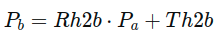

假设我们有一个三维点或向量 (*x*,*y*,*z*)，并且我们希望对其进行移动和旋转变换，首先将其表示为齐次坐标形式(*x*,*y*,*z*,1)。

有了机械臂末端相对于机械臂基座的位姿态信息（旋转矩阵Rh2b和平移向量Th2b），以及四足车的位姿信息（旋转矩阵Cr和平移矩阵Ct），你可以采取以下步骤来保持机械臂末端稳定：

1. **姿态变换**：首先，根据机械臂末端相对于机械臂基座的位姿态信息，可以将机械臂末端的坐标系转换为基座坐标系。这可以通过将机械臂末端的位置向量和旋转矩阵Rh2b相乘得到：

2. 

   其中，��*P**b* 是机械臂末端在基座坐标系下的位置向量，��*P**a* 是机械臂末端在末端坐标系下的位置向量。

3. **车体姿态补偿**：考虑到四足车的运动会影响机械臂末端的稳定性，需要根据四足车的位姿信息对机械臂末端的位置进行补偿。这可以通过将机械臂末端在基座坐标系下的位置向量��*P**b*变换到车体坐标系下：

   ��=���⋅(��−��)*P**c*=*C**r**T*⋅(*P**b*−*Ct*)

   其中，��*P**c* 是机械臂末端在车体坐标系下的位置向量，���*C**r**T* 是四足车的旋转矩阵的转置，��*Ct* 是四足车的平移向量。

4. **控制策略**：根据机械臂末端在车体坐标系下的位置向量��*P**c*，实现一个控制策略来调整机械臂的关节角度，使机械臂末端保持稳定。这可能涉及到运动规划、轨迹跟踪和动态补偿等技术。